# LiPeaks Backend 系统架构文档

## 目录
1. [系统概述](#1-系统概述)
2. [系统分层架构](#2-系统分层架构)
3. [请求处理流程](#3-请求处理流程)
4. [认证授权流程](#4-认证授权流程)
5. [多租户架构](#5-多租户架构)
6. [用户模型体系](#6-用户模型体系)
7. [RBAC权限系统](#7-rbac权限系统)
8. [数据模型关系](#8-数据模型关系)
9. [模块依赖关系](#9-模块依赖关系)
10. [中间件链详解](#10-中间件链详解)

---

## 1. 系统概述

LiPeaks Backend 是一个基于 Django 5.2 和 Django REST Framework 构建的多租户 SaaS 平台后端，采用共享数据库、共享Schema的多租户隔离方案。

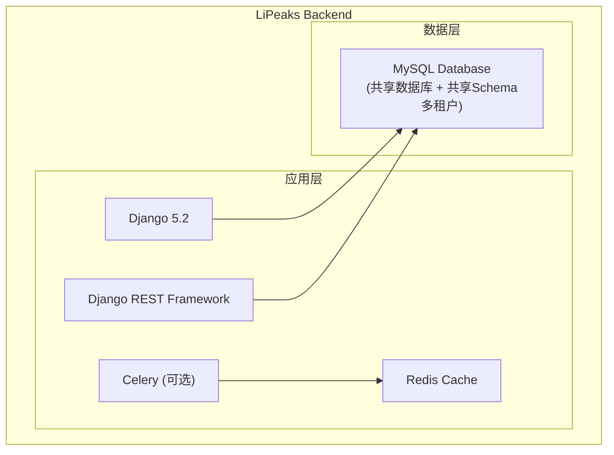
```mermaid
graph TB
    subgraph "LiPeaks Backend"
        subgraph "应用层"
            Django["Django 5.2"]
            DRF["Django REST Framework"]
            Celery["Celery (可选)"]
            Redis["Redis Cache"]
        end
        
        subgraph "数据层"
            MySQL["MySQL Database<br/>(共享数据库 + 共享Schema多租户)"]
        end
        
        Django --> MySQL
        DRF --> MySQL
        Celery --> Redis
    end
```

---

## 2. 系统分层架构

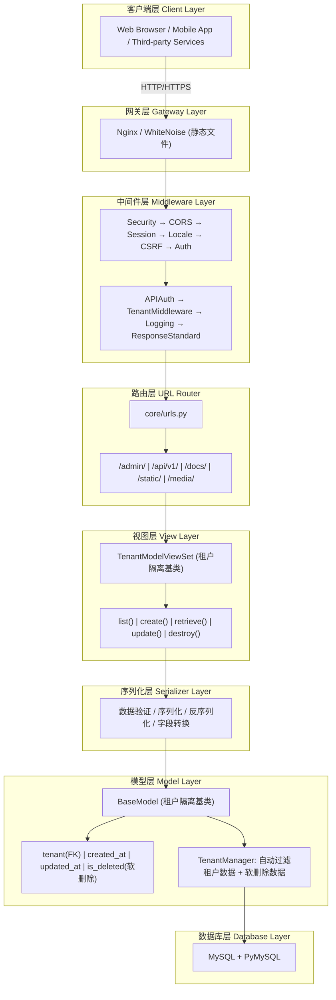
```mermaid
graph TB
    subgraph "客户端层 Client Layer"
        Client["Web Browser / Mobile App / Third-party Services"]
    end
    
    subgraph "网关层 Gateway Layer"
        Gateway["Nginx / WhiteNoise (静态文件)"]
    end
    
    subgraph "中间件层 Middleware Layer"
        MW1["Security → CORS → Session → Locale → CSRF → Auth"]
        MW2["APIAuth → TenantMiddleware → Logging → ResponseStandard"]
    end
    
    subgraph "路由层 URL Router"
        Router["core/urls.py"]
        Routes["/admin/ | /api/v1/ | /docs/ | /static/ | /media/"]
    end
    
    subgraph "视图层 View Layer"
        ViewSet["TenantModelViewSet (租户隔离基类)"]
        Actions["list() | create() | retrieve() | update() | destroy()"]
    end
    
    subgraph "序列化层 Serializer Layer"
        Serializer["数据验证 / 序列化 / 反序列化 / 字段转换"]
    end
    
    subgraph "模型层 Model Layer"
        BaseModel["BaseModel (租户隔离基类)"]
        Fields["tenant(FK) | created_at | updated_at | is_deleted(软删除)"]
        Manager["TenantManager: 自动过滤租户数据 + 软删除数据"]
    end
    
    subgraph "数据库层 Database Layer"
        DB["MySQL + PyMySQL"]
    end
    
    Client -->|"HTTP/HTTPS"| Gateway
    Gateway --> MW1
    MW1 --> MW2
    MW2 --> Router
    Router --> Routes
    Routes --> ViewSet
    ViewSet --> Actions
    Actions --> Serializer
    Serializer --> BaseModel
    BaseModel --> Fields
    BaseModel --> Manager
    Manager --> DB
```

---

## 3. 请求处理流程

### 3.1 完整请求生命周期

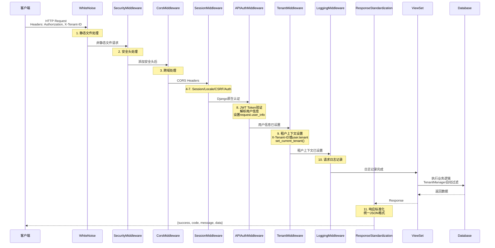
```mermaid
sequenceDiagram
    participant C as 客户端
    participant WN as WhiteNoise
    participant SEC as SecurityMiddleware
    participant CORS as CorsMiddleware
    participant SESS as SessionMiddleware
    participant AUTH as APIAuthMiddleware
    participant TENANT as TenantMiddleware
    participant LOG as LoggingMiddleware
    participant RESP as ResponseStandardization
    participant VIEW as ViewSet
    participant DB as Database
    
    C->>WN: HTTP Request<br/>Headers: Authorization, X-Tenant-ID
    
    Note over WN: 1. 静态文件处理
    WN->>SEC: 非静态文件请求
    
    Note over SEC: 2. 安全头处理
    SEC->>CORS: 添加安全头后
    
    Note over CORS: 3. 跨域处理
    CORS->>SESS: CORS Headers
    
    Note over SESS: 4-7. Session/Locale/CSRF/Auth
    SESS->>AUTH: Django原生认证
    
    Note over AUTH: 8. JWT Token验证<br/>解析用户信息<br/>设置request.user_info
    AUTH->>TENANT: 用户信息已设置
    
    Note over TENANT: 9. 租户上下文设置<br/>X-Tenant-ID或user.tenant<br/>set_current_tenant()
    TENANT->>LOG: 租户上下文已设置
    
    Note over LOG: 10. 请求日志记录
    LOG->>VIEW: 日志记录完成
    
    VIEW->>DB: 执行业务逻辑<br/>TenantManager自动过滤
    DB-->>VIEW: 返回数据
    
    VIEW-->>RESP: Response
    Note over RESP: 11. 响应标准化<br/>统一JSON格式
    
    RESP-->>C: {success, code, message, data}
```

### 3.2 中间件处理链

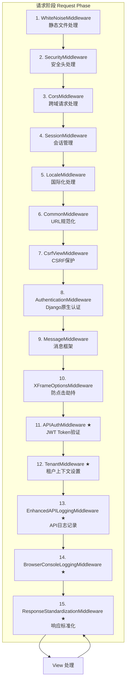
```mermaid
flowchart TB
    subgraph "请求阶段 Request Phase"
        direction TB
        R1["1. WhiteNoiseMiddleware<br/>静态文件处理"]
        R2["2. SecurityMiddleware<br/>安全头处理"]
        R3["3. CorsMiddleware<br/>跨域请求处理"]
        R4["4. SessionMiddleware<br/>会话管理"]
        R5["5. LocaleMiddleware<br/>国际化处理"]
        R6["6. CommonMiddleware<br/>URL规范化"]
        R7["7. CsrfViewMiddleware<br/>CSRF保护"]
        R8["8. AuthenticationMiddleware<br/>Django原生认证"]
        R9["9. MessageMiddleware<br/>消息框架"]
        R10["10. XFrameOptionsMiddleware<br/>防点击劫持"]
        R11["11. APIAuthMiddleware ★<br/>JWT Token验证"]
        R12["12. TenantMiddleware ★<br/>租户上下文设置"]
        R13["13. EnhancedAPILoggingMiddleware ★<br/>API日志记录"]
        R14["14. BrowserConsoleLoggingMiddleware ★"]
        R15["15. ResponseStandardizationMiddleware ★<br/>响应标准化"]
        
        R1 --> R2 --> R3 --> R4 --> R5
        R5 --> R6 --> R7 --> R8 --> R9 --> R10
        R10 --> R11 --> R12 --> R13 --> R14 --> R15
    end
    
    VIEW["View 处理"]
    R15 --> VIEW
    VIEW --> R15
```

### 3.3 响应码映射规则

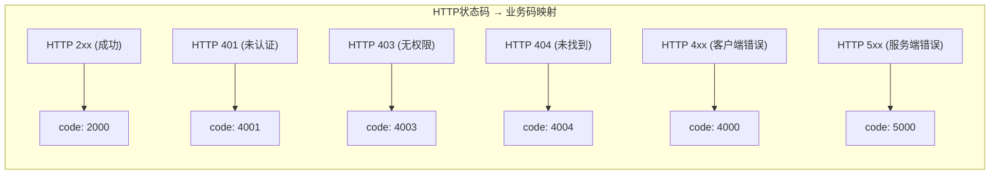
```mermaid
graph LR
    subgraph "HTTP状态码 → 业务码映射"
        H2xx["HTTP 2xx (成功)"] --> C2000["code: 2000"]
        H401["HTTP 401 (未认证)"] --> C4001["code: 4001"]
        H403["HTTP 403 (无权限)"] --> C4003["code: 4003"]
        H404["HTTP 404 (未找到)"] --> C4004["code: 4004"]
        H4xx["HTTP 4xx (客户端错误)"] --> C4000["code: 4000"]
        H5xx["HTTP 5xx (服务端错误)"] --> C5000["code: 5000"]
    end
```

---

## 4. 认证授权流程

### 4.1 JWT登录流程

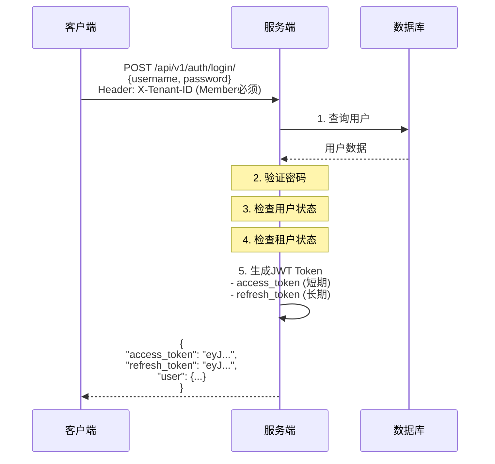
```mermaid
sequenceDiagram
    participant C as 客户端
    participant S as 服务端
    participant DB as 数据库
    
    C->>S: POST /api/v1/auth/login/<br/>{username, password}<br/>Header: X-Tenant-ID (Member必须)
    
    S->>DB: 1. 查询用户
    DB-->>S: 用户数据
    
    Note over S: 2. 验证密码
    Note over S: 3. 检查用户状态
    Note over S: 4. 检查租户状态
    
    S->>S: 5. 生成JWT Token<br/>- access_token (短期)<br/>- refresh_token (长期)
    
    S-->>C: {<br/>  "access_token": "eyJ...",<br/>  "refresh_token": "eyJ...",<br/>  "user": {...}<br/>}
```

### 4.2 Token验证流程

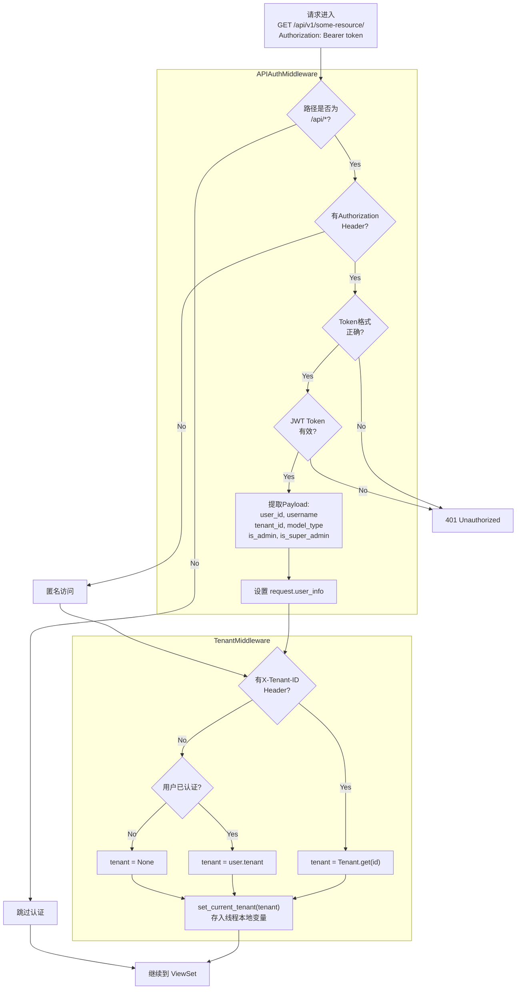
```mermaid
flowchart TB
    START["请求进入<br/>GET /api/v1/some-resource/<br/>Authorization: Bearer token"]
    
    subgraph "APIAuthMiddleware"
        A1{"路径是否为<br/>/api/*?"}
        A2{"有Authorization<br/>Header?"}
        A3{"Token格式<br/>正确?"}
        A4{"JWT Token<br/>有效?"}
        A5["提取Payload:<br/>user_id, username<br/>tenant_id, model_type<br/>is_admin, is_super_admin"]
        A6["设置 request.user_info"]
    end
    
    subgraph "TenantMiddleware"
        T1{"有X-Tenant-ID<br/>Header?"}
        T2["tenant = Tenant.get(id)"]
        T3{"用户已认证?"}
        T4["tenant = user.tenant"]
        T5["tenant = None"]
        T6["set_current_tenant(tenant)<br/>存入线程本地变量"]
    end
    
    VIEW["继续到 ViewSet"]
    SKIP["跳过认证"]
    ANON["匿名访问"]
    E401["401 Unauthorized"]
    
    START --> A1
    A1 -->|No| SKIP
    A1 -->|Yes| A2
    A2 -->|No| ANON
    A2 -->|Yes| A3
    A3 -->|No| E401
    A3 -->|Yes| A4
    A4 -->|No| E401
    A4 -->|Yes| A5
    A5 --> A6
    
    A6 --> T1
    ANON --> T1
    
    T1 -->|Yes| T2
    T1 -->|No| T3
    T3 -->|Yes| T4
    T3 -->|No| T5
    
    T2 --> T6
    T4 --> T6
    T5 --> T6
    
    T6 --> VIEW
    SKIP --> VIEW
```

### 4.3 Token刷新流程

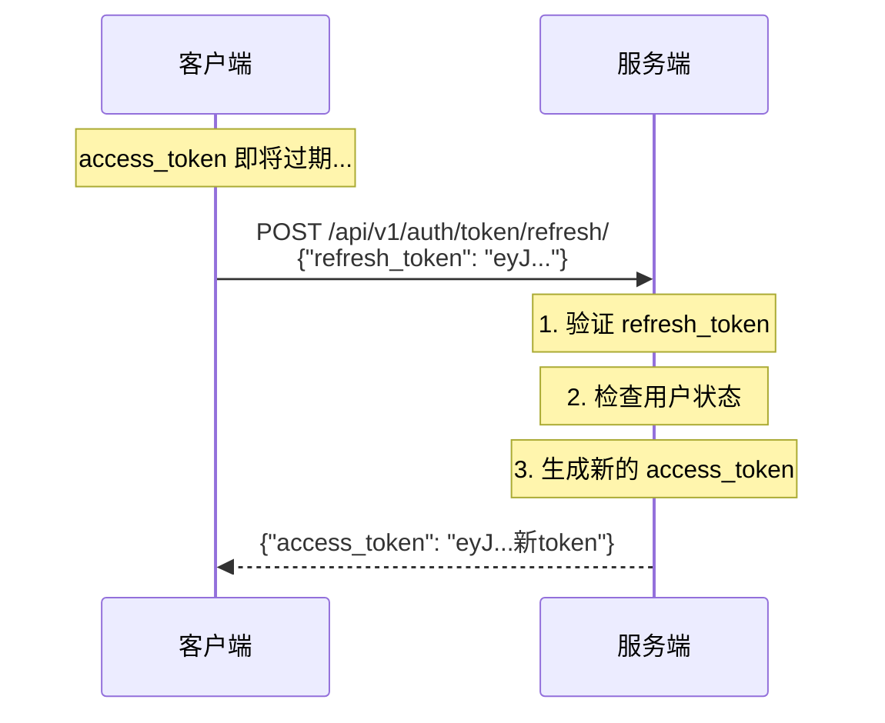
```mermaid
sequenceDiagram
    participant C as 客户端
    participant S as 服务端
    
    Note over C: access_token 即将过期...
    
    C->>S: POST /api/v1/auth/token/refresh/<br/>{"refresh_token": "eyJ..."}
    
    Note over S: 1. 验证 refresh_token
    Note over S: 2. 检查用户状态
    Note over S: 3. 生成新的 access_token
    
    S-->>C: {"access_token": "eyJ...新token"}
```

### 4.4 JWT Token结构

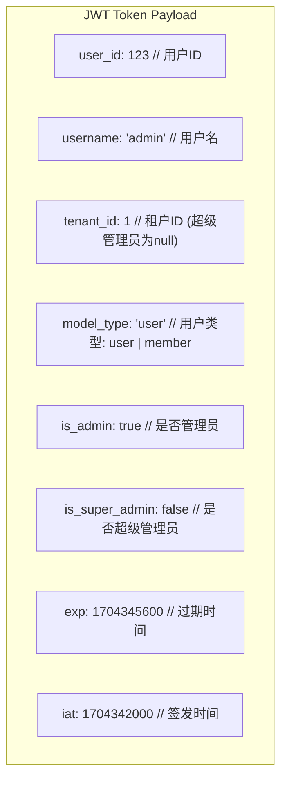
```mermaid
graph TB
    subgraph "JWT Token Payload"
        F1["user_id: 123 // 用户ID"]
        F2["username: 'admin' // 用户名"]
        F3["tenant_id: 1 // 租户ID (超级管理员为null)"]
        F4["model_type: 'user' // 用户类型: user | member"]
        F5["is_admin: true // 是否管理员"]
        F6["is_super_admin: false // 是否超级管理员"]
        F7["exp: 1704345600 // 过期时间"]
        F8["iat: 1704342000 // 签发时间"]
    end
```

---

## 5. 多租户架构

### 5.1 多租户隔离模型

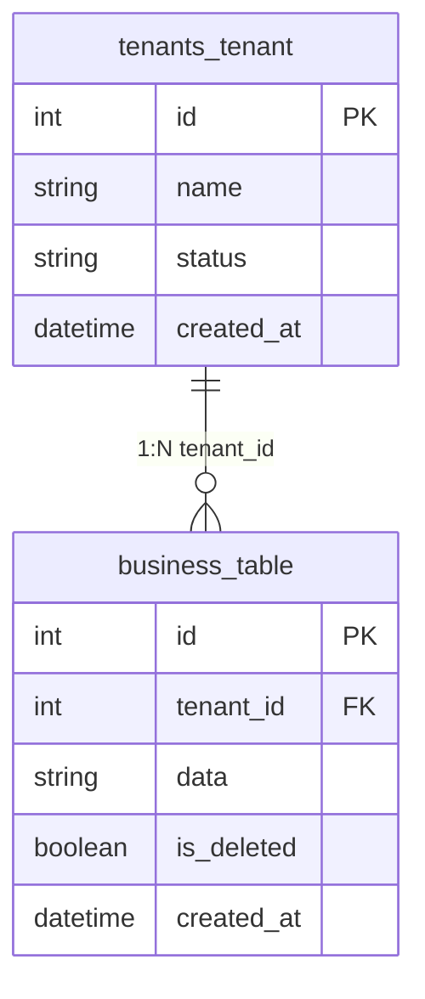
```mermaid
erDiagram
    tenants_tenant {
        int id PK
        string name
        string status
        datetime created_at
    }
    
    business_table {
        int id PK
        int tenant_id FK
        string data
        boolean is_deleted
        datetime created_at
    }
    
    tenants_tenant ||--o{ business_table : "1:N tenant_id"
```

### 5.2 数据隔离示意图

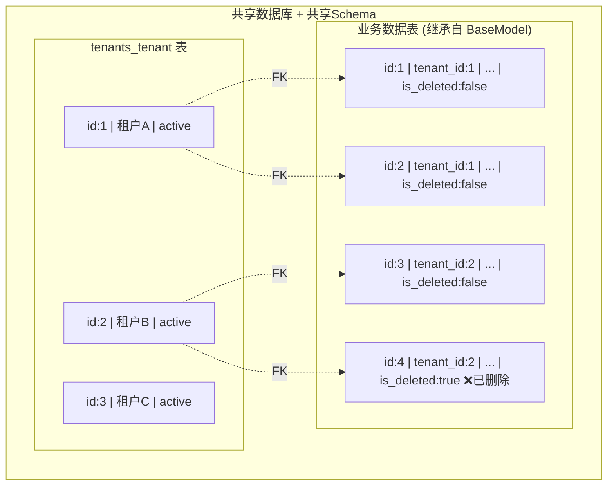
```mermaid
graph TB
    subgraph "共享数据库 + 共享Schema"
        subgraph "tenants_tenant 表"
            T1["id:1 | 租户A | active"]
            T2["id:2 | 租户B | active"]
            T3["id:3 | 租户C | active"]
        end
        
        subgraph "业务数据表 (继承自 BaseModel)"
            D1["id:1 | tenant_id:1 | ... | is_deleted:false"]
            D2["id:2 | tenant_id:1 | ... | is_deleted:false"]
            D3["id:3 | tenant_id:2 | ... | is_deleted:false"]
            D4["id:4 | tenant_id:2 | ... | is_deleted:true ❌已删除"]
        end
        
        T1 -.->|FK| D1
        T1 -.->|FK| D2
        T2 -.->|FK| D3
        T2 -.->|FK| D4
    end
```

### 5.3 租户上下文设置流程

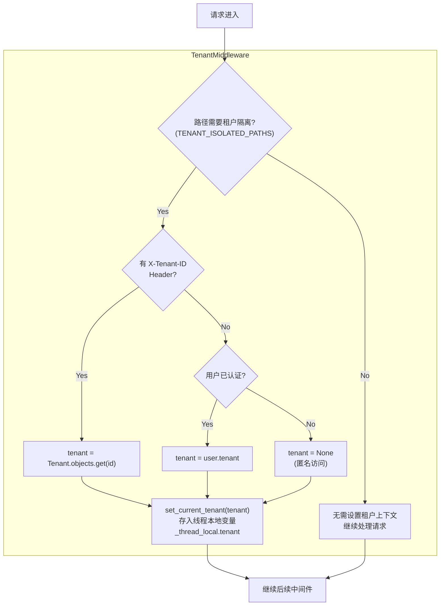
```mermaid
flowchart TB
    START["请求进入"]
    
    subgraph "TenantMiddleware"
        C1{"路径需要租户隔离?<br/>(TENANT_ISOLATED_PATHS)"}
        C2{"有 X-Tenant-ID<br/>Header?"}
        C3["tenant = Tenant.objects.get(id)"]
        C4{"用户已认证?"}
        C5["tenant = user.tenant"]
        C6["tenant = None<br/>(匿名访问)"]
        C7["set_current_tenant(tenant)<br/>存入线程本地变量<br/>_thread_local.tenant"]
        SKIP["无需设置租户上下文<br/>继续处理请求"]
    end
    
    NEXT["继续后续中间件"]
    
    START --> C1
    C1 -->|No| SKIP
    C1 -->|Yes| C2
    C2 -->|Yes| C3
    C2 -->|No| C4
    C4 -->|Yes| C5
    C4 -->|No| C6
    
    C3 --> C7
    C5 --> C7
    C6 --> C7
    
    C7 --> NEXT
    SKIP --> NEXT
```

### 5.4 TenantManager自动过滤

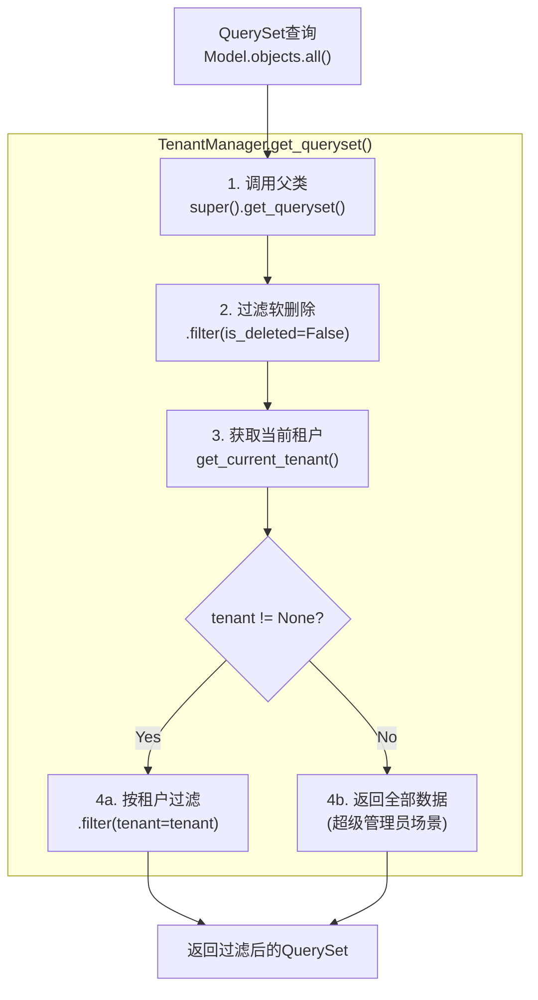
```mermaid
flowchart TB
    START["QuerySet查询<br/>Model.objects.all()"]
    
    subgraph "TenantManager.get_queryset()"
        S1["1. 调用父类<br/>super().get_queryset()"]
        S2["2. 过滤软删除<br/>.filter(is_deleted=False)"]
        S3["3. 获取当前租户<br/>get_current_tenant()"]
        C1{"tenant != None?"}
        S4A["4a. 按租户过滤<br/>.filter(tenant=tenant)"]
        S4B["4b. 返回全部数据<br/>(超级管理员场景)"]
    end
    
    RESULT["返回过滤后的QuerySet"]
    
    START --> S1
    S1 --> S2
    S2 --> S3
    S3 --> C1
    C1 -->|Yes| S4A
    C1 -->|No| S4B
    S4A --> RESULT
    S4B --> RESULT
```

### 5.5 TenantModelViewSet CRUD流程

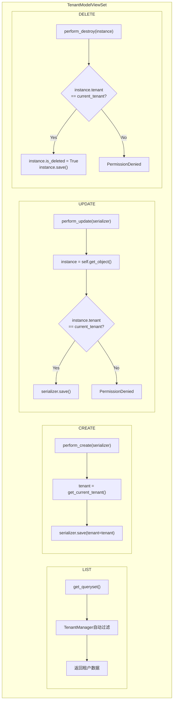
```mermaid
flowchart TB
    subgraph "TenantModelViewSet"
        subgraph "LIST"
            L1["get_queryset()"]
            L2["TenantManager自动过滤"]
            L3["返回租户数据"]
            L1 --> L2 --> L3
        end
        
        subgraph "CREATE"
            C1["perform_create(serializer)"]
            C2["tenant = get_current_tenant()"]
            C3["serializer.save(tenant=tenant)"]
            C1 --> C2 --> C3
        end
        
        subgraph "UPDATE"
            U1["perform_update(serializer)"]
            U2["instance = self.get_object()"]
            U3{"instance.tenant<br/>== current_tenant?"}
            U4["serializer.save()"]
            U5["PermissionDenied"]
            U1 --> U2 --> U3
            U3 -->|Yes| U4
            U3 -->|No| U5
        end
        
        subgraph "DELETE"
            D1["perform_destroy(instance)"]
            D2{"instance.tenant<br/>== current_tenant?"}
            D3["instance.is_deleted = True<br/>instance.save()"]
            D4["PermissionDenied"]
            D1 --> D2
            D2 -->|Yes| D3
            D2 -->|No| D4
        end
    end
```

---

## 6. 用户模型体系

### 6.1 用户类型层级

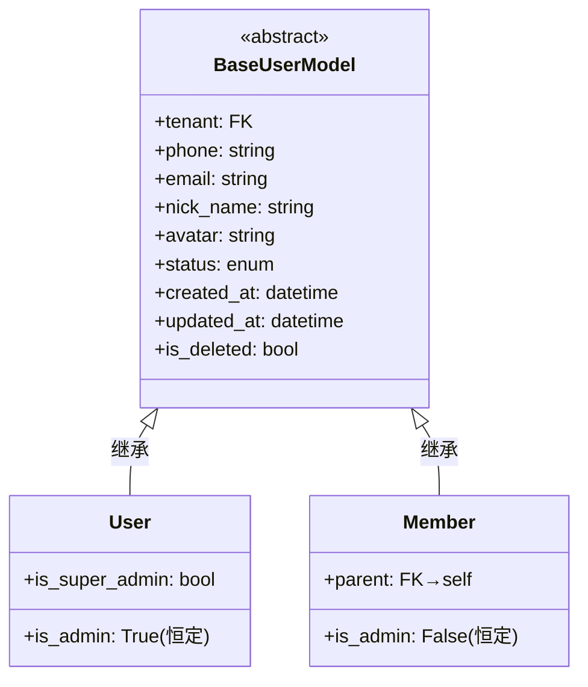
```mermaid
classDiagram
    class BaseUserModel {
        <<abstract>>
        +tenant: FK
        +phone: string
        +email: string
        +nick_name: string
        +avatar: string
        +status: enum
        +created_at: datetime
        +updated_at: datetime
        +is_deleted: bool
    }
    
    class User {
        +is_admin: True (恒定)
        +is_super_admin: bool
    }
    
    class Member {
        +is_admin: False (恒定)
        +parent: FK→self
    }
    
    BaseUserModel <|-- User : 继承
    BaseUserModel <|-- Member : 继承
```

### 6.2 用户类型详细说明

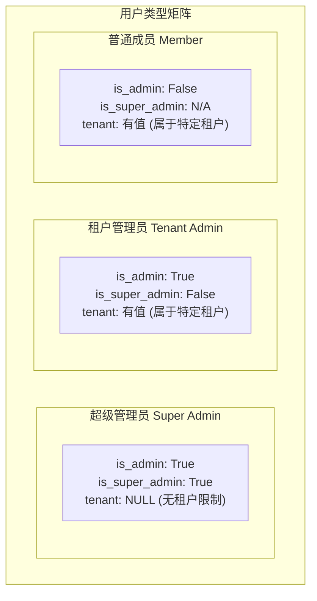
```mermaid
graph TB
    subgraph "用户类型矩阵"
        subgraph "超级管理员 Super Admin"
            SA["is_admin: True<br/>is_super_admin: True<br/>tenant: NULL (无租户限制)"]
        end
        
        subgraph "租户管理员 Tenant Admin"
            TA["is_admin: True<br/>is_super_admin: False<br/>tenant: 有值 (属于特定租户)"]
        end
        
        subgraph "普通成员 Member"
            M["is_admin: False<br/>is_super_admin: N/A<br/>tenant: 有值 (属于特定租户)"]
        end
    end
```

### 6.3 子账号关系

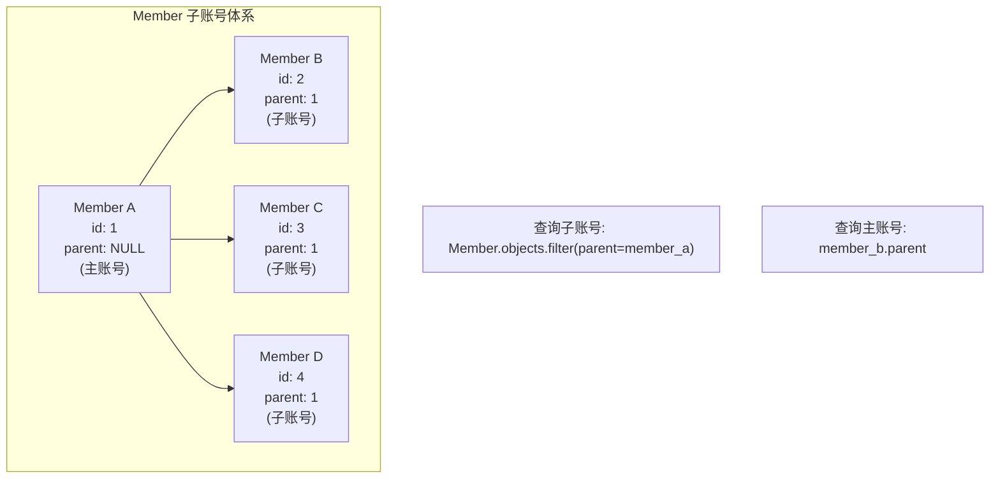
```mermaid
graph TB
    subgraph "Member 子账号体系"
        MA["Member A<br/>id: 1<br/>parent: NULL<br/>(主账号)"]
        
        MB["Member B<br/>id: 2<br/>parent: 1<br/>(子账号)"]
        MC["Member C<br/>id: 3<br/>parent: 1<br/>(子账号)"]
        MD["Member D<br/>id: 4<br/>parent: 1<br/>(子账号)"]
        
        MA --> MB
        MA --> MC
        MA --> MD
    end
    
    Q1["查询子账号: Member.objects.filter(parent=member_a)"]
    Q2["查询主账号: member_b.parent"]
```

---

## 7. RBAC权限系统

### 7.1 RBAC模型结构

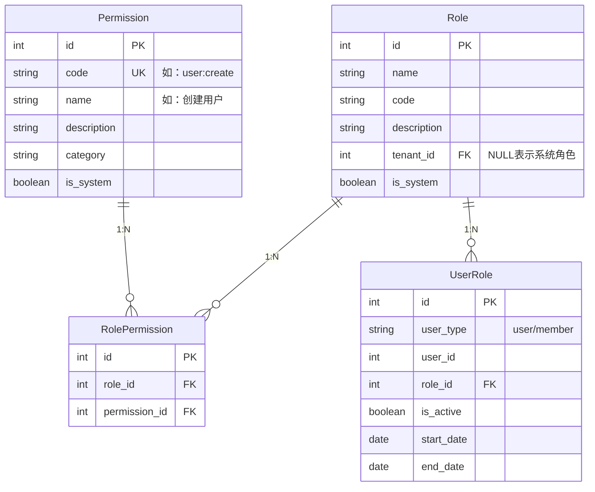
```mermaid
erDiagram
    Permission {
        int id PK
        string code UK "如：user:create"
        string name "如：创建用户"
        string description
        string category
        boolean is_system
    }
    
    Role {
        int id PK
        string name
        string code
        string description
        int tenant_id FK "NULL表示系统角色"
        boolean is_system
    }
    
    RolePermission {
        int id PK
        int role_id FK
        int permission_id FK
    }
    
    UserRole {
        int id PK
        string user_type "user/member"
        int user_id
        int role_id FK
        boolean is_active
        date start_date
        date end_date
    }
    
    Permission ||--o{ RolePermission : "1:N"
    Role ||--o{ RolePermission : "1:N"
    Role ||--o{ UserRole : "1:N"
```

### 7.2 权限检查流程

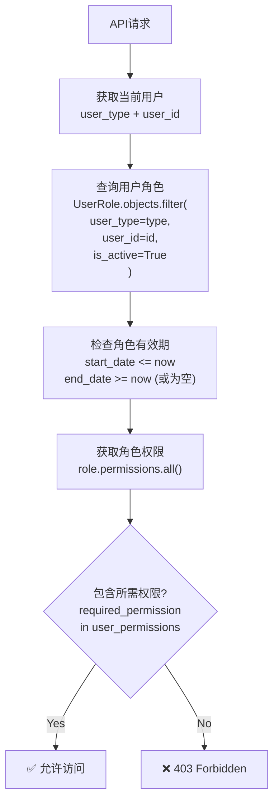
```mermaid
flowchart TB
    START["API请求"]
    
    S1["获取当前用户<br/>user_type + user_id"]
    S2["查询用户角色<br/>UserRole.objects.filter(<br/>  user_type=type,<br/>  user_id=id,<br/>  is_active=True<br/>)"]
    S3["检查角色有效期<br/>start_date <= now<br/>end_date >= now (或为空)"]
    S4["获取角色权限<br/>role.permissions.all()"]
    S5{"包含所需权限?<br/>required_permission<br/>in user_permissions"}
    
    ALLOW["✅ 允许访问"]
    DENY["❌ 403 Forbidden"]
    
    START --> S1 --> S2 --> S3 --> S4 --> S5
    S5 -->|Yes| ALLOW
    S5 -->|No| DENY
```

### 7.3 角色类型

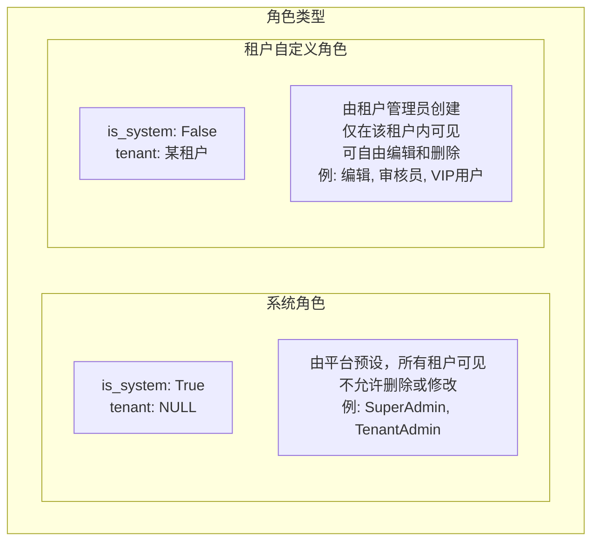
```mermaid
graph TB
    subgraph "角色类型"
        subgraph "系统角色"
            SYS["is_system: True<br/>tenant: NULL"]
            SYS_DESC["由平台预设，所有租户可见<br/>不允许删除或修改<br/>例: SuperAdmin, TenantAdmin"]
        end
        
        subgraph "租户自定义角色"
            CUSTOM["is_system: False<br/>tenant: 某租户"]
            CUSTOM_DESC["由租户管理员创建<br/>仅在该租户内可见<br/>可自由编辑和删除<br/>例: 编辑, 审核员, VIP用户"]
        end
    end
```

---

## 8. 数据模型关系

### 8.1 核心模型关系图

```mermaid
erDiagram
    Tenant ||--o{ User : "1:N"
    Tenant ||--o{ Member : "1:N"
    Tenant ||--|| TenantQuota : "1:1"
    
    Tenant ||--o{ Article : "1:N"
    Tenant ||--o{ Customer : "1:N"
    Tenant ||--o{ Order : "1:N"
    Tenant ||--o{ License : "1:N"
    Tenant ||--o{ Feedback : "1:N"
    Tenant ||--o{ Category : "1:N"
    Tenant ||--o{ Menu : "1:N"
    Tenant ||--o{ Point : "1:N"
    Tenant ||--o{ App : "1:N"
    Tenant ||--o{ CheckRecord : "1:N"
    
    Tenant {
        int id PK
        string name
        string status
    }
    
    User {
        int id PK
        int tenant_id FK
        boolean is_super_admin
    }
    
    Member {
        int id PK
        int tenant_id FK
        int parent_id FK "子账号"
    }
```

### 8.2 RBAC模型关系

```mermaid
graph LR
    Permission["Permission<br/>(权限)"]
    Role["Role<br/>(角色)"]
    UserRole["UserRole<br/>(用户角色)"]
    
    Permission <-->|"M:N<br/>RolePermission"| Role
    Role <-->|"1:N"| UserRole
```

### 8.3 用户互动模型

```mermaid
graph TB
    subgraph "用户互动模型 (通用关联)"
        Favorite["Favorite (收藏)<br/>GenericFK"]
        Like["Like (点赞)<br/>GenericFK"]
        Follow["Follow (关注)<br/>user→user"]
    end
```

### 8.4 CMS模块数据模型

```mermaid
erDiagram
    Category ||--o{ Article : "1:N"
    Category ||--o{ CategoryTranslation : "1:N"
    Article ||--o{ ArticleTranslation : "1:N"
    
    Category {
        int id PK
        int tenant_id FK
        string slug
        int parent_id FK "自关联"
        int order
        boolean is_active
    }
    
    CategoryTranslation {
        int id PK
        int master_id FK
        string language_code
        string name
        string description
    }
    
    Article {
        int id PK
        int tenant_id FK
        int category_id FK
        string author_type
        int author_id
        string status
        boolean is_original
        int view_count
        int like_count
        int favorite_count
        int comment_count
        datetime published_at
    }
    
    ArticleTranslation {
        int id PK
        int master_id FK
        string language_code
        string title
        text summary
        text content
    }
```

> 注: 使用 django-parler 实现多语言支持

---

## 9. 模块依赖关系

### 9.1 应用模块依赖图

```mermaid
graph TB
    subgraph "核心层"
        CORE["core<br/>(核心配置)"]
        COMMON["common<br/>(公共组件)<br/>BaseModel / Middleware<br/>Auth / ViewSets"]
    end
    
    subgraph "基础服务层"
        TENANTS["tenants<br/>(租户管理)"]
        USERS["users<br/>(用户管理)"]
        RBAC["rbac<br/>(权限管理)"]
    end
    
    subgraph "业务模块层"
        CMS["cms<br/>(内容)"]
        CUSTOMERS["customers<br/>(客户)"]
        ORDERS["orders<br/>(订单)"]
        LICENSES["licenses<br/>(许可证)"]
        FEEDBACKS["feedbacks<br/>(反馈)"]
        MENUS["menus<br/>(菜单)"]
        APPS["applications<br/>(应用)"]
        POINTS["points<br/>(积分)"]
        CHECK["check_system<br/>(打卡)"]
        CHARTS["charts<br/>(图表)"]
        INTERACTIONS["interactions<br/>(互动)"]
    end
    
    CORE --> COMMON
    COMMON --> TENANTS
    COMMON --> USERS
    COMMON --> RBAC
    
    TENANTS --> CMS
    TENANTS --> CUSTOMERS
    TENANTS --> ORDERS
    TENANTS --> LICENSES
    TENANTS --> FEEDBACKS
    TENANTS --> MENUS
    TENANTS --> APPS
    TENANTS --> POINTS
    TENANTS --> CHECK
    TENANTS --> CHARTS
    TENANTS --> INTERACTIONS
    
    USERS --> CMS
    USERS --> INTERACTIONS
```

### 9.2 核心模块详解

```mermaid
graph TB
    subgraph "core 模块"
        C1["settings.py - Django配置"]
        C2["urls.py - 根路由配置"]
        C3["wsgi.py - WSGI入口"]
        C4["asgi.py - ASGI入口"]
        C5["celery.py - Celery配置"]
        C6["admin.py - Admin站点配置"]
    end
```

```mermaid
graph TB
    subgraph "common 模块"
        CM1["models.py - BaseModel"]
        CM2["viewsets.py - TenantModelViewSet"]
        CM3["serializers.py - 公共序列化器"]
        
        subgraph "middleware/"
            MW1["api_auth_middleware.py"]
            MW2["tenant_middleware.py"]
            MW3["response_standardization_middleware.py"]
            MW4["enhanced_api_logging_middleware.py"]
        end
        
        subgraph "authentication/"
            AUTH["jwt_auth.py - JWT认证"]
        end
        
        subgraph "utils/"
            U1["tenant_context.py"]
            U2["tenant_manager.py"]
        end
    end
```

```mermaid
graph TB
    subgraph "users 模块"
        subgraph "models.py"
            UM1["BaseUserModel (abstract)"]
            UM2["User - 管理员"]
            UM3["Member - 普通成员"]
            UM1 --> UM2
            UM1 --> UM3
        end
        
        subgraph "urls/"
            UU1["auth_urls.py"]
            UU2["user_urls.py"]
            UU3["member_urls.py"]
        end
        
        subgraph "views/"
            UV1["auth_views.py"]
            UV2["user_views.py"]
            UV3["member_views.py"]
        end
    end
```

```mermaid
graph TB
    subgraph "rbac 模块"
        R1["Permission - 权限"]
        R2["Role - 角色"]
        R3["RolePermission - 角色权限"]
        R4["UserRole - 用户角色"]
        
        R1 <--> R3
        R2 <--> R3
        R2 <--> R4
    end
```

---

## 10. 中间件链详解

### 10.1 完整中间件链

```mermaid
flowchart TB
    subgraph "请求阶段"
        direction TB
        IN["请求进入"] --> M1
        M1["1. WhiteNoiseMiddleware<br/>处理静态文件请求"]
        M2["2. SecurityMiddleware<br/>添加安全相关HTTP头"]
        M3["3. CorsMiddleware<br/>处理跨域请求 (CORS)"]
        M4["4. SessionMiddleware<br/>管理用户会话"]
        M5["5. LocaleMiddleware<br/>处理国际化/多语言"]
        M6["6. CommonMiddleware<br/>URL规范化处理"]
        M7["7. CsrfViewMiddleware<br/>CSRF保护"]
        M8["8. AuthenticationMiddleware<br/>Django原生Session认证"]
        M9["9. MessageMiddleware<br/>消息框架支持"]
        M10["10. XFrameOptionsMiddleware<br/>防止点击劫持"]
        M11["11. APIAuthMiddleware ★自定义★<br/>仅处理/api/*路径<br/>解析Authorization Header<br/>验证JWT Token<br/>设置request.user_info"]
        M12["12. TenantMiddleware ★自定义★<br/>检查路径是否需要租户隔离<br/>从X-Tenant-ID或user.tenant获取租户<br/>调用set_current_tenant()"]
        M13["13. EnhancedAPILoggingMiddleware ★自定义★<br/>记录API请求/响应日志"]
        M14["14. BrowserConsoleLoggingMiddleware ★自定义★<br/>浏览器控制台日志"]
        M15["15. ResponseStandardizationMiddleware ★自定义★<br/>仅在响应返回时处理<br/>统一响应格式为标准JSON"]
        
        M1 --> M2 --> M3 --> M4 --> M5
        M5 --> M6 --> M7 --> M8 --> M9 --> M10
        M10 --> M11 --> M12 --> M13 --> M14 --> M15
    end
    
    VIEW["View 处理"]
    OUT["响应返回<br/>(逆序经过中间件)"]
    
    M15 --> VIEW
    VIEW --> OUT
```

### 10.2 自定义中间件功能表

```mermaid
graph TB
    subgraph "APIAuthMiddleware"
        A1["• 解析 Authorization: Bearer token"]
        A2["• 验证JWT Token有效性和过期时间"]
        A3["• 提取用户信息到 request.user_info"]
        A4["• 仅作用于 /api/* 路径"]
    end
    
    subgraph "TenantMiddleware"
        T1["• 解析 X-Tenant-ID Header"]
        T2["• 设置当前请求的租户上下文"]
        T3["• 使后续查询自动按租户过滤"]
        T4["• 检查 TENANT_ISOLATED_API_PATHS"]
    end
    
    subgraph "EnhancedAPILoggingMiddleware"
        L1["• 记录请求方法、路径、参数"]
        L2["• 记录响应状态码、耗时"]
        L3["• 支持敏感信息脱敏"]
    end
    
    subgraph "BrowserConsoleLoggingMiddleware"
        B1["• 开发环境辅助调试"]
        B2["• 输出日志到浏览器控制台"]
    end
    
    subgraph "ResponseStandardizationMiddleware"
        R1["• 统一API响应格式"]
        R2["• 转换HTTP状态码为业务码"]
        R3["• 标准化: success/code/message/data"]
        R4["• 排除 /admin/ 和 API文档路径"]
    end
```

---

## 附录: API路由结构

```mermaid
graph LR
    subgraph "/api/v1/"
        AUTH["/auth/<br/>登录/注册/Token"]
        USERS["/users/<br/>用户管理"]
        MEMBERS["/members/<br/>成员管理"]
        TENANTS["/tenants/<br/>租户管理"]
        RBAC["/rbac/<br/>权限管理"]
        COMMON["/common/<br/>文件上传"]
        CMS["/cms/<br/>内容管理"]
        MENUS["/menus/<br/>菜单管理"]
        CUSTOMERS["/customers/<br/>客户管理"]
        ORDERS["/orders/<br/>订单管理"]
        LICENSES["/licenses/<br/>许可证"]
        POINTS["/points/<br/>积分系统"]
        FEEDBACKS["/feedbacks/<br/>反馈系统"]
        INTERACTIONS["/interactions/<br/>收藏/点赞/关注"]
        CHECK["/check-system/<br/>打卡系统"]
        APPS["/applications/<br/>应用管理"]
        CHARTS["/admin/charts/<br/>图表数据"]
        DOCS["/schema/ /docs/ /redoc/<br/>API文档"]
    end
```

### 详细路由树

```
/api/v1/
├── auth/                    # 认证 (users.urls.auth_urls)
│   ├── login/              # 登录
│   ├── register/           # 注册  
│   ├── token/refresh/      # Token刷新
│   └── token/verify/       # Token验证
│
├── users/                   # 用户管理 (users.urls)
│   ├── me/                 # 当前用户信息
│   └── ...                 # CRUD
│
├── members/                 # 成员管理 (users.urls)
│   ├── me/                 # 当前成员信息
│   ├── sub-accounts/       # 子账号
│   └── password-reset/     # 密码重置
│
├── tenants/                 # 租户管理 (tenants.urls)
├── rbac/                    # 权限管理 (rbac.urls)
├── common/                  # 公共功能 (common.urls)
│   ├── upload-file/        # 文件上传
│   └── upload-image-with-thumbnail/  # 图片上传
│
├── cms/                     # 内容管理 (cms.urls)
│   ├── categories/         # 分类
│   ├── articles/           # 文章 (管理员)
│   └── member/articles/    # 文章 (成员)
│
├── menus/                   # 菜单管理 (menus.urls)
├── customers/               # 客户管理 (customers.urls)
├── orders/                  # 订单管理 (orders.urls)
├── licenses/                # 许可证 (licenses.urls)
├── points/                  # 积分系统 (points.api.urls)
├── feedbacks/               # 反馈系统 (feedbacks.urls)
├── interactions/            # 用户互动 (interactions.urls)
│   ├── favorites/          # 收藏
│   ├── likes/              # 点赞
│   └── follows/            # 关注
│
├── check-system/            # 打卡系统 (check_system.urls)
├── applications/            # 应用管理 (applications.urls)
├── admin/charts/            # 图表数据 (charts.urls)
│
├── schema/                  # OpenAPI Schema
├── docs/                    # Swagger UI
└── redoc/                   # ReDoc
```

---

*文档生成时间: 2026-01-04*
*文档版本: v2.0*
