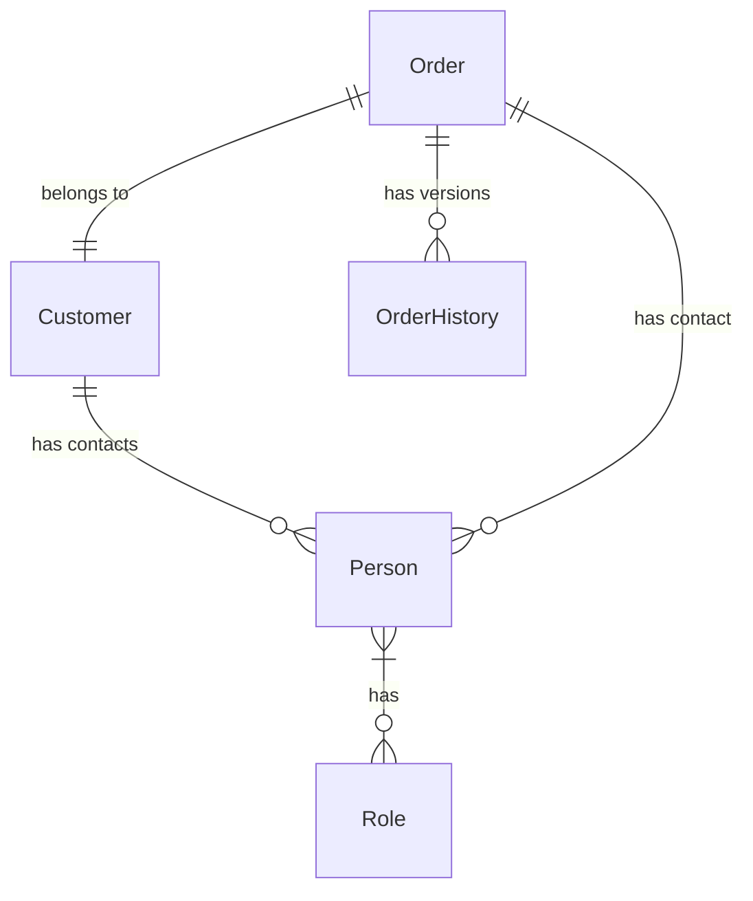
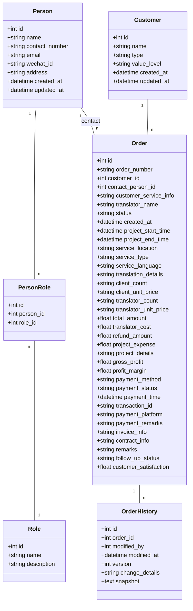
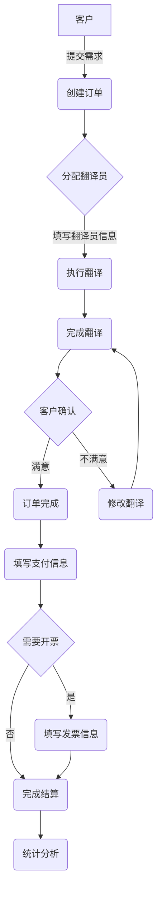

# 普全订单管理系统数据结构设计（简化版）

## 1. 数据结构概述

普全订单管理系统的数据结构设计基于对翻译服务业务流程的分析，主要包含以下几个核心实体：

- **Person（人员）**：统一的人员实体，通过角色区分为客户联系人等
- **Customer（客户）**：客户公司或组织
- **Order（订单）**：核心业务实体，包含订单的所有信息（包括服务类型、语种、支付记录、发票和翻译人员信息）
- **OrderHistory（订单历史）**：记录订单的修改历史

## 2. 实体关系图



## 3. 核心实体详细设计

### 3.1 Person（人员）

Person实体是一个统一的人员模型，通过角色关联区分不同身份（客户联系人等）。

#### 属性：
- id: 唯一标识符
- name: 姓名
- contact_number: 联系电话
- email: 电子邮件
- wechat_id: 微信号
- address: 地址
- created_at: 创建时间
- updated_at: 更新时间

#### 角色：
- 客户联系人
- 客服人员
- 系统管理员

### 3.2 Customer（客户）

代表客户公司或组织。

#### 属性：
- id: 唯一标识符
- name: 客户名称
- type: 客户类型（个人/公司）
- value_level: 价值等级（普通/VIP等）
- business_license_number: 营业执照号
- tax_identification_number: 纳税人识别号
- registered_capital: 注册资本
- legal_representative: 法定代表人
- registered_address: 注册地址
- business_address: 经营地址
- business_scope: 经营范围
- industry_type: 行业类型
- company_size: 公司规模（小型/中型/大型）
- establishment_date: 成立日期
- contact_person: 主要联系人
- contact_phone: 联系电话
- contact_email: 联系邮箱
- website: 公司网站
- bank_name: 开户银行
- bank_account: 银行账号
- credit_rating: 信用等级
- payment_terms: 付款条件
- contract_template: 合同模板
- special_requirements: 特殊要求
- notes: 备注信息
- created_at: 创建时间
- updated_at: 更新时间

### 3.3 Order（订单）

系统的核心实体，包含订单的完整信息，包括服务类型、语种、支付记录、发票和翻译人员信息。

#### 属性：
- id: 唯一标识符
- order_number: 订单编号
- customer_id: 关联客户ID
- contact_person_id: 客户联系人ID
- customer_service_info: 客服人员信息（字符串格式，可包含姓名、联系方式等）
- translator_name: 翻译人员姓名
- status: 订单状态（新建/进行中/已完成/已取消/待支付）
- created_at: 创建时间
- project_start_time: 项目开始时间
- project_end_time: 项目完成时间
- service_location: 服务地点

<!-- 服务和语种信息 -->
- service_type: 服务类型（口译/笔译/同传等）
- service_language: 服务语种（可存储多语种，如"英译中,日译中"）
- translation_details: 翻译明细

<!-- 费用相关信息 -->
- client_count: 客户数量（字符串格式，用户自己填写）
- client_unit_price: 客户单价（字符串格式）
- translator_count: 翻译数量（字符串格式）
- translator_unit_price: 翻译单价（字符串格式）
- total_amount: 成交额
- translator_cost: 翻译师成本
- refund_amount: 退款金额
- project_expense: 项目费用
- project_details: 项目明细
- gross_profit: 毛利（计算字段）
- profit_margin: 毛利率（计算字段）

<!-- 支付信息 -->
- payment_method: 支付方式（微信/支付宝/银行转账/现金等）
- payment_status: 支付状态（未支付/部分支付/已支付）
- payment_time: 支付时间
- transaction_id: 交易编号
- payment_platform: 支付平台
- payment_remarks: 支付备注

<!-- 发票和合同信息 -->
- invoice_info: 发票信息（JSON格式，包含发票编号、抬头、金额、类型、状态、开票时间等信息）
- contract_info: 合同信息（JSON格式，包含合同编号、签署时间、合同文件路径等信息）

<!-- 其他信息 -->
- remarks: 备注
- follow_up_status: 回访情况
- customer_satisfaction: 客户满意度

### 3.4 OrderHistory（订单历史）

记录订单的每次修改历史。

#### 属性：
- id: 唯一标识符
- order_id: 关联订单ID
- modified_by: 修改人ID
- modified_at: 修改时间
- version: 版本号
- change_details: 变更详情（JSON格式，记录具体修改了哪些字段，从什么值改为什么值）
- snapshot: 订单快照（JSON格式，包含修改后订单的完整状态）

## 4. 数据库表结构线框图



## 5. 数据流程图



## 6. 设计说明

### 6.1 简化的数据模型

本系统采用了简化的数据模型，将服务类型、语种、支付记录、发票和翻译人员信息直接整合到Order表中。这种设计有以下优势：

1. **简化查询**：无需多表连接，直接从Order表获取所有相关信息
2. **适合单一订单场景**：当订单结构相对固定且简单时，这种设计更加高效
3. **减少数据库复杂度**：减少表的数量，简化数据库管理

### 6.2 订单历史版本控制

系统通过OrderHistory表实现订单的版本控制，每次修改订单时都会生成一个新的历史记录，包含：

1. 修改人和修改时间
2. 版本号
3. 变更详情（JSON格式，记录具体修改了哪些字段，从什么值改为什么值）
4. 订单快照（JSON格式，包含修改后订单的完整状态）

示例快照格式：
```json
{
  "id": 1001,
  "order_number": "ORD-20230615-001",
  "customer_id": 42,
  "translator_name": "张三",
  "customer_service_info": "李四 (电话: 13800138000)",
  "service_type": "笔译",
  "service_language": "英译中",
  "client_count": "5000字",
  "client_unit_price": "0.8元/字",
  "translator_count": "5000字",
  "translator_unit_price": "0.5元/字",
  "total_amount": 3500.00,
  "payment_status": "已支付",
  "invoice_info": "{\"invoice_number\":\"INV-20230620-001\",\"invoice_title\":\"上海某某科技有限公司\",\"invoice_amount\":3500.00,\"invoice_type\":\"增值税专用发票\",\"invoice_status\":\"已开具\",\"invoice_time\":\"2023-06-20T15:30:00\"}",
  "contract_info": "{\"contract_number\":\"CT-20230615-001\",\"signed_date\":\"2023-06-15\",\"contract_file\":\"/files/contracts/CT-20230615-001.pdf\"}",
  ...
}
```

示例变更详情格式：
```json
{
  "changed_fields": [
    {
      "field": "status",
      "old_value": "进行中",
      "new_value": "已完成"
    },
    {
      "field": "invoice_info",
      "old_value": null,
      "new_value": "{\"invoice_number\":\"INV-20230620-001\",\"invoice_title\":\"上海某某科技有限公司\",\"invoice_amount\":3500.00,\"invoice_type\":\"增值税专用发票\",\"invoice_status\":\"已开具\",\"invoice_time\":\"2023-06-20T15:30:00\"}"
    }
  ],
  "reason": "项目完成并开具发票"
}
```

这种设计可以完整追踪订单的变更历史，支持版本回溯和审计需求。

## 7. 数据关系总结

1. 一个客户可以有多个联系人（通过Person表和角色关联）
2. 一个订单关联一个客户，并指定特定的客户联系人
3. 订单包含所有相关信息（服务类型、语种、翻译人员、支付、发票等）
4. 订单的每次修改都会生成历史记录，包含完整快照和变更详情 