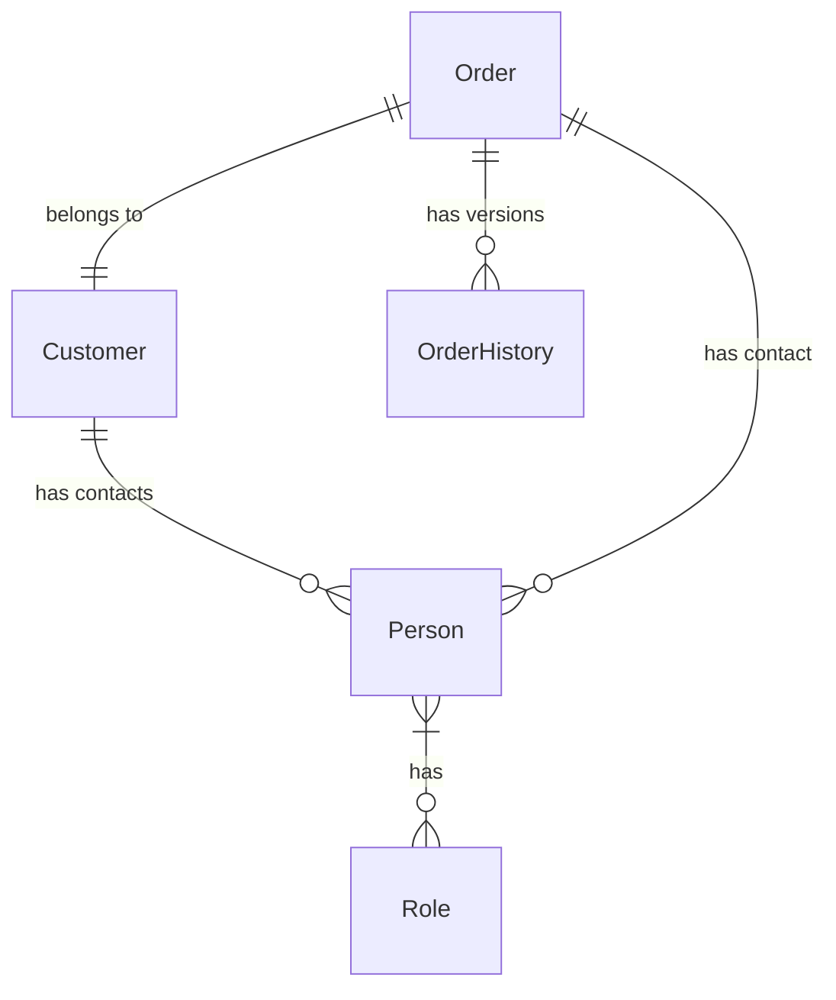
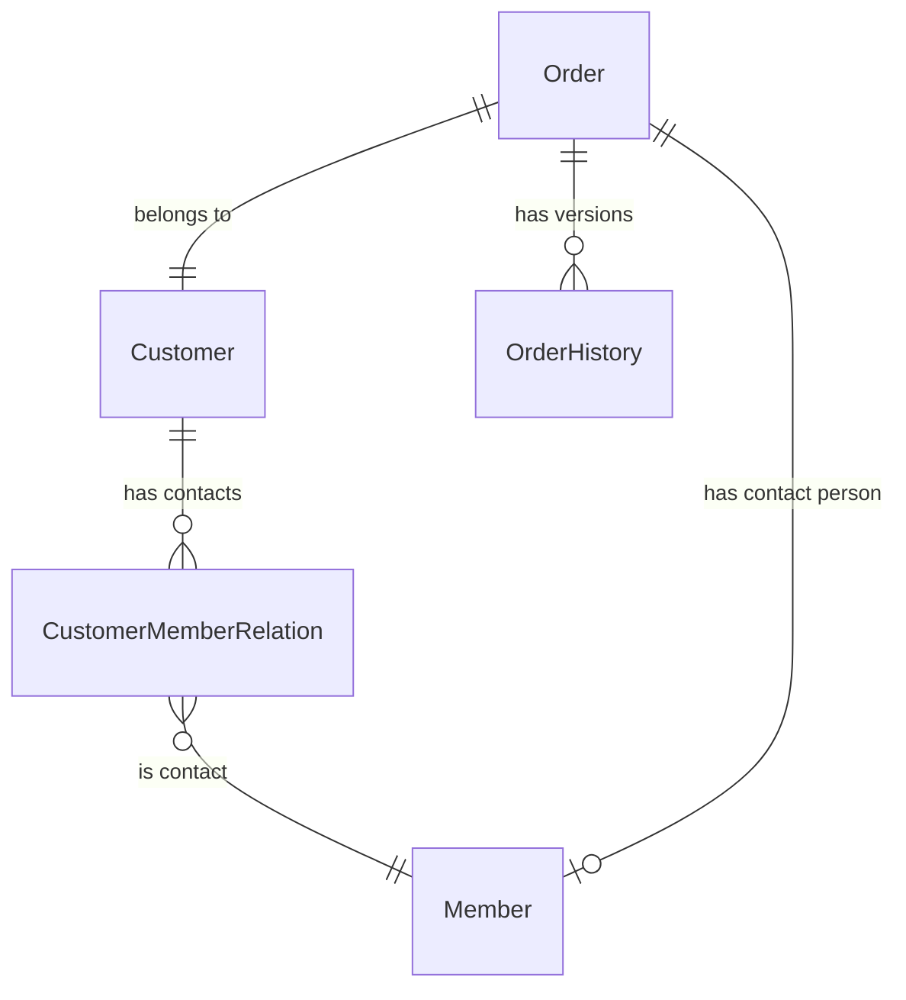

# 普全订单管理系统数据结构设计比较

本文档比较原始数据结构设计和更新后的设计之间的差异，重点关注使用现有系统模型替代原设计中实体的调整。

## 1. 核心实体对比

| 原始设计 | 更新后设计 | 说明 |
|---------|-----------|------|
| Person（人员） | Member（成员） | 使用现有的 Member 模型替代原设计中的 Person 实体 |
| Customer（客户） | Customer（客户） | 直接使用现有的 Customer 模型，无需修改 |
| Order（订单） | Order（订单） | 保持原设计，但继承 BaseModel 以获得租户隔离和软删除功能 |
| OrderHistory（订单历史） | OrderHistory（订单历史） | 基本保持原设计，调整关联关系 |

## 2. 实体关系对比

### 2.1 原始设计的实体关系



### 2.2 更新后的实体关系



## 3. 主要变更详情

### 3.1 Person 替换为 Member

#### 原始设计（Person）：
```
Person实体是一个统一的人员模型，通过角色关联区分不同身份（客户联系人等）。

属性：
- id: 唯一标识符
- name: 姓名
- contact_number: 联系电话
- email: 电子邮件
- wechat_id: 微信号
- address: 地址
- created_at: 创建时间
- updated_at: 更新时间

角色：
- 客户联系人
- 客服人员
- 系统管理员
```

#### 更新后设计（Member）：
```
使用现有系统中的 Member 模型，替代原设计中的 Person 实体。Member 模型继承自 BaseUserModel，具有用户认证和基本信息功能。

主要属性：
- id: 唯一标识符
- username: 用户名
- email: 电子邮件
- phone: 联系电话
- nick_name: 昵称
- first_name: 名
- last_name: 姓
- avatar: 头像
- tenant: 所属租户
- parent: 父账号（用于子账号功能）
- is_active: 是否激活
- status: 状态（活跃/暂停/未激活）
- is_deleted: 是否删除
- date_joined: 注册时间
- last_login: 最后登录时间
- last_login_ip: 最后登录IP

与客户的关系：
通过 CustomerMemberRelation 中间表与 Customer 建立多对多关系
```

### 3.2 Customer 模型保持不变

原始设计中的 Customer 模型与现有系统中的 Customer 模型基本一致，因此直接使用现有模型，无需修改。

### 3.3 Order 模型调整

#### 主要调整：

1. **继承 BaseModel**：
   - 获得租户隔离功能（tenant 外键）
   - 获得软删除功能（is_deleted 字段）
   - 获得创建和更新时间记录（created_at, updated_at 字段）

2. **关联关系调整**：
   - 将 contact_person 外键指向 Member 模型，而非原设计中的 Person
   - 使用 PROTECT 保护策略防止删除客户导致订单丢失
   - 使用 SET_NULL 策略允许联系人被删除而不影响订单

3. **添加审计字段**：
   - created_by: 创建人（外键，指向 User）
   - updated_by: 更新人（外键，指向 User）

### 3.4 OrderHistory 模型调整

#### 主要调整：

1. **关联关系调整**：
   - modified_by 外键指向 User 模型，而非原设计中的 Person

2. **添加字段**：
   - reason: 修改原因（便于记录修改目的）

## 4. 数据模型设计理念对比

### 4.1 原始设计理念

1. 独立的 Person 实体，通过角色关联区分不同身份
2. 简化的数据模型，将服务类型、语种等信息整合到 Order 表中
3. 通过 OrderHistory 表实现订单版本控制

### 4.2 更新后设计理念

1. 利用现有系统中的 Member 模型替代 Person 实体
2. 通过 CustomerMemberRelation 中间表实现客户与联系人的多对多关系
3. 继承 BaseModel 获得租户隔离和软删除功能
4. 保持简化的数据模型和版本控制设计

## 5. 实现优势

### 5.1 系统集成优势

1. **减少重复代码**：
   - 避免创建与现有 Member 模型功能重复的 Person 实体
   - 复用现有的用户认证和权限管理系统

2. **数据一致性**：
   - 客户联系人直接使用 Member 系统，保持用户数据的一致性
   - 避免在不同系统间同步用户信息的复杂性

3. **功能扩展**：
   - 利用 Member 模型的子账号功能，为客户联系人提供更丰富的功能
   - 利用现有的租户隔离机制，确保订单数据的安全隔离

### 5.2 开发效率优势

1. **减少开发工作量**：
   - 无需开发新的用户实体和认证系统
   - 可以直接使用现有的用户管理界面和API

2. **简化数据库设计**：
   - 减少数据库表的数量
   - 简化数据库关系，降低查询复杂度

3. **代码复用**：
   - 复用现有的模型方法和工具函数
   - 保持系统架构的一致性

## 6. 结论

更新后的设计通过利用现有系统中的 Member 和 Customer 模型，实现了与原始设计相同的功能需求，同时提高了系统集成度和开发效率。主要变更集中在将 Person 替换为 Member，并调整相关的关联关系，使订单系统能够无缝集成到现有系统架构中。

这种设计方案既保留了原始设计中简化数据模型和版本控制的优点，又充分利用了现有系统的功能和架构，是一种更加实用和高效的实现方案。 