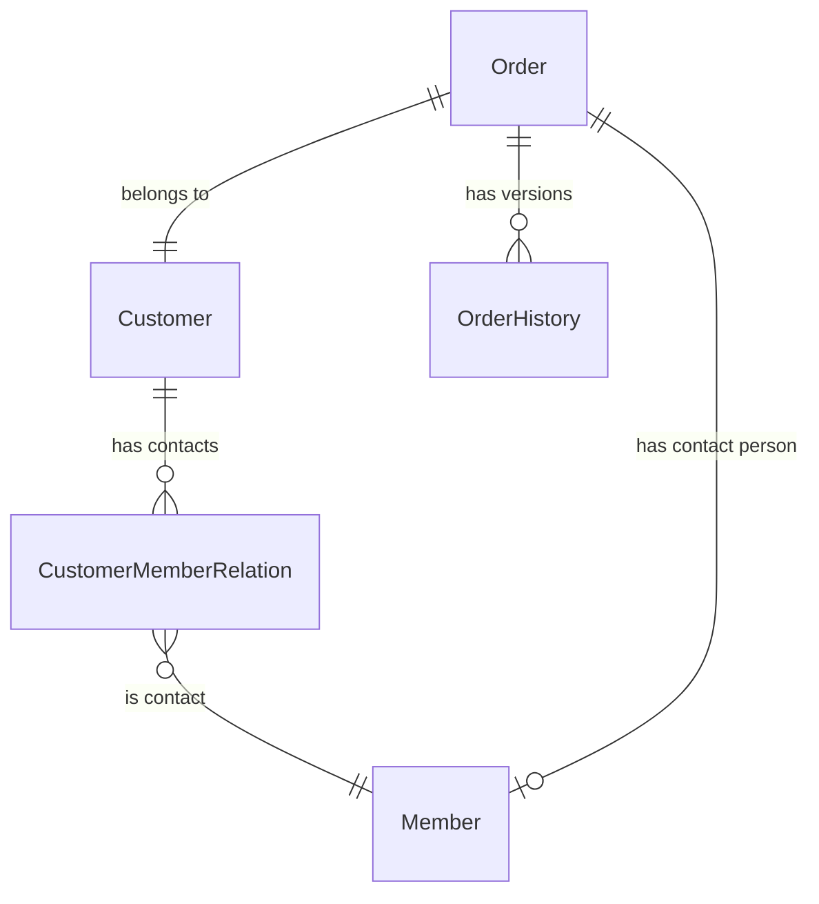

# 普全订单管理系统实现分析文档

## 1. 概述

本文档分析如何基于现有项目结构实现订单管理系统，主要关注将订单系统与现有的 Member 和 Customer 模型集成的可行性，以及需要对数据结构设计做出的调整。

## 2. 现有系统分析

### 2.1 Member 模型分析

当前系统中的 Member 模型用于表示普通成员用户，主要特点：

1. 继承自 BaseUserModel，具有用户认证和基本信息功能
2. 包含租户关联，支持多租户隔离
3. 支持子账号功能（通过 parent 字段自关联）
4. 具有软删除、状态管理等特性

Member 模型可以替代原设计中的 Person 实体，作为客户联系人和系统用户。

### 2.2 Customer 模型分析

Customer 模型用于表示客户实体，主要特点：

1. 包含丰富的客户信息字段（名称、类型、价值等级等）
2. 支持软删除
3. 通过 CustomerMemberRelation 与 Member 建立多对多关系
4. 通过 CustomerTenantRelation 与 Tenant 建立多对多关系

Customer 模型可以直接用于订单系统中的客户实体。

### 2.3 BaseModel 分析

项目中的 BaseModel 提供了以下共通功能：

1. 租户隔离（tenant 外键）
2. 创建和更新时间记录
3. 软删除支持
4. 租户过滤的默认管理器

订单相关模型应继承 BaseModel 以获得这些共通功能。

## 3. 订单系统实现方案

### 3.1 模型结构调整

基于现有系统和订单需求，建议做以下调整：

1. **替换 Person 为 Member**：
   - 使用现有的 Member 模型替代原设计中的 Person 实体
   - 通过 CustomerMemberRelation 已有的关联关系实现客户与联系人的关联

2. **保留 Customer**：
   - 直接使用现有的 Customer 模型，无需修改

3. **新增 Order 和 OrderHistory**：
   - 创建 Order 模型，继承 BaseModel 以获得租户隔离和软删除功能
   - 创建 OrderHistory 模型，记录订单的修改历史

### 3.2 Order 模型设计

```python
class Order(BaseModel):
    """
    订单模型，记录翻译服务订单信息
    """
    # 基本信息
    order_number = models.CharField(_("订单编号"), max_length=50, unique=True)
    customer = models.ForeignKey(
        'customers.Customer',
        on_delete=models.PROTECT,  # 防止删除客户导致订单丢失
        related_name='orders',
        verbose_name=_("客户")
    )
    contact_person = models.ForeignKey(
        'users.Member',
        on_delete=models.SET_NULL,
        null=True,
        blank=True,
        related_name='contact_orders',
        verbose_name=_("客户联系人")
    )
    customer_service_info = models.CharField(_("客服人员信息"), max_length=255, blank=True, null=True)
    translator_name = models.CharField(_("翻译人员姓名"), max_length=100, blank=True, null=True)
    status = models.CharField(
        _("订单状态"),
        max_length=20,
        choices=[
            ('new', '新建'),
            ('in_progress', '进行中'),
            ('completed', '已完成'),
            ('cancelled', '已取消'),
            ('pending_payment', '待支付'),
        ],
        default='new'
    )
    
    # 项目时间信息
    project_start_time = models.DateTimeField(_("项目开始时间"), blank=True, null=True)
    project_end_time = models.DateTimeField(_("项目完成时间"), blank=True, null=True)
    service_location = models.CharField(_("服务地点"), max_length=255, blank=True, null=True)
    
    # 服务和语种信息
    service_type = models.CharField(_("服务类型"), max_length=50)  # 口译/笔译/同传等
    service_language = models.CharField(_("服务语种"), max_length=100)  # 可存储多语种，如"英译中,日译中"
    translation_details = models.TextField(_("翻译明细"), blank=True, null=True)
    
    # 费用相关信息
    client_count = models.CharField(_("客户数量"), max_length=50, blank=True, null=True)  # 字符串格式，用户自己填写
    client_unit_price = models.CharField(_("客户单价"), max_length=50, blank=True, null=True)  # 字符串格式
    translator_count = models.CharField(_("翻译数量"), max_length=50, blank=True, null=True)  # 字符串格式
    translator_unit_price = models.CharField(_("翻译单价"), max_length=50, blank=True, null=True)  # 字符串格式
    total_amount = models.DecimalField(_("成交额"), max_digits=12, decimal_places=2, default=0)
    translator_cost = models.DecimalField(_("翻译师成本"), max_digits=12, decimal_places=2, default=0)
    refund_amount = models.DecimalField(_("退款金额"), max_digits=12, decimal_places=2, default=0)
    project_expense = models.DecimalField(_("项目费用"), max_digits=12, decimal_places=2, default=0)
    project_details = models.TextField(_("项目明细"), blank=True, null=True)
    
    # 支付信息
    payment_method = models.CharField(_("支付方式"), max_length=50, blank=True, null=True)  # 微信/支付宝/银行转账/现金等
    payment_status = models.CharField(
        _("支付状态"),
        max_length=20,
        choices=[
            ('unpaid', '未支付'),
            ('partial_paid', '部分支付'),
            ('paid', '已支付'),
        ],
        default='unpaid'
    )
    payment_time = models.DateTimeField(_("支付时间"), blank=True, null=True)
    transaction_id = models.CharField(_("交易编号"), max_length=100, blank=True, null=True)
    payment_platform = models.CharField(_("支付平台"), max_length=50, blank=True, null=True)
    payment_remarks = models.TextField(_("支付备注"), blank=True, null=True)
    
    # 发票和合同信息
    invoice_info = models.JSONField(_("发票信息"), blank=True, null=True)  # JSON格式，包含发票编号、抬头、金额等
    contract_info = models.JSONField(_("合同信息"), blank=True, null=True)  # JSON格式，包含合同编号、签署时间等
    
    # 其他信息
    remarks = models.TextField(_("备注"), blank=True, null=True)
    follow_up_status = models.CharField(_("回访情况"), max_length=100, blank=True, null=True)
    customer_satisfaction = models.FloatField(_("客户满意度"), blank=True, null=True)
    
    # 创建和更新人信息（BaseModel已有created_at和updated_at）
    created_by = models.ForeignKey(
        'users.User',
        on_delete=models.SET_NULL,
        null=True,
        related_name='created_orders',
        verbose_name=_("创建人")
    )
    updated_by = models.ForeignKey(
        'users.User',
        on_delete=models.SET_NULL,
        null=True,
        related_name='updated_orders',
        verbose_name=_("更新人")
    )
    
    class Meta:
        verbose_name = _('订单')
        verbose_name_plural = _('订单')
        db_table = 'order'
        ordering = ['-created_at']
        indexes = [
            models.Index(fields=['order_number']),
            models.Index(fields=['customer']),
            models.Index(fields=['status']),
            models.Index(fields=['payment_status']),
            models.Index(fields=['project_start_time']),
            models.Index(fields=['project_end_time']),
        ]
    
    def __str__(self):
        return f"{self.order_number} - {self.customer.name}"
    
    def save(self, *args, **kwargs):
        # 如果是新订单且没有订单编号，自动生成
        if not self.pk and not self.order_number:
            import datetime
            from django.utils.crypto import get_random_string
            date_str = datetime.datetime.now().strftime('%Y%m%d')
            random_str = get_random_string(length=6, allowed_chars='0123456789')
            self.order_number = f"ORD-{date_str}-{random_str}"
        
        # 计算毛利和毛利率
        self.calculate_profit()
        
        super().save(*args, **kwargs)
    
    def calculate_profit(self):
        """计算毛利和毛利率"""
        self.gross_profit = self.total_amount - self.translator_cost - self.project_expense
        if self.total_amount > 0:
            self.profit_margin = (self.gross_profit / self.total_amount) * 100
        else:
            self.profit_margin = 0
    
    @property
    def gross_profit(self):
        """获取毛利"""
        return self.total_amount - self.translator_cost - self.project_expense
    
    @property
    def profit_margin(self):
        """获取毛利率（百分比）"""
        if self.total_amount > 0:
            return (self.gross_profit / self.total_amount) * 100
        return 0
```

### 3.3 OrderHistory 模型设计

```python
class OrderHistory(models.Model):
    """
    订单历史记录，记录订单的每次修改
    """
    order = models.ForeignKey(
        'orders.Order',
        on_delete=models.CASCADE,
        related_name='history',
        verbose_name=_("订单")
    )
    modified_by = models.ForeignKey(
        'users.User',
        on_delete=models.SET_NULL,
        null=True,
        related_name='order_modifications',
        verbose_name=_("修改人")
    )
    modified_at = models.DateTimeField(_("修改时间"), auto_now_add=True)
    version = models.IntegerField(_("版本号"))
    change_details = models.JSONField(_("变更详情"), help_text=_("JSON格式，记录具体修改了哪些字段，从什么值改为什么值"))
    snapshot = models.JSONField(_("订单快照"), help_text=_("JSON格式，包含修改后订单的完整状态"))
    reason = models.TextField(_("修改原因"), blank=True, null=True)
    
    class Meta:
        verbose_name = _('订单历史')
        verbose_name_plural = _('订单历史')
        db_table = 'order_history'
        ordering = ['-version']
        indexes = [
            models.Index(fields=['order']),
            models.Index(fields=['modified_at']),
            models.Index(fields=['version']),
        ]
    
    def __str__(self):
        return f"{self.order.order_number} - 版本 {self.version}"
```

## 4. 数据关系调整

### 4.1 实体关系图（调整后）



### 4.2 关系说明

1. **Customer-Member 关系**：
   - 通过 CustomerMemberRelation 中间表建立多对多关系
   - 一个客户可以有多个联系人（Member）
   - 一个 Member 可以是多个客户的联系人

2. **Order-Customer 关系**：
   - 一个订单关联一个客户（多对一）
   - 使用 PROTECT 保护策略防止删除客户导致订单丢失

3. **Order-Member 关系**：
   - 一个订单可以指定一个客户联系人（Member）
   - 使用 SET_NULL 策略，允许联系人被删除而不影响订单

4. **Order-OrderHistory 关系**：
   - 一个订单有多个历史版本记录
   - 使用 CASCADE 策略，删除订单时同时删除其历史记录

## 5. 实现建议

### 5.1 创建新应用

建议创建一个新的 Django 应用 `orders` 来实现订单系统：

```bash
python manage.py startapp orders
```

### 5.2 添加应用到 INSTALLED_APPS

在 `core/settings.py` 中添加新应用：

```python
INSTALLED_APPS = [
    # ...现有应用...
    'orders',  # 新增订单应用
]
```

### 5.3 实现订单管理功能

按照 CRUD 操作实现订单管理功能：

1. **创建订单**：
   - 表单验证
   - 自动生成订单编号
   - 自动计算毛利和毛利率
   - 创建初始历史版本

2. **查询订单**：
   - 多条件筛选
   - 分页显示
   - 排序功能

3. **更新订单**：
   - 表单验证
   - 创建新的历史版本
   - 记录变更详情

4. **删除订单**：
   - 软删除（标记删除）
   - 权限控制

5. **订单历史版本查看**：
   - 版本列表
   - 版本比较
   - 版本还原

## 6. 结论

基于现有的 Member 和 Customer 模型实现订单系统是完全可行的，主要需要：

1. 创建新的 Order 和 OrderHistory 模型
2. 利用现有的 Member 模型替代原设计中的 Person 实体
3. 直接使用现有的 Customer 模型
4. 确保新模型继承 BaseModel 以获得租户隔离和软删除等共通功能

这种实现方式可以很好地与现有系统集成，同时满足订单管理系统的需求。

## 7. 下一步工作

1. 创建 orders 应用
2. 实现模型定义
3. 创建序列化器和视图
4. 添加URL路由
5. 实现权限控制
6. 编写单元测试
7. 开发前端界面 