# 普全订单管理系统需求明细文档

## 1. 系统概述

普全订单管理系统是一个专为翻译服务业务设计的管理平台，旨在提供订单管理、客户管理和系统管理等核心功能。本系统将帮助翻译服务提供商高效管理订单流程、客户关系，并提供完整的数据追踪和分析能力。

## 2. 核心功能需求

### 2.1 订单管理（CRUD）

#### 2.1.1 订单创建

**功能描述**：
- 系统应允许管理员创建新订单，录入订单的所有必要信息
- 创建订单时应自动生成唯一的订单编号
- 创建订单时应记录创建时间

**详细需求**：
1. 创建订单表单应包含以下字段：
   - 客户信息（从客户列表中选择）
   - 客户联系人（从选定客户的联系人列表中选择）
   - 客服人员信息（手动输入）
   - 翻译人员姓名（手动输入）
   - 服务类型（如口译、笔译、同传等）
   - 服务语种（支持多语种输入，如"英译中,日译中"）
   - 项目开始和结束时间
   - 服务地点
   - 翻译明细
   - 费用相关信息：
     - 客户数量（自由文本，如"5000字"）
     - 客户单价（自由文本，如"0.8元/字"）
     - 翻译数量（自由文本）
     - 翻译单价（自由文本）
     - 成交额
     - 翻译师成本
     - 项目费用
     - 项目明细
   - 备注

2. 订单创建界面应具有以下功能：
   - 表单验证，确保必填字段已填写
   - 自动计算字段（如毛利=成交额-翻译师成本-项目费用）
   - 自动计算毛利率（毛利/成交额）
   - 保存为草稿功能
   - 提交创建功能

#### 2.1.2 订单查询

**功能描述**：
- 系统应提供多种方式查询和筛选订单
- 支持分页显示订单列表
- 支持订单详情查看

**详细需求**：
1. 订单列表页面应包含以下功能：
   - 按多种条件筛选：
     - 订单编号
     - 客户名称
     - 翻译人员
     - 服务类型
     - 服务语种
     - 订单状态
     - 创建日期范围
     - 项目时间范围
   - 排序功能：
     - 按创建时间
     - 按项目开始/结束时间
     - 按成交额
     - 按毛利率
   - 分页显示，可调整每页显示数量
   - 简要信息显示：订单号、客户、服务类型、状态、成交额等
   - 导出功能，支持导出为Excel格式

2. 订单详情页面应显示订单的所有信息，包括：
   - 基本信息
   - 服务信息
   - 费用信息
   - 支付信息
   - 发票信息（JSON格式展示为结构化数据）
   - 合同信息（JSON格式展示为结构化数据）
   - 订单历史版本列表

#### 2.1.3 订单更新

**功能描述**：
- 系统应允许管理员更新现有订单的信息
- 每次更新应创建新的订单历史记录
- 应明确显示哪些字段被修改

**详细需求**：
1. 订单编辑界面应包含以下功能：
   - 预填充当前订单信息
   - 允许修改除订单编号、创建时间外的所有字段
   - 表单验证
   - 自动重新计算相关字段（毛利、毛利率等）
   - 保存更新功能

2. 订单更新时应执行以下操作：
   - 记录修改人（当前登录用户）
   - 记录修改时间
   - 生成新的版本号
   - 创建变更详情记录，包含修改前后的值
   - 创建完整的订单快照

#### 2.1.4 订单删除

**功能描述**：
- 系统应允许管理员删除不需要的订单
- 删除应支持软删除（标记删除）和彻底删除两种方式

**详细需求**：
1. 订单删除功能应包含：
   - 删除确认对话框，说明删除后果
   - 软删除选项（默认），仅标记订单为已删除状态，不显示在常规列表中
   - 彻底删除选项（需要更高权限），从数据库中完全移除订单记录
   - 批量删除功能，可同时删除多个选中订单

2. 删除保护机制：
   - 已完成且已支付的订单不允许彻底删除
   - 删除操作应记录在系统日志中

#### 2.1.5 订单版本查看

**功能描述**：
- 系统应允许查看订单的所有历史版本
- 应支持版本间的比较功能

**详细需求**：
1. 订单历史版本列表应显示：
   - 版本号
   - 修改时间
   - 修改人
   - 修改原因（如有）

2. 版本详情查看功能应包含：
   - 该版本的完整订单快照
   - 与上一版本的差异高亮显示
   - 变更详情列表，清晰显示修改的字段及前后值
   - 还原到此版本的选项（创建新版本，而非覆盖当前版本）

3. 版本比较功能：
   - 选择任意两个版本进行比较
   - 并排显示两个版本的内容
   - 差异高亮显示

### 2.2 客户管理

#### 2.2.1 客户创建

**功能描述**：
- 系统应允许管理员创建新客户记录
- 创建客户时可同时添加客户联系人

**详细需求**：
1. 客户创建表单应包含以下字段：
   - 客户名称
   - 客户类型（个人/公司）
   - 价值等级（普通/VIP等）
   - 创建时间（自动生成）

2. 客户创建界面应具有以下功能：
   - 表单验证
   - 检查重复客户名称
   - 保存创建功能

#### 2.2.2 客户查询

**功能描述**：
- 系统应提供多种方式查询和筛选客户
- 支持分页显示客户列表
- 支持客户详情查看

**详细需求**：
1. 客户列表页面应包含以下功能：
   - 按多种条件筛选：
     - 客户名称
     - 客户类型
     - 价值等级
     - 创建日期范围
   - 排序功能
   - 分页显示
   - 导出功能

2. 客户详情页面应显示：
   - 客户基本信息
   - 客户联系人列表
   - 该客户的订单历史列表
   - 客户统计信息（总订单数、总成交额等）

#### 2.2.3 客户更新

**功能描述**：
- 系统应允许管理员更新客户信息
- 更新应记录修改历史

**详细需求**：
1. 客户编辑界面应包含：
   - 预填充当前客户信息
   - 表单验证
   - 保存更新功能

2. 客户更新时应记录：
   - 修改人
   - 修改时间
   - 修改内容

#### 2.2.4 客户删除

**功能描述**：
- 系统应允许管理员删除不需要的客户记录
- 删除应考虑关联数据的处理

**详细需求**：
1. 客户删除功能应包含：
   - 删除确认对话框
   - 关联数据处理选项：
     - 级联删除（同时删除关联的联系人和订单）
     - 保留订单（删除客户和联系人，但保留订单记录）
     - 仅标记删除（软删除）

2. 删除保护机制：
   - 有未完成订单的客户不允许彻底删除
   - 删除操作应记录在系统日志中

#### 2.2.5 客户联系人管理

**功能描述**：
- 系统应支持为客户添加多个联系人
- 应支持联系人的CRUD操作

**详细需求**：
1. 联系人创建功能：
   - 在客户详情页内添加
   - 包含字段：姓名、联系电话、电子邮件、微信号、地址等
   - 表单验证

2. 联系人列表功能：
   - 在客户详情页显示所有联系人
   - 支持排序和筛选

3. 联系人编辑功能：
   - 修改联系人信息
   - 记录修改历史

4. 联系人删除功能：
   - 删除确认
   - 检查是否有关联订单使用该联系人

### 2.3 管理员登录与权限管理

#### 2.3.1 管理员登录

**功能描述**：
- 系统应提供安全的管理员登录功能
- 支持多种登录验证方式

**详细需求**：
1. 登录页面应包含：
   - 用户名/邮箱输入框
   - 密码输入框（加密显示）
   - 记住我选项
   - 验证码（可选）
   - 登录按钮
   - 忘记密码链接

2. 登录功能应包含：
   - 输入验证
   - 账户锁定机制（多次失败后）
   - 登录日志记录
   - 成功登录后重定向到主页面

#### 2.3.2 管理员账户管理

**功能描述**：
- 系统应支持创建和管理多个管理员账户

**详细需求**：
1. 管理员创建功能：
   - 已有管理员可创建新管理员
   - 设置用户名、初始密码等
   - 发送账户激活邮件

2. 管理员列表功能：
   - 显示所有管理员账户
   - 显示账户状态（活跃/锁定）
   - 支持筛选和排序

3. 管理员编辑功能：
   - 修改基本信息
   - 重置密码
   - 锁定/解锁账户

4. 管理员删除功能：
   - 删除确认
   - 记录删除操作

### 2.4 订单导入导出

#### 2.4.1 订单导入

**功能描述**：
- 系统应支持批量导入订单数据
- 导入过程应包含数据验证和错误处理

**详细需求**：
1. 导入功能应包含：
   - 支持Excel格式的订单数据导入
   - 提供导入模板下载
   - 数据验证机制，确保导入数据符合系统要求
   - 错误报告，显示导入失败的记录及原因
   - 导入预览功能，允许用户在确认前查看将要导入的数据

2. 导入流程：
   - 上传Excel文件
   - 系统解析并验证数据
   - 显示预览和验证结果
   - 用户确认导入
   - 系统执行导入并显示结果摘要

3. 导入数据处理：
   - 支持新增订单导入
   - 支持已有订单更新（通过订单编号匹配）
   - 导入时自动生成必要的关联数据（如客户不存在时可选择创建新客户）

#### 2.4.2 订单导出

**功能描述**：
- 系统应支持将订单数据导出为多种格式
- 导出应支持自定义字段和筛选条件

**详细需求**：
1. 导出功能应包含：
   - 支持导出为Excel格式
   - 支持导出为PDF格式
   - 支持导出为CSV格式
   - 自定义导出字段选择
   - 基于当前筛选条件导出

2. 导出选项：
   - 选择导出全部数据或仅当前页
   - 选择是否包含订单历史版本
   - 选择是否包含详细的费用信息
   - 设置导出文件名

3. 批量导出：
   - 支持选择多个订单进行导出
   - 支持大数据量导出（后台处理并提供下载链接）
   - 导出任务进度显示

### 2.5 订单提醒功能

#### 2.5.1 项目开始提醒

**功能描述**：
- 系统应能在订单项目开始前自动提醒相关人员
- 提醒应通过多种渠道发送，确保及时接收

**详细需求**：
1. 提醒时间设置：
   - 默认提前3天提醒
   - 支持自定义提醒时间（提前1-7天）
   - 支持设置多次提醒（如提前3天和提前1天各提醒一次）

2. 提醒内容：
   - 订单编号和基本信息
   - 项目开始时间
   - 服务类型和语种
   - 客户信息
   - 相关联系人信息
   - 直达订单详情的链接

3. 提醒方式：
   - 系统内部消息通知
   - 邮件通知
   - 短信通知（可选）
   - 微信/钉钉等第三方平台通知（可选）

4. 提醒对象：
   - 订单负责人
   - 客服人员
   - 翻译人员
   - 可自定义添加其他接收人

#### 2.5.2 项目截止提醒

**功能描述**：
- 系统应能在订单项目截止前提醒相关人员
- 防止项目逾期，确保按时交付

**详细需求**：
1. 提醒时间设置：
   - 默认提前2天提醒
   - 支持自定义提醒时间
   - 支持设置多次提醒

2. 提醒内容：
   - 订单基本信息
   - 项目截止时间
   - 当前项目状态
   - 直达订单详情的链接

3. 提醒方式：
   - 同项目开始提醒

4. 提醒对象：
   - 同项目开始提醒

#### 2.5.3 提醒管理

**功能描述**：
- 系统应提供提醒管理功能
- 用户可查看、设置和关闭提醒

**详细需求**：
1. 提醒设置：
   - 全局提醒设置（适用于所有订单）
   - 单个订单的自定义提醒设置
   - 提醒模板管理

2. 提醒历史：
   - 记录所有已发送的提醒
   - 提醒状态跟踪（已发送/已读/已处理）
   - 提醒统计报告

3. 提醒控制：
   - 启用/禁用特定类型的提醒
   - 暂停提醒功能
   - 提醒频率控制，避免过多打扰

4. 提醒界面：
   - 系统顶部通知栏显示未读提醒数量
   - 提醒中心页面，集中展示和管理所有提醒
   - 提醒详情查看和批量操作

## 3. 非功能需求

### 3.1 性能需求

1. 响应时间：
   - 页面加载时间不超过2秒
   - 数据提交响应时间不超过1秒
   - 复杂查询响应时间不超过3秒

2. 并发处理：
   - 系统应支持至少50个用户同时在线操作
   - 高峰期系统性能不应明显下降

3. 数据处理能力：
   - 支持每日至少1000条订单记录的处理
   - 支持至少10万条历史订单记录的存储和查询

### 3.2 安全需求

1. 身份验证：
   - 强密码策略（长度、复杂度要求）
   - 定期密码更换提醒
   - 多因素认证支持（可选）

2. 数据安全：
   - 敏感数据加密存储
   - 数据传输加密（HTTPS）
   - 防SQL注入和XSS攻击

3. 访问控制：
   - 基于角色的访问控制
   - 操作日志记录
   - 敏感操作二次确认

### 3.3 可用性需求

1. 系统可用性：
   - 系统可用时间不低于99.5%
   - 计划内维护时间应提前通知用户

2. 备份恢复：
   - 每日自动备份数据
   - 支持数据恢复功能
   - 恢复点目标（RPO）不超过24小时

3. 用户体验：
   - 直观的用户界面
   - 响应式设计，支持不同设备访问
   - 操作引导和帮助文档

### 3.4 可维护性需求

1. 系统监控：
   - 性能监控
   - 错误日志记录
   - 用户操作审计

2. 系统配置：
   - 可配置的系统参数
   - 支持热更新配置

3. 代码质量：
   - 模块化设计
   - 代码注释完善
   - 单元测试覆盖率不低于80%

## 4. 系统界面需求

### 4.1 总体界面风格

1. 设计风格：
   - 简洁现代的界面设计
   - 一致的色彩方案和布局
   - 响应式设计，适配不同屏幕尺寸

2. 导航结构：
   - 顶部导航栏（主要功能区）
   - 侧边栏（详细功能菜单）
   - 面包屑导航（当前位置指示）

### 4.2 主要界面描述

1. 登录页面：
   - 简洁的登录表单
   - 品牌标识和背景
   - 错误提示区域

2. 仪表盘/首页：
   - 关键数据摘要（今日订单数、待处理订单等）
   - 图表展示（订单趋势、收入统计等）
   - 快捷操作区（创建订单、查找客户等）

3. 订单管理页面：
   - 筛选和搜索区域
   - 订单列表（表格形式）
   - 批量操作工具栏
   - 分页控件

4. 订单详情页面：
   - 分区显示不同类别信息
   - 编辑和操作按钮
   - 历史版本列表
   - 相关联系人信息

5. 客户管理页面：
   - 客户列表（表格或卡片形式）
   - 筛选和搜索区域
   - 客户分类标签
   - 快速操作按钮

6. 客户详情页面：
   - 客户基本信息区
   - 联系人列表区
   - 订单历史列表
   - 编辑和操作按钮

## 5. 数据需求

### 5.1 数据量估计

1. 订单数据：
   - 日均新增订单：约50条
   - 年均订单量：约1.5万条
   - 5年数据规模：约7.5万条订单记录

2. 客户数据：
   - 估计客户数量：约1000个
   - 平均每客户联系人数：2-3人
   - 总联系人数据量：约2000-3000条

3. 订单历史版本：
   - 平均每订单修改次数：3次
   - 订单历史记录总量：约22.5万条（5年）

### 5.2 数据备份要求

1. 备份频率：
   - 完整备份：每周一次
   - 增量备份：每日一次

2. 备份内容：
   - 数据库完整备份
   - 配置文件备份
   - 上传的文件备份（发票、合同等）

3. 备份保留策略：
   - 每日备份保留7天
   - 每周备份保留4周
   - 每月备份保留12个月
   - 每年备份永久保留

## 6. 集成需求

### 6.1 外部系统集成

1. 支付系统集成：
   - 支持微信支付、支付宝等主流支付方式
   - 支付状态自动同步更新

2. 短信/邮件通知系统：
   - 订单状态变更通知
   - 客户回访提醒
   - 系统报警通知

3. 文件存储系统：
   - 发票、合同等文件的存储和管理
   - 支持文件预览和下载

### 6.2 数据导入导出

1. 数据导入功能：
   - 支持Excel格式的批量导入
   - 导入模板下载
   - 导入数据验证和错误报告

2. 数据导出功能：
   - 订单数据导出（Excel、PDF格式）
   - 客户数据导出
   - 自定义导出字段和筛选条件

## 7. 部署需求

### 7.1 环境需求

1. 服务器环境：
   - 操作系统：Linux（推荐Ubuntu Server LTS或CentOS）
   - Web服务器：Nginx或Apache
   - 数据库：MySQL 8.0或更高版本
   - 应用服务器：取决于开发技术栈

2. 客户端环境：
   - 支持主流浏览器：Chrome、Firefox、Edge、Safari最新版本
   - 最低屏幕分辨率：1366x768

### 7.2 部署方式

1. 推荐部署方式：
   - 应用服务器和数据库服务器分离
   - 使用容器化部署（Docker）
   - 负载均衡配置（可选）

2. 扩展性考虑：
   - 水平扩展能力
   - 数据库读写分离（可选）
   - CDN加速静态资源（可选）

## 8. 测试需求

### 8.1 测试类型

1. 功能测试：
   - 核心功能测试
   - 边界条件测试
   - 错误处理测试

2. 性能测试：
   - 负载测试
   - 压力测试
   - 并发测试

3. 安全测试：
   - 渗透测试
   - 漏洞扫描
   - 权限验证测试

4. 兼容性测试：
   - 浏览器兼容性测试
   - 设备兼容性测试

### 8.2 测试环境

1. 测试环境配置：
   - 开发环境
   - 测试环境
   - 预生产环境
   - 生产环境

2. 测试数据：
   - 模拟数据生成
   - 数据脱敏处理
   - 测试数据管理

## 9. 项目实施计划

### 9.1 开发阶段

1. 需求分析和设计：2周
   - 需求确认
   - 数据库设计
   - 界面原型设计

2. 核心功能开发：8周
   - 订单管理模块
   - 客户管理模块
   - 管理员登录模块

3. 系统集成和测试：4周
   - 功能集成
   - 系统测试
   - 问题修复

4. 部署和上线：2周
   - 环境准备
   - 系统部署
   - 数据迁移
   - 上线验证

### 9.2 维护阶段

1. 系统稳定期：上线后1个月
   - 密切监控系统运行
   - 快速响应和解决问题
   - 收集用户反馈

2. 功能优化期：上线后2-6个月
   - 根据用户反馈优化功能
   - 性能调优
   - 小功能迭代

3. 版本迭代：每季度一次小版本更新，每年一次大版本更新

## 10. 附录

### 10.1 术语表

| 术语 | 定义 |
|------|------|
| CRUD | Create（创建）、Read（读取）、Update（更新）、Delete（删除）的缩写，指基本的数据操作功能 |
| 软删除 | 不实际从数据库中删除数据，而是通过标记字段表示该记录已被删除的技术 |
| 毛利 | 成交额减去直接成本（翻译师成本、项目费用等）后的余额 |
| 毛利率 | 毛利除以成交额的百分比，反映业务盈利能力 |
| 订单快照 | 订单在特定时间点的完整状态记录，用于历史追踪 |

### 10.2 数据结构参考

详见 [data_structure.md](data_structure.md) 文件，其中包含系统的详细数据结构设计。

### 10.3 系统界面线框图

#### 10.3.1 登录页面

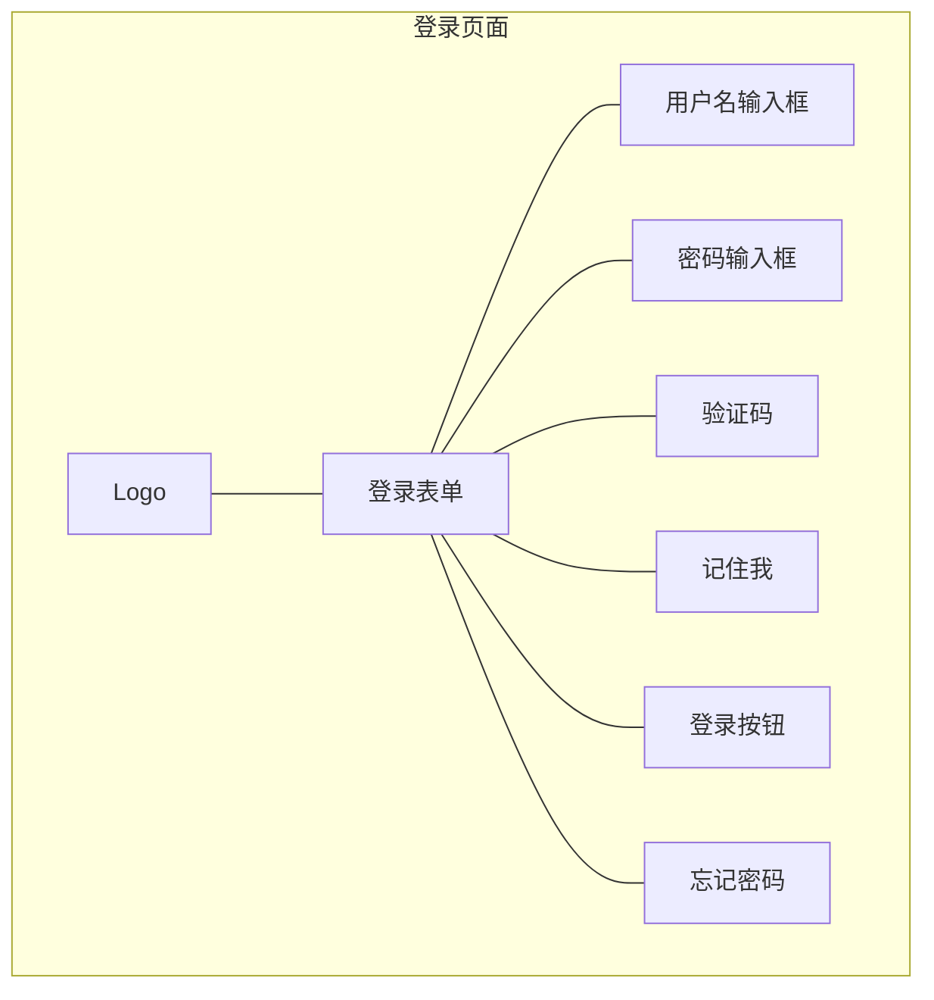

#### 10.3.2 系统主页/仪表盘

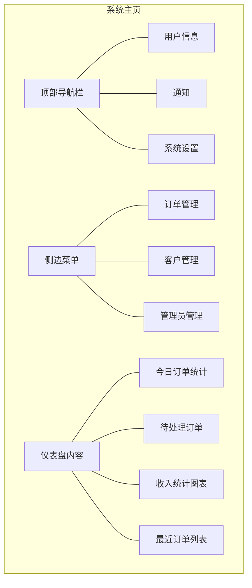

#### 10.3.3 订单管理页面

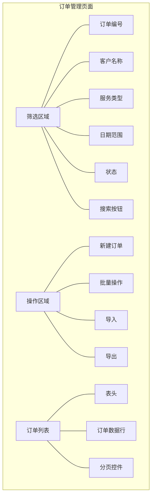

#### 10.3.4 订单详情页面

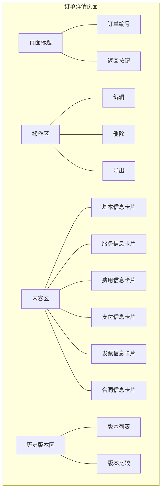

#### 10.3.5 订单创建/编辑页面

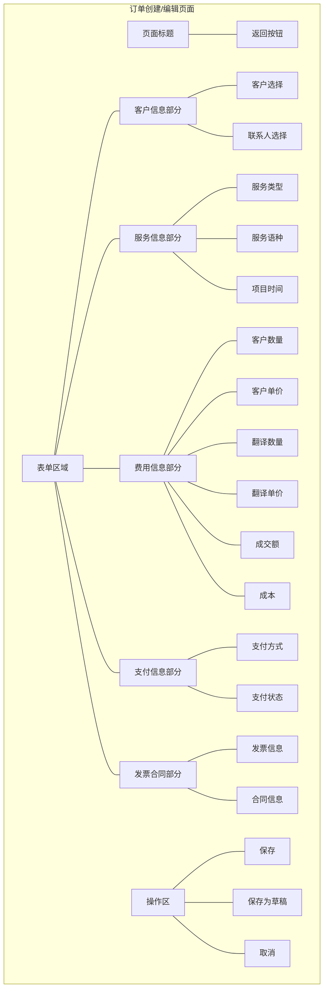

#### 10.3.6 客户管理页面

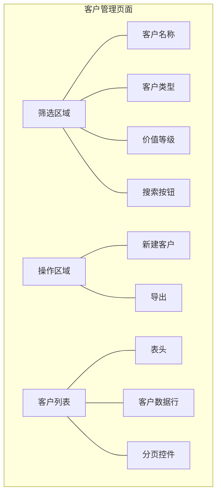

#### 10.3.7 客户详情页面

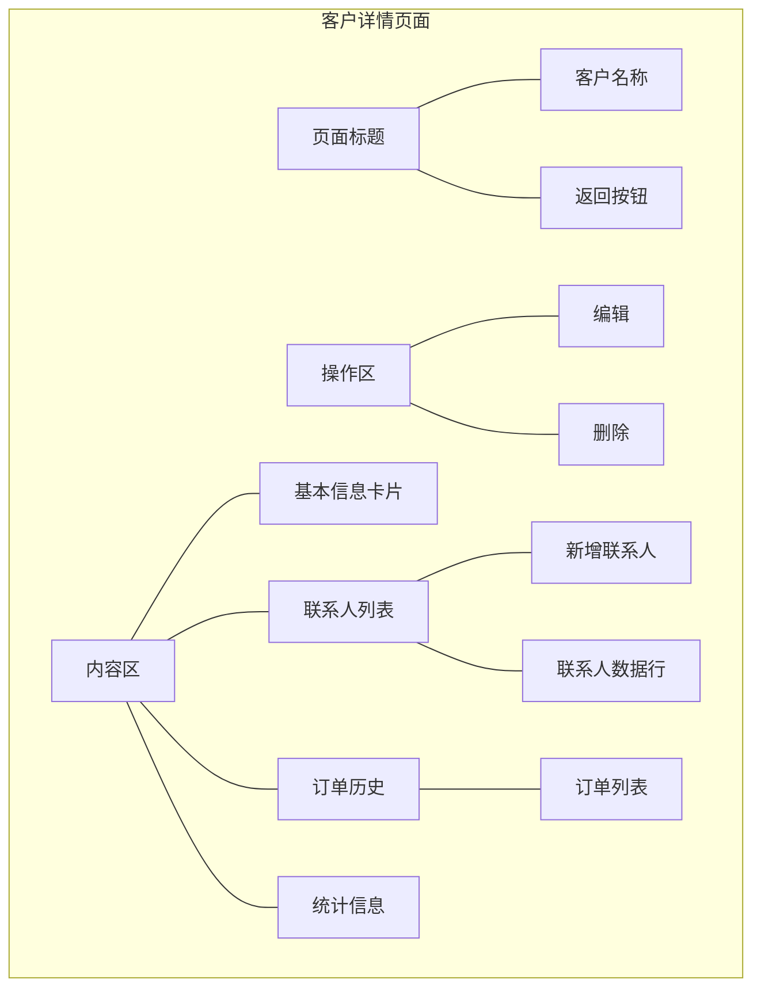

#### 10.3.8 订单导入页面

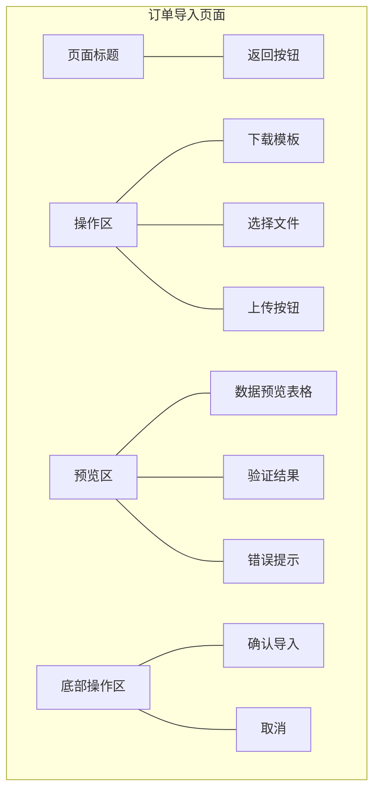

#### 10.3.9 订单导出页面

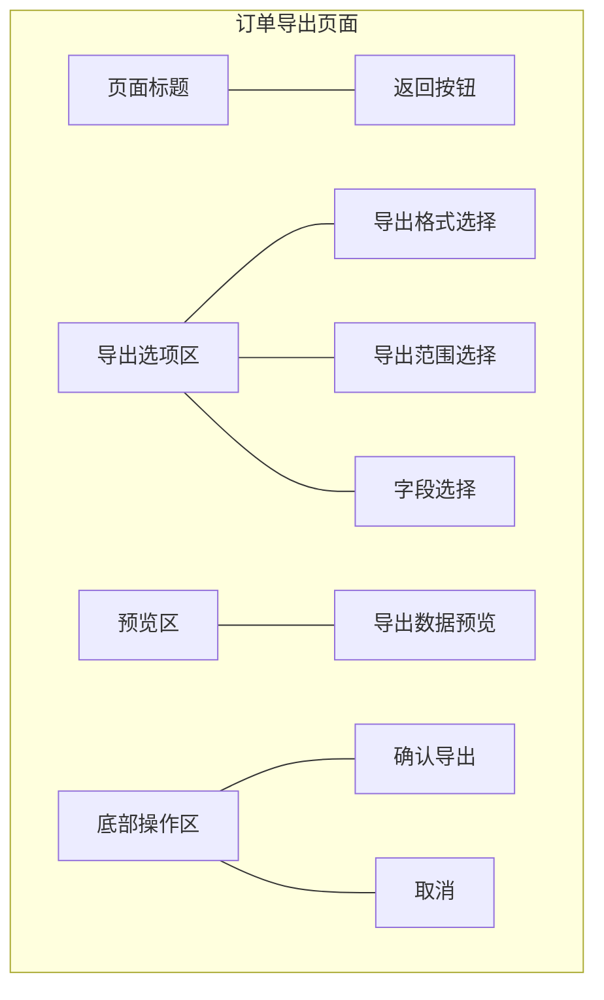

#### 10.3.10 订单历史版本比较页面

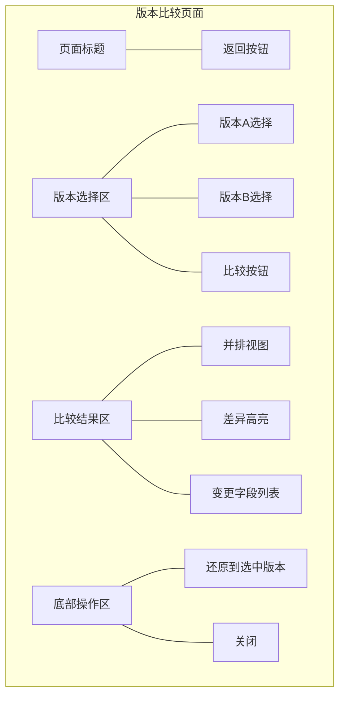

#### 10.3.11 提醒中心页面

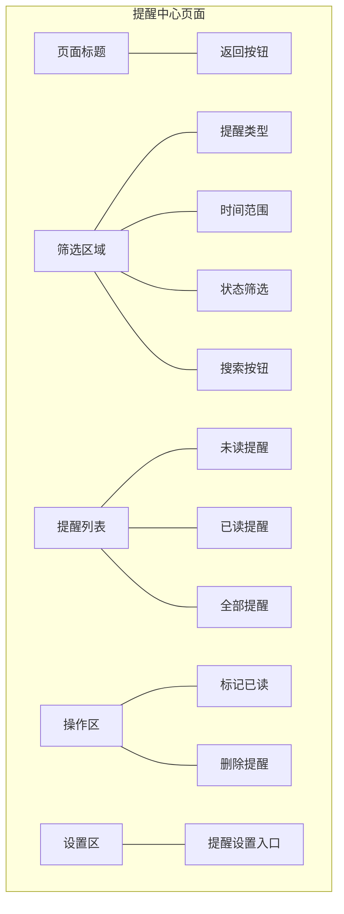

#### 10.3.12 提醒设置页面

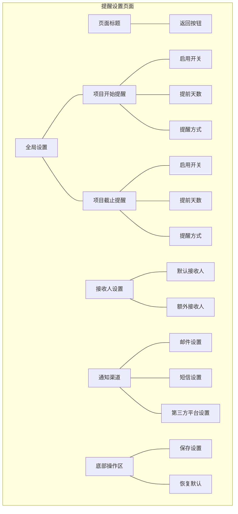