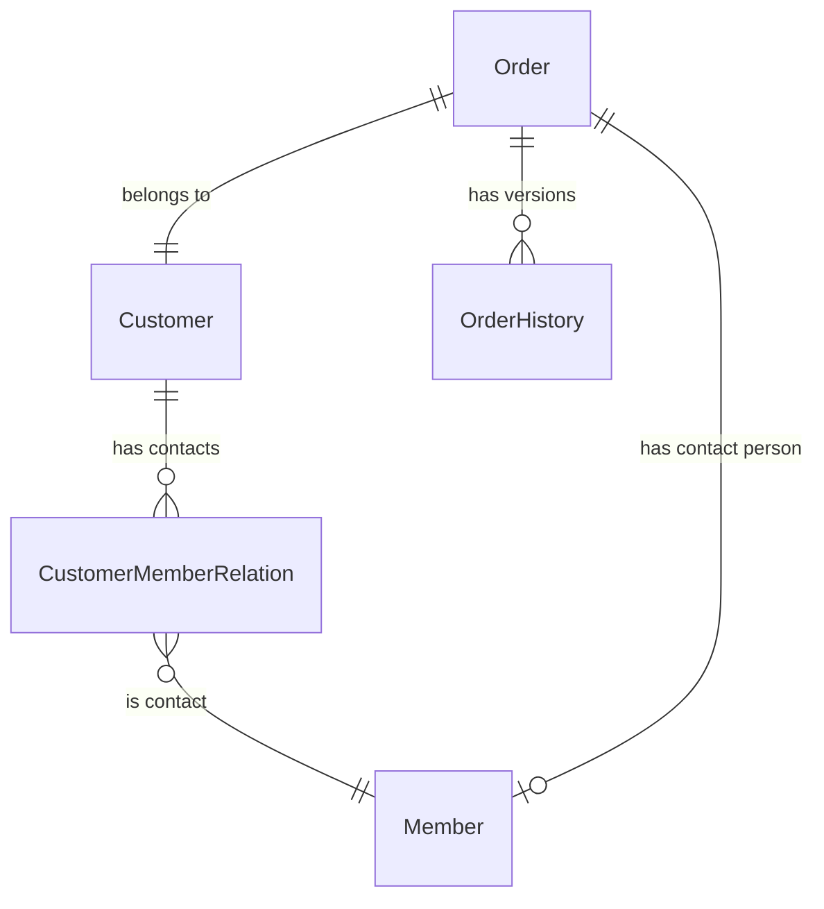
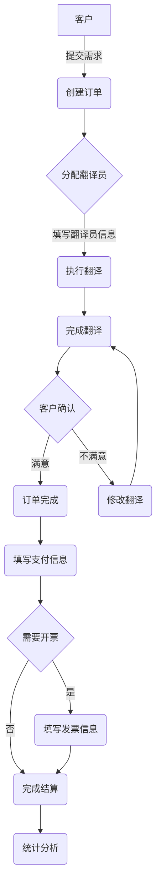

# 普全订单管理系统数据结构设计（更新版）

## 1. 数据结构概述

普全订单管理系统的数据结构设计基于对翻译服务业务流程的分析，考虑与现有系统的集成，主要包含以下几个核心实体：

- **Member（成员）**：替代原设计中的 Person 实体，利用现有的 Member 模型作为客户联系人
- **Customer（客户）**：使用现有的 Customer 模型，代表客户公司或组织
- **Order（订单）**：核心业务实体，包含订单的所有信息（包括服务类型、语种、支付记录、发票和翻译人员信息）
- **OrderHistory（订单历史）**：记录订单的修改历史

## 2. 实体关系图



## 3. 核心实体详细设计

### 3.1 Member（成员）

使用现有系统中的 Member 模型，替代原设计中的 Person 实体。Member 模型继承自 BaseUserModel，具有用户认证和基本信息功能。

#### 主要属性：
- id: 唯一标识符
- username: 用户名
- email: 电子邮件
- phone: 联系电话
- nick_name: 昵称
- first_name: 名
- last_name: 姓
- avatar: 头像
- tenant: 所属租户
- parent: 父账号（用于子账号功能）
- is_active: 是否激活
- status: 状态（活跃/暂停/未激活）
- is_deleted: 是否删除
- date_joined: 注册时间
- last_login: 最后登录时间
- last_login_ip: 最后登录IP

#### 与客户的关系：
通过 CustomerMemberRelation 中间表与 Customer 建立多对多关系，一个 Member 可以是多个客户的联系人。

### 3.2 Customer（客户）

使用现有系统中的 Customer 模型，代表客户公司或组织。

#### 主要属性：
- id: 唯一标识符
- name: 客户名称
- type: 客户类型（个人/公司/政府机构等）
- value_level: 价值等级（铂金/黄金/白银/青铜）
- status: 状态（活跃/非活跃/潜在/流失）
- business_license_number: 营业执照号
- tax_identification_number: 纳税人识别号
- registered_capital: 注册资本
- legal_representative: 法定代表人
- registered_address: 注册地址
- business_address: 经营地址
- business_scope: 经营范围
- industry_type: 行业类型
- company_size: 公司规模（微型/小型/中型/大型）
- establishment_date: 成立日期
- primary_contact_name: 主要联系人姓名
- primary_contact_phone: 主要联系人电话
- primary_contact_email: 主要联系人邮箱
- website: 公司网站
- bank_name: 开户银行
- bank_account: 银行账号
- credit_rating: 信用等级
- payment_terms: 付款条件
- special_requirements: 特殊要求
- notes: 备注信息
- source: 客户来源
- is_deleted: 是否删除
- created_at: 创建时间
- updated_at: 更新时间
- created_by: 创建者
- updated_by: 更新者

#### 与成员的关系：
通过 CustomerMemberRelation 中间表与 Member 建立多对多关系，一个客户可以有多个联系人。

### 3.3 Order（订单）

系统的核心实体，包含订单的完整信息，包括服务类型、语种、支付记录、发票和翻译人员信息。继承自 BaseModel，具有租户隔离和软删除功能。

#### 属性：
- id: 唯一标识符
- order_number: 订单编号
- customer: 关联客户（外键）
- contact_person: 客户联系人（外键，指向 Member）
- customer_service_info: 客服人员信息（字符串格式，可包含姓名、联系方式等）
- translator_name: 翻译人员姓名
- status: 订单状态（新建/进行中/已完成/已取消/待支付）
- created_at: 创建时间（继承自 BaseModel）
- updated_at: 更新时间（继承自 BaseModel）
- project_start_time: 项目开始时间
- project_end_time: 项目完成时间
- service_location: 服务地点

<!-- 服务和语种信息 -->
- service_type: 服务类型（口译/笔译/同传等）
- service_language: 服务语种（可存储多语种，如"英译中,日译中"）
- translation_details: 翻译明细

<!-- 费用相关信息 -->
- client_count: 客户数量（字符串格式，用户自己填写）
- client_unit_price: 客户单价（字符串格式）
- translator_count: 翻译数量（字符串格式）
- translator_unit_price: 翻译单价（字符串格式）
- total_amount: 成交额
- translator_cost: 翻译师成本
- refund_amount: 退款金额
- project_expense: 项目费用
- project_details: 项目明细
- gross_profit: 毛利（计算属性）
- profit_margin: 毛利率（计算属性）

<!-- 支付信息 -->
- payment_method: 支付方式（微信/支付宝/银行转账/现金等）
- payment_status: 支付状态（未支付/部分支付/已支付）
- payment_time: 支付时间
- transaction_id: 交易编号
- payment_platform: 支付平台
- payment_remarks: 支付备注

<!-- 发票和合同信息 -->
- invoice_info: 发票信息（JSON格式，包含发票编号、抬头、金额、类型、状态、开票时间等信息）
- contract_info: 合同信息（JSON格式，包含合同编号、签署时间、合同文件路径等信息）

<!-- 其他信息 -->
- remarks: 备注
- follow_up_status: 回访情况
- customer_satisfaction: 客户满意度
- tenant: 所属租户（继承自 BaseModel）
- is_deleted: 是否删除（继承自 BaseModel）
- created_by: 创建人
- updated_by: 更新人

### 3.4 OrderHistory（订单历史）

记录订单的每次修改历史。

#### 属性：
- id: 唯一标识符
- order: 关联订单（外键）
- modified_by: 修改人（外键，指向 User）
- modified_at: 修改时间
- version: 版本号
- change_details: 变更详情（JSON格式，记录具体修改了哪些字段，从什么值改为什么值）
- snapshot: 订单快照（JSON格式，包含修改后订单的完整状态）
- reason: 修改原因

## 4. 数据库表结构线框图

```mermaid
classDiagram
    class Member {
        +int id
        +string username
        +string email
        +string phone
        +string nick_name
        +string first_name
        +string last_name
        +string avatar
        +ForeignKey tenant
        +ForeignKey parent
        +bool is_active
        +string status
        +bool is_deleted
        +datetime date_joined
        +datetime last_login
        +string last_login_ip
    }
    
    class CustomerMemberRelation {
        +int id
        +ForeignKey customer
        +ForeignKey member
        +string role
        +bool is_primary
        +string remarks
        +datetime created_at
        +datetime updated_at
    }
    
    class Customer {
        +int id
        +string name
        +string type
        +string value_level
        +string status
        +string business_license_number
        +string tax_identification_number
        +string registered_capital
        +string legal_representative
        +string registered_address
        +string business_address
        +string business_scope
        +string industry_type
        +string company_size
        +date establishment_date
        +string primary_contact_name
        +string primary_contact_phone
        +string primary_contact_email
        +string website
        +string bank_name
        +string bank_account
        +string credit_rating
        +string payment_terms
        +string special_requirements
        +string notes
        +string source
        +bool is_deleted
        +datetime created_at
        +datetime updated_at
        +string created_by
        +string updated_by
    }
    
    class Order {
        +int id
        +string order_number
        +ForeignKey customer
        +ForeignKey contact_person
        +string customer_service_info
        +string translator_name
        +string status
        +datetime created_at
        +datetime updated_at
        +datetime project_start_time
        +datetime project_end_time
        +string service_location
        
        +string service_type
        +string service_language
        +string translation_details
        
        +string client_count
        +string client_unit_price
        +string translator_count
        +string translator_unit_price
        +decimal total_amount
        +decimal translator_cost
        +decimal refund_amount
        +decimal project_expense
        +string project_details
        
        +string payment_method
        +string payment_status
        +datetime payment_time
        +string transaction_id
        +string payment_platform
        +string payment_remarks
        
        +json invoice_info
        +json contract_info
        
        +string remarks
        +string follow_up_status
        +float customer_satisfaction
        
        +ForeignKey tenant
        +bool is_deleted
        +ForeignKey created_by
        +ForeignKey updated_by
    }
    
    class OrderHistory {
        +int id
        +ForeignKey order
        +ForeignKey modified_by
        +datetime modified_at
        +int version
        +json change_details
        +json snapshot
        +string reason
    }
    
    Customer "1" -- "n" CustomerMemberRelation
    CustomerMemberRelation "n" -- "1" Member
    Customer "1" -- "n" Order
    Member "1" -- "n" Order : contact_person
    Order "1" -- "n" OrderHistory
```



## 5. 数据流程图



## 6. 设计说明

### 6.1 与现有系统的集成

本设计充分利用现有系统中的模型和功能：

1. **使用 Member 替代 Person**：
   - 利用现有的 Member 模型作为客户联系人
   - 通过 CustomerMemberRelation 中间表实现客户与联系人的多对多关系
   - 避免重复创建类似功能的实体

2. **使用现有的 Customer 模型**：
   - 直接复用现有的客户实体及其丰富的属性
   - 保持客户数据的一致性

3. **继承 BaseModel**：
   - Order 模型继承 BaseModel，获得租户隔离和软删除功能
   - 确保订单系统与现有系统的架构保持一致

### 6.2 简化的数据模型

本系统采用了简化的数据模型，将服务类型、语种、支付记录、发票和翻译人员信息直接整合到Order表中。这种设计有以下优势：

1. **简化查询**：无需多表连接，直接从Order表获取所有相关信息
2. **适合单一订单场景**：当订单结构相对固定且简单时，这种设计更加高效
3. **减少数据库复杂度**：减少表的数量，简化数据库管理

### 6.3 订单历史版本控制

系统通过OrderHistory表实现订单的版本控制，每次修改订单时都会生成一个新的历史记录，包含：

1. 修改人和修改时间
2. 版本号
3. 变更详情（JSON格式，记录具体修改了哪些字段，从什么值改为什么值）
4. 订单快照（JSON格式，包含修改后订单的完整状态）

示例快照格式：
```json
{
  "id": 1001,
  "order_number": "ORD-20230615-001",
  "customer_id": 42,
  "contact_person_id": 105,
  "translator_name": "张三",
  "customer_service_info": "李四 (电话: 13800138000)",
  "service_type": "笔译",
  "service_language": "英译中",
  "client_count": "5000字",
  "client_unit_price": "0.8元/字",
  "translator_count": "5000字",
  "translator_unit_price": "0.5元/字",
  "total_amount": 3500.00,
  "payment_status": "已支付",
  "invoice_info": "{\"invoice_number\":\"INV-20230620-001\",\"invoice_title\":\"上海某某科技有限公司\",\"invoice_amount\":3500.00,\"invoice_type\":\"增值税专用发票\",\"invoice_status\":\"已开具\",\"invoice_time\":\"2023-06-20T15:30:00\"}",
  "contract_info": "{\"contract_number\":\"CT-20230615-001\",\"signed_date\":\"2023-06-15\",\"contract_file\":\"/files/contracts/CT-20230615-001.pdf\"}",
  ...
}
```

示例变更详情格式：
```json
{
  "changed_fields": [
    {
      "field": "status",
      "old_value": "进行中",
      "new_value": "已完成"
    },
    {
      "field": "invoice_info",
      "old_value": null,
      "new_value": "{\"invoice_number\":\"INV-20230620-001\",\"invoice_title\":\"上海某某科技有限公司\",\"invoice_amount\":3500.00,\"invoice_type\":\"增值税专用发票\",\"invoice_status\":\"已开具\",\"invoice_time\":\"2023-06-20T15:30:00\"}"
    }
  ],
  "reason": "项目完成并开具发票"
}
```

这种设计可以完整追踪订单的变更历史，支持版本回溯和审计需求。

## 7. 数据关系总结

1. 一个客户可以有多个联系人（通过 CustomerMemberRelation 中间表实现）
2. 一个订单关联一个客户，并指定特定的客户联系人（Member）
3. 订单包含所有相关信息（服务类型、语种、翻译人员、支付、发票等）
4. 订单的每次修改都会生成历史记录，包含完整快照和变更详情 