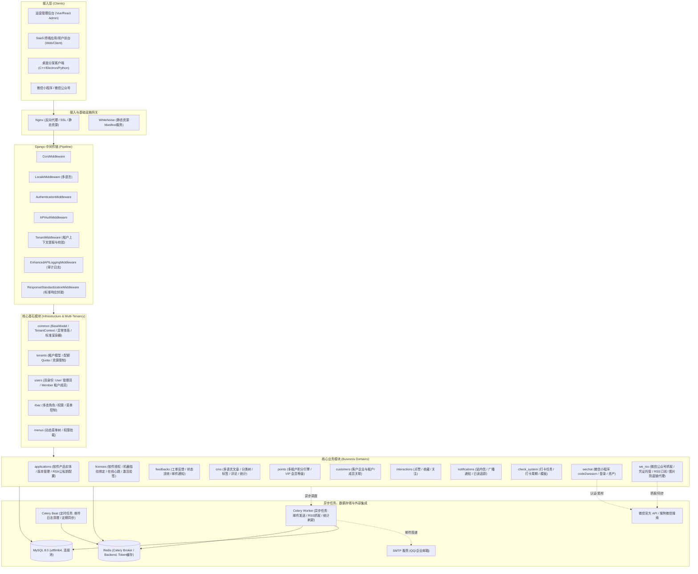
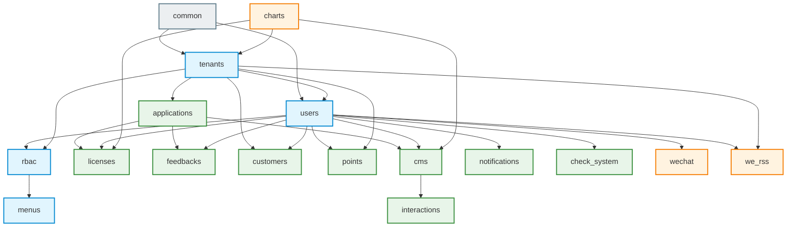
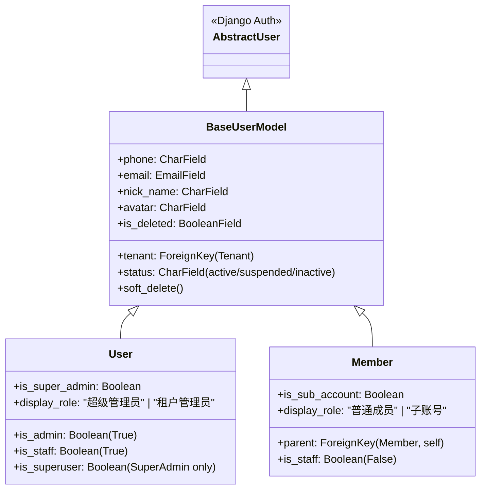
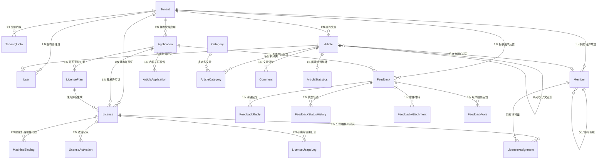
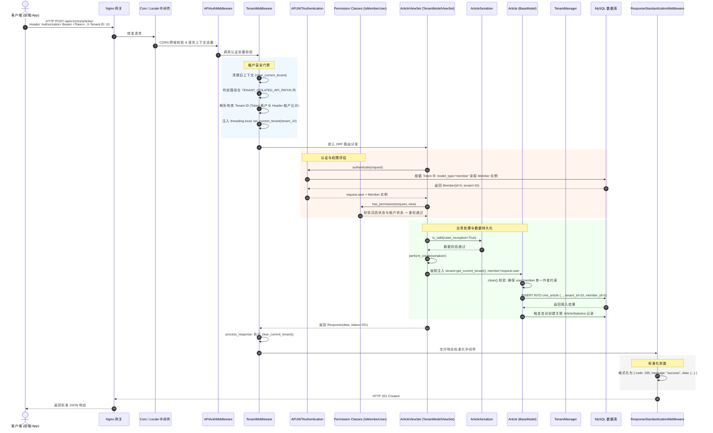
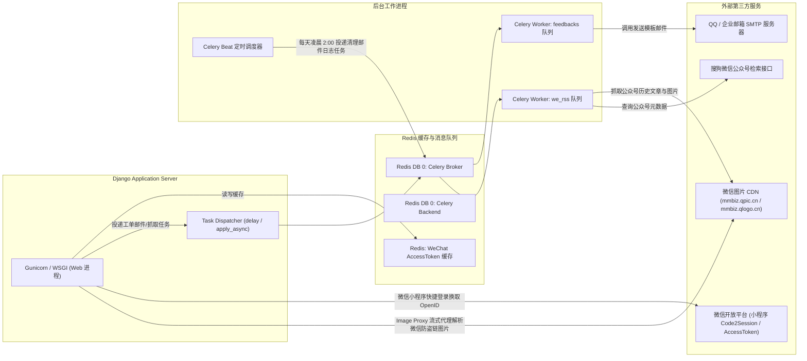

# 第一阶段：项目整体架构与系统地图分析

本项目是一套基于 **Django 6.0 + Django REST Framework (DRF)** 构建的**企业级多租户 SaaS 核心底座与应用管理平台**。系统支持“管理员端（运营/租户管理）”与“成员端（终端 SaaS 客户/终端用户）”双重身份体系，并深度集成了软件授权许可（Licenses）、用户反馈（Feedbacks）、多语言内容发布（CMS）、微信生态整合（WeChat / We-RSS）以及积分等级权益（Points）等业务。

---

## 1. 系统模块全景拓扑图（System Architecture Map）



---

## 2. 模块组成与依赖拓扑关系

项目共划分为 **16 个 App**，分属于 4 个架构层级：

| 架构层级 | App 列表 | 职责定位 |
| :--- | :--- | :--- |
| **框架与基础设施层** | `core`, `common` | 全局路由配置、WSGI/ASGI、环境变量、多租户上下文、全局日志、标准响应封装、统一分页与异常处理 |
| **租户与身份权限层** | `tenants`, `users`, `rbac`, `menus` | 租户注册与配额管理、双身份用户模型（User vs Member）、多态 RBAC 权限控制、前端动态菜单 |
| **核心商业化业务层** | `applications`, `licenses`, `feedbacks`, `customers`, `points` | 软件实体管理、机器指纹授权许可（支持在线/离线/租期/心跳）、工单反馈系统、客户CRM、积分与VIP等级系统 |
| **内容与扩展业务层** | `cms`, `interactions`, `notifications`, `check_system`, `charts`, `wechat`, `we_rss`, `docs_view` | 多语言内容管理、用户社交互动（点赞/收藏）、消息通知中心、打卡签到任务、可视化图表、微信生态集成 |

### 模块依赖关系拓扑图



---

## 3. 多租户隔离机制与权限体系剖析

### 3.1 多租户（Multi-Tenancy）底层设计

本项目采用**共享数据库、共享数据表、共享架构，通过租户字段（Tenant ID）进行逻辑隔离**的模式，并在模型层、查询管理器层、中间件层以及 ViewSet 层构筑了四重安全防线：

```mermaid
flowchart TD
    Req[客户端 HTTP 请求] --> M1[TenantMiddleware 租户中间件]
    
    subgraph TenantMiddlewareFlow [TenantMiddleware 校验与解析]
        CheckPath{路径是否属于<br>TENANT_ISOLATED_API_PATHS ?}
        CheckPath -- 否 --> PassMW[跳过租户校验]
        CheckPath -- 是 --> IsPublic{是否在公开白名单<br>TENANT_PUBLIC_API_PATHS ?}
        IsPublic -- 是 --> PassMW
        IsPublic -- 否 --> Resolve[TenantIdResolver 解析租户ID]
        
        Resolve --> RuleMatch{请求身份解析}
        RuleMatch -- SuperAdmin --> SuperAdminCheck[允许无头或指定租户]
        RuleMatch -- TenantAdmin --> TenantAdminCheck[严格强制必须为其自身租户，禁止随意跨租户]
        RuleMatch -- Member --> MemberCheck[校验 Token 中的租户与 Header X-Tenant-ID 一致]
        RuleMatch -- Anonymous GET --> AnonCheck[必须携带合法且活跃的 X-Tenant-ID]
        
        SuperAdminCheck --> SetContext[set_current_tenant: 注入线程局部变量 threading.local]
        TenantAdminCheck --> SetContext
        MemberCheck --> SetContext
        AnonCheck --> SetContext
    end

    SetContext --> ViewSet[TenantModelViewSet 视图集]
    
    subgraph DataIsolationFlow [数据访问与操作隔离]
        ViewSet --> GetQueryset[get_queryset 过滤]
        GetQueryset --> TenantManager[TenantManager.get_queryset]
        TenantManager --> AutoFilter["自动注入: filter(is_deleted=False, tenant=current_tenant)"]
        
        ViewSet --> PerformCreate[perform_create / perform_update]
        PerformCreate --> AutoInjectTenant[自动注入/强制绑定 serializer.save(tenant=current_tenant)]
    end

    AutoFilter --> DB[(MySQL 查询执行)]
    AutoInjectTenant --> DB
    
    PassMW --> ViewSet
```

1. **底层线程上下文**：`common/utils/tenant_context.py` 基于 `threading.local` 存储 `_thread_local.tenant`，提供了 `get_current_tenant()`、`set_current_tenant()` 与 `clear_current_tenant()`。
2. **模型与管理器**：
   - 绝大多数业务模型继承自 `common.models.BaseModel`，自带 `tenant` 外键、`created_at`、`updated_at`、`is_deleted`（软删除标志）。
   - 默认管理器为 `common.utils.tenant_manager.TenantManager`，其 `get_queryset()` 会自动拦截并追加 `filter(is_deleted=False, tenant=current_tenant)`。如需无租户过滤查询，必须显式调用 `original_objects`。
3. **租户配额控制（Quota）**：
   - `TenantQuota`（`tenants/models.py`）针对每个租户约束 `max_users`（最大成员数）、`max_admins`（最大管理员数）、`max_storage_mb`（最大存储空间）与 `max_products`。在创建 `User` 与 `Member` 时通过 `save()` 钩子强制校验。

---

### 3.2 双身份认证体系（Dual Authentication）与 RBAC

系统将用户区分为两大隔离实体，均继承自 `BaseUserModel`：



- **认证模式（JWT Authentication）**：
  - 核心类：`common/authentication/jwt_auth.py`。
  - 生成 Payload 时带有 `model_type: 'user' | 'member'`。
  - 解密 Token 时，若 `model_type == 'member'` 则查询 `Member` 表；否则查询 `User` 表。
  - 安全门禁：拦截子账号（`parent` 非空禁止直接登录）、校验用户激活状态（`status == 'active'`）、校验租户活跃状态（`tenant.status == 'active'` 且未软删除）。

- **多态 RBAC 权限设计**：
  - 模型：`rbac/models.py` 中的 `Permission`, `Role`, `RolePermission`, `UserRole`。
  - `UserRole` 采用多态设计：`user_type`（`'user'` 或 `'member'`）配合 `user_id`，打破单表关联，一套 RBAC 引擎同时管理管理员和终端客户角色的权限与有效期（`start_date`, `end_date`, `is_active`）。

---

## 4. 核心数据模型关系图（ER Diagram）



---

## 5. 核心业务模块概览

| 核心业务模块 | 业务领域与核心功能 | 核心数据模型 | 关键端点 (API Prefix) |
| :--- | :--- | :--- | :--- |
| **`applications`** | 统一管理对外发布的软件实体、版本号发布、运行状态、RSA公私钥元数据（为许可证验签提供基准密钥）。 | `Application` | `/api/v1/applications/` |
| **`licenses`** | 商业软件授权体系，支持试用版/企业版方案，基于 SHA256 许可证密钥与硬件指纹（CPU/MAC/BIOS）哈希绑定，支持机器解绑、在线心跳、离线激活码签发、租户成员授权分配。 | `LicensePlan`, `License`, `MachineBinding`, `LicenseActivation`, `LicenseUsageLog`, `LicenseAssignment` | `/api/v1/licenses/` |
| **`feedbacks`** | 统一工单与用户建议反馈中心，支持公网匿名提交、附件上传、工单状态推进（待处理→处理中→已解决）、内部私密备注与公开回复，自动触发 Celery 邮件通知客户。 | `Feedback`, `FeedbackReply`, `FeedbackAttachment`, `FeedbackEmailLog`, `EmailTemplate` | `/api/v1/feedbacks/` |
| **`cms`** | 多租户内容发布系统，支持 Markdown/HTML 混合编排、无限层级父子文章树、多语言分类（Parler i18n）、标签分组、版本修订快照（Version）、防刷阅读统计与操作日志审计。 | `Article`, `Category`, `TagGroup`, `Tag`, `Comment`, `ArticleVersion`, `ArticleStatistics` | `/api/v1/cms/` |
| **`points`** | 租户用户忠诚度与积分等级引擎，支持经验值增长、VIP等级梯度（白银/黄金/钻石）、积分扣除与增发规则引擎、会员权益标签。 | `TenantUserProfile`, `UserLevel`, `TenantUserPoints`, `UserTypeTag` | `/api/v1/points/` |
| **`we_rss`** | 微信公众号内容订阅与知识聚合系统，支持微信登录凭证托管（扫码轮询登录）、自动化文章拉取、微信防盗链图片反代（Image Proxy）、Markdown 导出与 ZIP 打包。 | `WechatCredential`, `WechatFeed`, `WechatArticle`, `MemberFeedSubscription`, `WechatSyncTask` | `/api/v1/we-rss/` |

---

## 6. 一次典型请求在系统中的全链路调用时序图

以一个“**租户成员发起创建 CMS 文章请求（POST /api/v1/cms/articles/）**”为例：



---

## 7. 外部依赖、缓存与异步任务拓扑



- **异步任务容灾策略**：系统在 `core/settings.py` 中定义了 `CELERY_ENABLED = os.getenv('CELERY_ENABLED', 'true')`。若部署环境为虚拟主机或无 Redis 守护进程的环境，系统支持 `CELERY_TASK_ALWAYS_EAGER = True`，此时邮件发送等任务自动退化为同步调用，确保系统具备极致的环境适应性。
