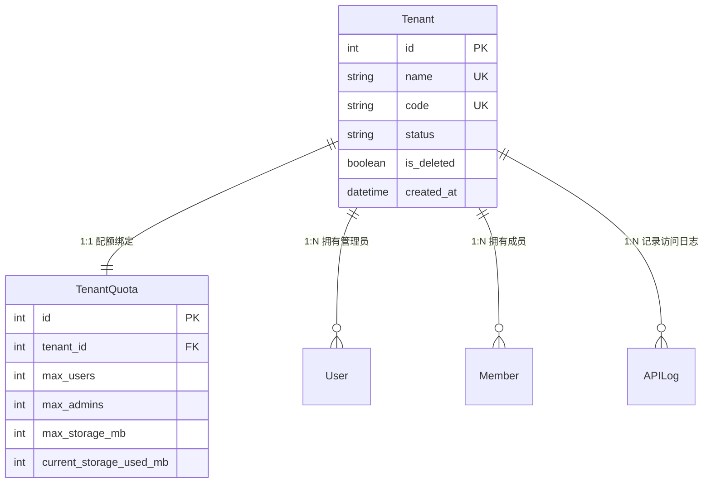

# 模块详细分析 01：基础支撑（common）与租户管理（tenants）

本文档针对系统最核心的基础设施层与多租户底座进行深度拆解，覆盖：
**common 模块（基础设施/中间件/基类）** 与 **tenants 模块（租户生命周期/配额限制/上下文控制）**。

---

## 1. common 模块详细分析

### 1.1 模块定位与核心业务
- **定位**：作为整套后端体系的基础设施底座，为上层所有业务模块提供通用能力支撑。
- **核心业务**：
  1. **多租户基类与软删除**：定义所有业务数据模型必须遵循的标准基类，统一支持租户外键关联、创建/更新时间审计、`is_deleted` 软删除状态标记。
  2. **租户上下文与自动过滤管理器**：基于线程局部变量（`threading.local`）安全维护每个 HTTP 请求生命周期内的当前租户，在 ORM 层面自动截断跨租户或已删除数据。
  3. **中间件流水线（Middleware Pipeline）**：提供基于路径白名单的租户判定、API 访问与耗时日志审计、响应格式标准化封装。
  4. **通用文件与图片上传处理**：支持多种 MIME 类型文件上传、本地存储与自动缩略图生成（Thumbnails）。
  5. **统一异常处理与标准响应渲染**：将系统抛出的 ValidationError、PermissionDenied、Http404、TenantException 等统筹格式化为 `{code, message, data}` 标准 JSON。

### 1.2 Model 详细分析

#### `BaseModel`（抽象基类）
- **文件位置**：`common/models.py`
- **继承关系**：`models.Model`（`abstract = True`）
- **核心字段**：
  - `tenant`: `ForeignKey('tenants.Tenant', on_delete=models.CASCADE, null=True, db_index=True)`，多租户核心外键。
  - `created_at`: `DateTimeField(auto_now_add=True, null=True, db_index=True)`。
  - `updated_at`: `DateTimeField(auto_now=True, null=True, db_index=True)`。
  - `is_deleted`: `BooleanField(default=False, db_index=True)`，软删除标记。
- **管理器（Managers）**：
  - `objects = TenantManager()`：默认管理器，自动滤除 `is_deleted=True` 且自动追加 `tenant=current_tenant` 过滤。
  - `original_objects = models.Manager()`：原生管理器，不执行任何过滤，专供超级管理员或跨租户聚合统计使用。
- **关键方法**：
  - `soft_delete()`: 将 `is_deleted` 标记为 `True` 并仅保存对应字段。

#### `APILog`（API 访问审计日志）
- **数据表**：`common_api_log`
- **核心字段**：
  - `user`: `ForeignKey('users.User', null=True, blank=True)`，操作人。
  - `ip_address`: `CharField(max_length=50)`。
  - `request_method`: `CharField(choices=['GET', 'POST', 'PUT', 'PATCH', 'DELETE', ...])`。
  - `request_path`: `CharField(max_length=255)`。
  - `view_name`: `CharField(max_length=255)`。
  - `query_params`, `request_body`: `JSONField()`。
  - `status_code`: `IntegerField()`。
  - `response_time`: `IntegerField()`，毫秒单位。
  - `status_type`: `CharField(choices=['success', 'error'])`。
  - `response_body`: `JSONField()`。
  - `error_message`: `TextField()`。
  - `user_agent`: `CharField(max_length=500)`。

#### `Config`（系统级键值配置）
- **数据表**：`common_config`
- **核心字段**：`name`, `key` (unique), `value` (JSONField), `type` ('menu', 'system', 'feature', 'other'), `is_active`。

---

### 1.3 API 接口层
- **路由前缀**：`/api/v1/common/`
- **核心端点**：
  1. `GET /api/v1/common/system-info/` (`SystemInfoView`)：获取系统当前运行信息与基础环境配置。
  2. `GET /api/v1/common/api-logs/` (`APILogListView`)：分页检索 API 访问审计日志。
  3. `GET /api/v1/common/api-logs/<id>/` (`APILogDetailView`)：查看单条 API 请求与响应快照详情。
  4. `POST /api/v1/common/upload-file/` (`FileUploadView`)：通用文件上传，支持白名单文件后缀限制。
  5. `POST /api/v1/common/upload-image-with-thumbnail/` (`ImageUploadWithThumbnailView`)：上传图片并自动生成指定尺寸缩略图。

---

### 1.4 Service 与工具层
- **`TenantIdResolver`** (`common/services/tenant_resolver.py`)：
  - 核心职责：解析并裁决请求中的租户标识。依次提取 `X-Tenant-ID` 请求头与 JWT Token 内的 `user.tenant_id`，依据角色规则计算出 `effective_tenant_id`。
- **`TenantPermissionChecker`** (`common/services/permission_checker.py`)：
  - 核心职责：核验当前请求主体是否有权访问对应 `effective_tenant_id`。普通用户禁止携带不属于自身租户的 Header；管理员禁止在无需多租户分流的场景随意篡改。
- **`TenantValidator` & `TenantPathChecker`** (`common/services/tenant_validator.py`)：
  - 核心职责：核对请求路径是否命中 `settings.TENANT_ISOLATED_API_PATHS`，若命中且非公开接口，则从数据库加载激活态 `Tenant` 对象，调用 `set_current_tenant()` 注入上下文。
- **`StandardJSONRenderer`** (`common/renderers.py`)：
  - 核心职责：重写 DRF 默认渲染行为，将输出统一封装为：
    ```json
    {
      "code": 200,
      "message": "success",
      "data": { ... }
    }
    ```

---

### 1.5 Permission 权限体系
- `IsSuperAdminUser`: 限制必须为 `user.is_authenticated and user.is_super_admin`。
- `IsAdminUser`: 限制为超级管理员或租户管理员 (`user.is_admin or user.is_super_admin`)。
- `IsTenantAdmin`: 限制必须为特定租户的管理员 (`user.is_admin and not user.is_super_admin`)。
- `IsOwnerOrAdmin`: 对象级权限。若访问者为 SuperAdmin 或同租户 TenantAdmin 直接放行；若为普通用户则检查 `obj.user_id == request.user.id` 或 `obj.created_by == request.user`。
- `IsSameTenantUser`: 对象级权限，确保 `obj.tenant == request.user.tenant`。

---

### 1.6 关键代码实录

#### 租户线程局部存储（`common/utils/tenant_context.py`）
```python
import threading

_thread_local = threading.local()

def get_current_tenant():
    return getattr(_thread_local, 'tenant', None)

def set_current_tenant(tenant):
    _thread_local.tenant = tenant

def clear_current_tenant():
    if hasattr(_thread_local, 'tenant'):
        del _thread_local.tenant
```

#### 租户自动过滤管理器（`common/utils/tenant_manager.py`）
```python
class TenantManager(models.Manager):
    def get_queryset(self):
        queryset = super().get_queryset()
        # 1. 自动过滤软删除数据
        queryset = queryset.filter(is_deleted=False)
        # 2. 自动按当前线程租户过滤
        tenant = get_current_tenant()
        if tenant:
            return queryset.filter(tenant=tenant)
        # 若无租户上下文（如超级管理员全局访问），返回全部未删除数据
        return queryset
```

---

## 2. tenants 模块详细分析

### 2.1 模块定位与核心业务
- **定位**：企业级多租户生命周期的管理者，主导组织（Tenant）实体的开通、配置、暂停/激活、资源配额限制。
- **核心业务**：
  1. **租户组织管理**：管理各租户的名称（`name`）、唯一识别代码（`code`）、状态（`active/suspended/deleted`）、联系人及邮箱。
  2. **硬性资源配额管理（Tenant Quota）**：每个租户绑定专属配额实体，限制最大成员数（`max_users`）、最大管理员数（`max_admins`）、最大云存储空间（`max_storage_mb`）与最大产品数（`max_products`）。
  3. **配额运行时防护**：在添加管理员（`User`）、添加成员（`Member`）、上传附件时动态触发 `can_add_user()` 与 `can_use_storage()` 拦截超出配额行为。
  4. **租户启停与级联影响**：租户一旦进入 `suspended` 状态，该租户下所有用户即便 Token 尚未过期，在 JWT 认证中间件中均会被即时拦截拒绝。

---

### 2.2 Model 详细分析

#### `Tenant`（租户模型）
- **数据表**：`tenant`
- **核心字段**：
  - `name`: `CharField(max_length=100, unique=True)`，租户组织名称。
  - `code`: `CharField(max_length=50, unique=True, null=True, blank=True)`，租户代号（若为空在保存时自动由 `name.lower()` 生成）。
  - `status`: `CharField(max_length=20, default='active', choices=[('active', '活跃'), ('suspended', '暂停'), ('deleted', '已删除')])`。
  - `contact_name`, `contact_email`, `contact_phone`: 联系人资料。
  - `is_deleted`: `BooleanField(default=False)`。
- **钩子与业务逻辑**：
  - `save()`：在初次创建租户（`is_new=True`）时，自动触发初始化默认 `TenantQuota` 实例（`max_users=10, max_admins=2, max_storage_mb=1024, max_products=100`）。
  - `soft_delete()`：将状态置为 `deleted` 并标记 `is_deleted=True`。
  - `ensure_quota()`：幂等校验并确保配额记录存在。

#### `TenantQuota`（租户资源配额模型）
- **数据表**：`tenant_quota`
- **核心字段**：
  - `tenant`: `OneToOneField(Tenant, on_delete=models.CASCADE, related_name='quota')`。
  - `max_users`: `IntegerField(default=10)`，最大普通成员上限。
  - `max_admins`: `IntegerField(default=2)`，最大管理员上限。
  - `max_storage_mb`: `IntegerField(default=1024)`，最大存储空间（默认 1GB）。
  - `max_products`: `IntegerField(default=100)`。
  - `current_storage_used_mb`: `IntegerField(default=0)`，已用存储空间缓存值。
- **业务校验方法**：
  - `can_add_user(is_admin=False) -> bool`：动态计算当前租户在 `User` 表（若 `is_admin=True`）或 `Member` 表中的现存人数，比对上限。
  - `can_use_storage(required_mb) -> bool`：校验剩余可用空间是否满足本次写入要求。
  - `get_usage_percentage(resource_type) -> float`：计算特定资源的消耗百分比，驱动管理后台仪表盘仪表。

---

### 2.3 API 接口层
- **路由前缀**：`/api/v1/tenants/`
- **端点清单**：
  1. `GET /api/v1/tenants/` (`TenantListCreateView`)：超级管理员分页获取所有租户。
  2. `POST /api/v1/tenants/` (`TenantListCreateView`)：新建租户并自动派发初始配额。
  3. `GET /api/v1/tenants/<id>/` (`TenantRetrieveUpdateDeleteView`)：获取租户基本详情。
  4. `PUT / PATCH /api/v1/tenants/<id>/` (`TenantRetrieveUpdateDeleteView`)：更新租户信息。
  5. `DELETE /api/v1/tenants/<id>/` (`TenantRetrieveUpdateDeleteView`)：软删除租户。
  6. `GET /api/v1/tenants/<id>/comprehensive/` (`TenantComprehensiveView`)：复合聚合接口，一次性返回租户基础信息、配额明细、管理员列表及使用率画像。
  7. `PUT /api/v1/tenants/<id>/quota/` (`TenantQuotaUpdateView`)：动态调配租户配额（提升人数上限或扩充存储容量）。
  8. `GET /api/v1/tenants/<id>/quota/usage/` (`TenantQuotaUsageView`)：查询配额消耗占比详情。
  9. `POST /api/v1/tenants/<id>/suspend/` (`TenantSuspendView`)：将租户变更为暂停状态。
  10. `POST /api/v1/tenants/<id>/activate/` (`TenantActivateView`)：激活/恢复租户。
  11. `GET /api/v1/tenants/<id>/users/` (`TenantUserListView`)：列出属于该租户的所有管理员与普通成员。

---

### 2.4 Permission 权限控制
- 租户管理相关 API 全部强制施加 **`TenantApiPermission`** 或 **`IsSuperAdminUser`**：
  - 严格拒绝任何非超级管理员（包括租户管理员与普通成员）发起租户创建、配额篡改或启停调用。
  - 认证头必须持有合法的 Bearer JWT Token，且 Token 解密后 `is_super_admin == True`。

---

### 2.5 数据模型关系（ER 映射）



---

### 2.6 关键代码实录

#### 租户配额核验逻辑（`tenants/models.py`）
```python
def can_add_user(self, is_admin=False):
    from users.models import User
    # 查询当前租户的用户数
    current_user_count = User.objects.filter(tenant=self.tenant).count()
    if current_user_count >= self.max_users:
        logger.warning(f"租户 {self.tenant.name} 的用户数已达到上限 {self.max_users}")
        return False
    
    # 若为管理员，还需进一步核验管理员专有配额
    if is_admin:
        current_admin_count = User.objects.filter(
            tenant=self.tenant, 
            is_admin=True
        ).count()
        if current_admin_count >= self.max_admins:
            logger.warning(f"租户 {self.tenant.name} 的管理员数已达到上限 {self.max_admins}")
            return False
    return True
```

#### 租户全量画像综合接口（`tenants/views.py`）
```python
class TenantComprehensiveView(APIView):
    permission_classes = [IsSuperAdminUser]

    def get(self, request, pk):
        tenant = get_object_or_404(Tenant, pk=pk)
        quota = tenant.ensure_quota()
        users = User.objects.filter(tenant=tenant)
        
        data = {
            'tenant': TenantSerializer(tenant).data,
            'quota': TenantQuotaSerializer(quota).data,
            'usage': {
                'users': quota.get_usage_percentage('users'),
                'admins': quota.get_usage_percentage('admins'),
                'storage': quota.get_usage_percentage('storage'),
            },
            'admins': UserSimpleSerializer(users.filter(is_admin=True), many=True).data,
        }
        return Response(data)
```
