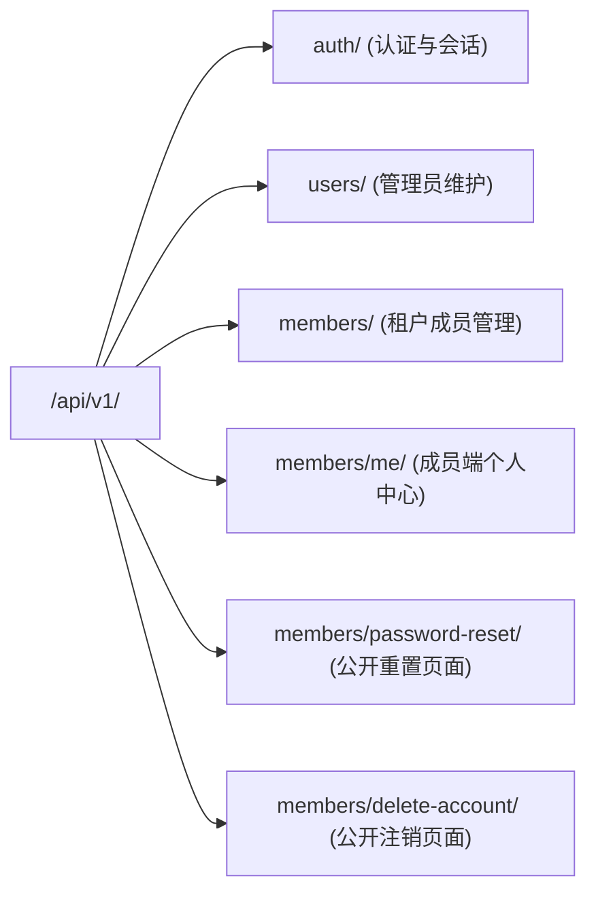
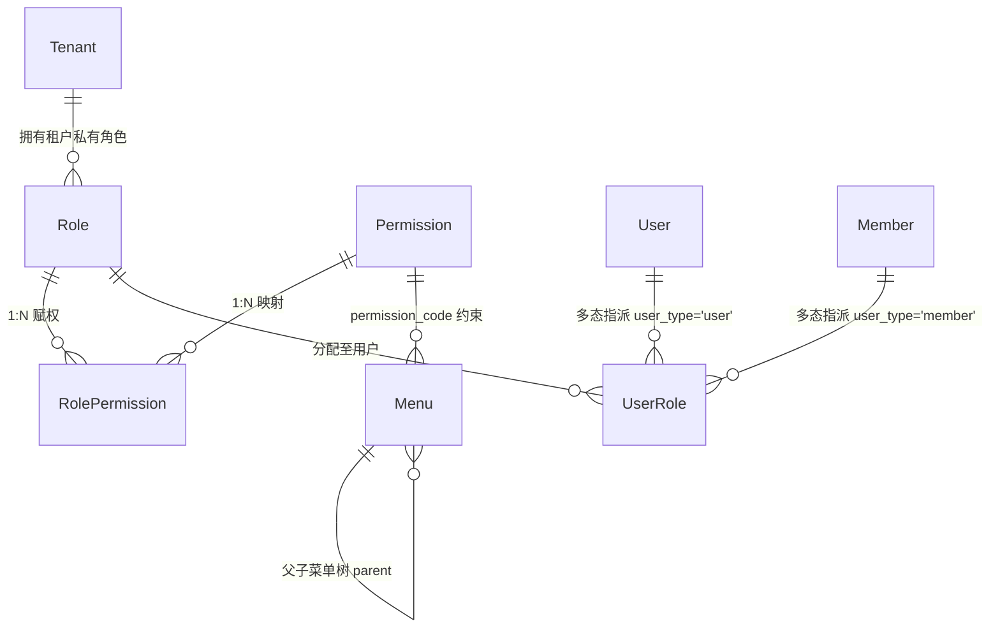

# 模块详细分析 02：身份、认证与权限体系（users / rbac / menus）

本文件详细剖析系统的身份主体、认证生命周期、角色访问控制与动态前端菜单映射，涵盖：
**users 模块（双身份用户体系与认证中心）**、**rbac 模块（多态角色与权限控制）** 与 **menus 模块（动态路由树与权限映射）**。

---

## 1. users 模块详细分析

### 1.1 模块定位与核心业务
- **定位**：系统的身份与认证枢纽，解决“谁在访问系统、拥有何种主体身份”的根本问题。
- **核心业务**：
  1. **双身份模型隔离（Dual Identity）**：将平台运营管理者（`User`，分为超级管理员和租户管理员）与终端 SaaS 客户/终端用户（`Member`，分为普通成员与子账号）物理分表，杜绝权限越界与概念混淆。
  2. **统一 JWT 签发与刷新引擎**：统一在 Token Payload 中注入 `model_type`（`'user'` 或 `'member'`），支持 24 小时访问凭证与 7 天刷新机制。
  3. **配额联动管控**：新建管理员或租户成员时，严格校验对应租户的 `TenantQuota.can_add_user()`，防止超额开户。
  4. **全生命周期自助服务**：提供 Member 密码找回（邮件安全 Token 签发与网页重置表单）、账号注销（严格合规 Google Play Data Safety 数据安全准则）。

---

### 1.2 Model 详细分析

#### `BaseUserModel`（抽象用户父类）
- **继承链**：`AbstractUser` -> `BaseUserModel`
- **公共字段**：
  - `tenant`: `ForeignKey('tenants.Tenant', on_delete=models.CASCADE, null=True, blank=True)`。
  - `phone`: `CharField(max_length=11)`。
  - `email`: `EmailField()`。
  - `nick_name`: `CharField(max_length=30)`。
  - `avatar`: `CharField(max_length=200)`。
  - `wechat_id`: `CharField(max_length=32)`。
  - `status`: `CharField(choices=[('active', '活跃'), ('suspended', '暂停'), ('inactive', '未激活')])`。
  - `is_deleted`: `BooleanField(default=False)`。
  - `last_login_ip`: `CharField(max_length=50)`。
- **公共方法**：
  - `soft_delete()`: 标记 `is_deleted=True, status='inactive', is_active=False`。
  - `display_name`: 智能显示优先级：`nick_name` > `first_name + last_name` > `username`。

#### `User`（管理端用户模型）
- **数据表**：`user`
- **特有字段**：
  - `is_admin`: `BooleanField(default=True)`。
  - `is_super_admin`: `BooleanField(default=False)`。
- **业务行为约束（`save()` 钩子）**：
  - 若 `is_super_admin=True`，强制剥离租户关联（`self.tenant = None`），并将 Django 内置 `is_superuser` 设为 `True`。
  - 若为租户管理员（`is_super_admin=False`），必须关联 `tenant`，且触发 `quota.can_add_user(is_admin=True)` 配额校验；`is_staff = True`，但 `is_superuser = False`。

#### `Member`（终端 SaaS 成员模型）
- **数据表**：`member`
- **特有字段**：
  - `parent`: `ForeignKey('self', null=True, blank=True, related_name='sub_accounts')`，父级主账号外键。
- **业务行为约束（`save()` 钩子）**：
  - 强制设置 `is_staff = False`，无论如何不能越权登入 Django 后台。
  - 若 `parent` 非空（即当前实例为子账号），强制设置 `is_active = False`，禁止其直接登录 API，仅作为协作附属账号。
  - 校验租户普通成员配额：`quota.can_add_user(is_admin=False)`。

#### `PasswordResetToken`（密码重置令牌模型）
- **数据表**：`password_reset_token`
- **核心字段**：
  - `user`: `ForeignKey(User, null=True, blank=True)`。
  - `member`: `ForeignKey(Member, null=True, blank=True)`。
  - `token`: `CharField(max_length=64, unique=True)`，随机安全串。
  - `expires_at`: `DateTimeField()`，有效截止时间。
  - `is_used`: `BooleanField(default=False)`。
- **关键方法**：
  - `is_valid()`: `not self.is_used and timezone.now() <= self.expires_at`。
  - `mark_as_used()`: 标记失效，防止重放攻击。

---

### 1.3 API 接口层

系统将用户 API 细分为 5 条子路由流水线：



| 端点路径 | 请求方法 | 对应 View / ViewSet | 权限控制要求 | 核心功能 |
| :--- | :--- | :--- | :--- | :--- |
| `/api/v1/auth/login/` | POST | `LoginView` | AllowAny | 管理员/成员统一登录，返回 access/refresh token |
| `/api/v1/auth/refresh/` | POST | `TokenRefreshView` | AllowAny | 凭有效 refresh_token 换发新 access_token |
| `/api/v1/auth/profile/` | GET/PUT | `UserProfileView` | IsAuthenticated | 获取或修改当前登录人基础信息与权限清单 |
| `/api/v1/admin/users/` | GET/POST | `AdminUserViewSet` | IsSuperAdminUser | 超管对租户管理员的增删改查与配额指派 |
| `/api/v1/admin/members/` | GET/POST | `MemberAdminViewSet` | IsTenantAdmin / IsSuperAdmin | 租户管理员对本租户 Member 的增删改查 |
| `/api/v1/members/me/profile/`| GET/PUT | `MemberProfileView` | IsMemberUser | 租户普通成员个人资料查看与更新 |
| `/api/v1/members/me/change-password/` | POST | `MemberChangePasswordView` | IsMemberUser | 验证旧密码并变更密码 |
| `/api/v1/members/password-reset/` | GET/POST | `MemberPasswordResetView` | AllowAny (公开Web) | 验证邮件 Token 并执行密码重置网页 |
| `/api/v1/members/delete-account/` | GET/POST | `MemberDeleteAccountView`| AllowAny (公开Web) | 提交账号注销申请与验证 |

---

### 1.4 Service 与工具层

#### JWT 生成机制（`common/authentication/jwt_auth.py`）
```python
def generate_jwt_token(user):
    token_expiry = datetime.now() + timedelta(seconds=settings.JWT_AUTH['JWT_EXPIRATION_DELTA'])
    refresh_expiry = datetime.now() + timedelta(seconds=settings.JWT_AUTH['JWT_REFRESH_EXPIRATION_DELTA'])
    
    from users.models import Member
    model_type = 'member' if isinstance(user, Member) else 'user'
    
    access_payload = {
        'user_id': user.id,
        'username': user.username,
        'exp': token_expiry,
        'model_type': model_type,
        'is_admin': getattr(user, 'is_admin', False),
        'is_super_admin': getattr(user, 'is_super_admin', False),
        'is_staff': getattr(user, 'is_staff', False)
    }
    # 生成 HS256 签名 Token ...
```

---

## 2. rbac 模块详细分析

### 2.1 模块定位与核心业务
- **定位**：细粒度权限控制中心，提供“角色-权限-用户”的动态绑定与鉴权评估。
- **核心业务**：
  1. **多态主体赋权**：通过 `user_type` 字段（`'user'` / `'member'`）与 `user_id` 解耦传统外键，使得同一套 RBAC 引擎能够无缝支持管理端人员与 SaaS 终端客户的角色指派。
  2. **租户级角色隔离与系统级角色继承**：若 `Role.tenant` 为空，则为全局系统预设角色；若指定了 `tenant`，则为租户自定义专属角色。
  3. **角色有效期机制**：支持设置 `start_date`、`end_date` 与 `is_active` 开关，满足临时授权与试用期赋权场景。
  4. **权限缓存与精准失效**：提供基于 Redis / 本地内存的权限缓存管理，在角色权限更新时可单点或全局触发刷新。

---

### 2.2 Model 详细分析

#### `Permission`（权限定义模型）
- **数据表**：`rbac_permission`
- **核心字段**：
  - `code`: `CharField(max_length=100, unique=True)`，权限唯一编码，如 `user:create`、`article:publish`。
  - `name`: `CharField(max_length=100)`，中文显示名称。
  - `category`: `CharField(max_length=50)`，分类（如用户管理、内容发布）。
  - `is_system`: `BooleanField(default=False)`，系统内置权限不可删除。

#### `Role`（角色模型）
- **数据表**：`rbac_role`
- **核心字段**：
  - `name`: `CharField(max_length=100)`。
  - `code`: `CharField(max_length=50)`。
  - `tenant`: `ForeignKey('tenants.Tenant', null=True, blank=True)`，为空时代表系统通用角色。
  - `is_system`: `BooleanField(default=False)`。
  - `permissions`: `ManyToManyField(Permission, through='RolePermission')`。
- **约束**：`unique_together = [['name', 'tenant']]`。

#### `RolePermission`（角色-权限关联表）
- **数据表**：`rbac_role_permission`
- **核心字段**：`role_id`, `permission_id`。

#### `UserRole`（多态用户-角色指派表）
- **数据表**：`rbac_user_role`
- **核心字段**：
  - `user_type`: `CharField(choices=[('user', '管理员'), ('member', '普通成员')])`。
  - `user_id`: `IntegerField()`，根据 `user_type` 指向 `user.id` 或 `member.id`。
  - `role`: `ForeignKey(Role, on_delete=models.CASCADE)`。
  - `is_active`: `BooleanField(default=True)`。
  - `start_date`, `end_date`: 生效与过期时间区间。
- **核心方法**：
  - `user` 属性：动态装载目标实例：
    ```python
    @property
    def user(self):
        if self.user_type == 'user':
            return User.objects.filter(pk=self.user_id).first()
        elif self.user_type == 'member':
            return Member.objects.filter(pk=self.user_id).first()
        return None
    ```

---

### 2.3 API 接口层
- **路由前缀**：`/api/v1/rbac/`
- **核心端点**：
  1. `GET / POST /api/v1/rbac/permissions/` (`PermissionViewSet`): 权限元数据浏览与创建。
  2. `GET / POST / PUT /api/v1/rbac/roles/` (`RoleViewSet`): 角色列表与权限定制。
  3. `GET / POST /api/v1/rbac/users/<user_type>/<user_id>/roles/` (`UserRolesViewSet`): 查询或赋予某用户的角色清单。
  4. `DELETE /api/v1/rbac/users/<user_type>/<user_id>/roles/<role_id>/` (`UserRoleDetailViewSet`): 解除某用户的特定角色。
  5. `GET /api/v1/rbac/users/<user_type>/<user_id>/permissions/` (`UserPermissionsViewSet`): 聚合计算用户在当前有效角色下拥有的所有权限代码列表（去重）。
  6. `POST /api/v1/rbac/cache/refresh/` (`CacheRefreshViewSet`): 刷新全局 RBAC 权限缓存。

---

## 3. menus 模块详细分析

### 3.1 模块定位与核心业务
- **定位**：前端动态导航路由与菜单配置中心，负责将后端的 RBAC 权限代码映射为前端管理后台界面的可视化侧边栏与按钮级别鉴权控制。
- **核心业务**：
  1. **层级树状菜单结构**：支持无限极父子嵌套（`parent` 自关联），输出树形结构供给前端直接渲染菜单树。
  2. **权限联动过滤**：菜单实体记录 `permission_code`。当前用户拉取路由树时，系统根据当前用户拥有的 RBAC 权限集自动剪枝无权访问的菜单节点。
  3. **超管/租户差异化导航分流**：`AdminRoutesView` 根据请求身份（超级管理员 vs 租户管理员）生成不同的工作台控制台导航路由。

---

### 3.2 Model 详细分析

#### `Menu`（系统菜单模型）
- **数据表**：`menu`
- **核心字段**：
  - `title`: `CharField(max_length=50)`，菜单显示标题。
  - `name`: `CharField(max_length=50)`，前端路由组件标识（Vue Component Name）。
  - `path`: `CharField(max_length=200)`，前端路由 URL 路径。
  - `component`: `CharField(max_length=200)`，前端组件路径文件。
  - `icon`: `CharField(max_length=50)`，菜单图标。
  - `parent`: `ForeignKey('self', null=True, blank=True, related_name='children')`。
  - `sort_order`: `IntegerField(default=0)`，展示排序。
  - `is_visible`: `BooleanField(default=True)`，是否在侧边栏显示（支持隐藏的详情页路由）。
  - `permission_code`: `CharField(max_length=100, blank=True)`，挂钩的 RBAC 权限编码。

#### `UserMenu`（用户个性化菜单配置）
- **数据表**：`user_menu`
- **核心字段**：`user_id`, `menu_id`, `is_favorite`（快捷收藏置顶）。

---

### 3.3 数据模型关系（ER 映射）



---

### 3.4 关键代码实录

#### 用户有效角色多态评估（`rbac/views.py`）
```python
class UserPermissionsViewSet(viewsets.ViewSet):
    def list(self, request, user_type=None, user_id=None):
        today = timezone.now().date()
        # 1. 过滤当前有效且未过期的用户角色记录
        user_roles = UserRole.objects.filter(
            user_type=user_type,
            user_id=user_id,
            is_active=True
        ).filter(
            models.Q(start_date__isnull=True) | models.Q(start_date__lte=today),
            models.Q(end_date__isnull=True) | models.Q(end_date__gte=today)
        ).select_related('role')
        
        role_ids = [ur.role_id for ur in user_roles]
        
        # 2. 汇总并去重关联的全部权限代码
        permissions = Permission.objects.filter(
            role_permissions__role_id__in=role_ids
        ).distinct().values_list('code', flat=True)
        
        return Response({'permissions': list(permissions)})
```
