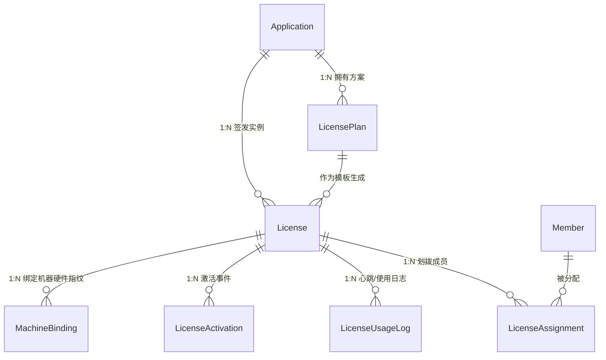
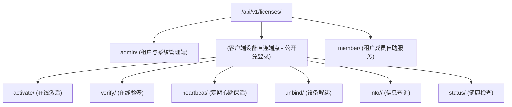

# 模块详细分析 03：软件实体与许可证授权（applications / licenses）

本文档详细剖析系统的核心商业化与知识产权变现底座，涵盖：
**applications 模块（统一软件产品实体与版本管理）** 与 **licenses 模块（多租户授权许可、机器指纹绑定、在线心跳与激活引擎）**。

---

## 1. applications 模块详细分析

### 1.1 模块定位与核心业务
- **定位**：对外部发布的数字化资产与软件产品的唯一“实体注册中心”。
- **演进背景**：系统早期在 `licenses` 模块定义了 `SoftwareProduct`，在 `feedbacks` 模块定义了 `Software`。为消除数据割裂，系统重构出顶层的 `applications.Application` 模型，作为单点事实来源（Single Source of Truth），下联授权方案、版本发布与用户工单反馈。
- **核心业务**：
  1. **软件产品唯一身份定义**：记录产品名称、代号（`code`，租户内唯一）、Logo、官网与负责人。
  2. **版本号与发布控制**：维护 `current_version`（如 `v1.2.3`）以及生命周期状态（`development`、`testing`、`active`、`maintenance`、`deprecated`、`archived`）。
  3. **非对称加密（RSA）公私钥元数据宿主**：在 `Application.metadata` 中集中托管该软件产品对应的 RSA 2048 位公私钥对，为后续离线激活码签发、在线验签提供不可篡改的密码学根基。

---

### 1.2 Model 详细分析

#### `Application`（租户应用/软件产品模型）
- **数据表**：`applications_application`
- **继承链**：`BaseModel`（具备 `tenant` 租户隔离与 `is_deleted` 软删除）
- **核心字段**：
  - `name`: `CharField(max_length=100)`，软件显示名称（如 "CompressX", "EspressoX"）。
  - `code`: `CharField(max_length=50)`，产品代码，同一租户内唯一。
  - `description`: `TextField(blank=True)`。
  - `logo`, `website`, `contact_email`: 展示与支持渠道。
  - `current_version`: `CharField(max_length=50, default="1.0.0")`。
  - `status`: `CharField(choices=[('active', '运行中'), ('deprecated', '已弃用'), ...])`。
  - `is_active`: `BooleanField(default=True)`。
  - `tags`: `JSONField(default=list)`。
  - `metadata`: `JSONField(default=dict)`，关键扩展字典，存放 `public_key`、`private_key`、`rsa_key_id`、发布说明等。

---

### 1.3 API 接口层
- **路由前缀**：`/api/v1/applications/`
- **端点清单**：
  - `GET /api/v1/applications/` (`ApplicationViewSet.list`): 租户隔离列出本租户管理的所有软件产品。
  - `POST /api/v1/applications/` (`ApplicationViewSet.create`): 创建新软件实体，可自动触发生成 RSA 密钥对。
  - `GET /api/v1/applications/<id>/` (`ApplicationViewSet.retrieve`): 获取应用元数据及关联方案总览。
  - `PUT / PATCH /api/v1/applications/<id>/`: 更新版本号或运行状态。
  - `DELETE /api/v1/applications/<id>/`: 软删除该应用。

---

## 2. licenses 模块详细分析

### 2.1 模块定位与核心业务
- **定位**：企业级软件版权保护与分发授权系统，负责生成、校验、分发与审计桌面端/服务端商业软件的 License。
- **核心业务**：
  1. **许可方案定价模板（LicensePlan）**：配置不同版本等级（试用版 `trial`、基础版 `basic`、专业版 `professional`、企业版 `enterprise`），设定默认最大激活台数与有效天数，配置特定功能开关（`features` JSON）。
  2. **许可证生成与密码学哈希（License）**：生成人性化 25 位序列号（如 `XXXXX-XXXXX-XXXXX-XXXXX-XXXXX`），同步生成其不可逆 SHA256 `license_hash` 建立高性能索引。
  3. **机器硬件指纹绑定（MachineBinding）**：客户端收集 CPU 序列号、主板 UUID、网卡 MAC 地址，经散列生成唯一的 `machine_fingerprint`。严格限制同一 License 绑定的活跃机器数不得超过 `max_activations`。
  4. **全模式激活通道（LicenseActivation）**：支持联网实时在线激活与离线激活码（公私钥签名凭证）验签。
  5. **持续运行状态心跳（Heartbeat）与使用日志（LicenseUsageLog）**：桌面软件定期上报心跳包、系统负载（CPU/内存使用率）及会话 Session，支持异地登录预警与机器自动解绑。
  6. **SaaS 租户成员授权分派（LicenseAssignment）**：租户管理员可将企业集中采购的 License 授权划拨给特定的 `Member` 用户使用。

---

### 2.2 Model 详细分析



#### `LicensePlan`（许可证方案模型）
- **数据表**：`licenses_license_plan`
- **核心字段**：
  - `application`: `ForeignKey('applications.Application', on_delete=models.CASCADE)`。
  - `name`: 方案名（如“专业版年费套餐”）。
  - `code`: 方案代码，如 `PRO_ANNUAL`。
  - `plan_type`: `CharField(choices=['trial', 'basic', 'professional', 'enterprise', 'custom'])`。
  - `default_max_activations`: `PositiveIntegerField(default=1)`，默认最大激活设备数。
  - `default_validity_days`: `PositiveIntegerField(default=365)`，默认有效天数。
  - `features`: `JSONField(default=dict)`，如 `{"export_4k": true, "cloud_sync": false}`。
  - `price`, `currency`: 价格与货币单位。
  - `status`: `active` 或 `inactive`。

#### `License`（许可证模型）
- **数据表**：`licenses_license`
- **核心字段**：
  - `application`: `ForeignKey(Application)`。
  - `plan`: `ForeignKey(LicensePlan)`。
  - `tenant`: `ForeignKey('tenants.Tenant')`。
  - `license_key`: `CharField(max_length=200, unique=True)`，用户可见的序列号。
  - `license_hash`: `CharField(max_length=64, unique=True, db_index=True)`，SHA-256 摘要。
  - `customer_name`, `customer_email`: 购买客户。
  - `max_activations`: `PositiveIntegerField(default=1)`。
  - `current_activations`: `PositiveIntegerField(default=0)`。
  - `issued_at`, `expires_at`: 签发与到期时间。
  - `last_verified_at`: 上次客户端联网核验时间。
  - `status`: `CharField(choices=['generated', 'activated', 'suspended', 'revoked', 'expired'])`。
- **关键方法**：
  - `clean()`: 确保 `plan.application == self.application`。
  - `save()`: 自动根据 `license_key` 计算生成 `license_hash`。
  - `extend_validity(days)`: 动态顺延过期时间。

#### `MachineBinding`（机器硬件指纹绑定模型）
- **数据表**：`licenses_machine_binding`
- **核心字段**：
  - `license`: `ForeignKey(License, related_name='machine_bindings')`。
  - `machine_id`: 客户端生成的硬件唯一标识。
  - `machine_fingerprint`: 64 位 SHA-256 机器指纹。
  - `encrypted_hardware_info`: 加密存储的主板/CPU/BIOS 明细。
  - `os_info`, `hardware_summary`: 操作系统版本与硬件概况。
  - `last_ip_address`, `last_location`: 最后活跃 IP 与地理位置。
  - `status`: `choices=['active', 'inactive', 'blocked']`。
- **约束**：`unique_together = [['license', 'machine_fingerprint']]`。

#### `LicenseActivation`（激活记录模型）
- **数据表**：`licenses_activation`
- **核心字段**：
  - `license`, `machine_binding`: 外键关联。
  - `activation_type`: `choices=['online', 'offline']`。
  - `activation_code`: 唯一激活凭证码。
  - `client_version`, `ip_address`, `user_agent`。
  - `result`: `choices=['success', 'failed', 'pending']`。

#### `LicenseAssignment`（租户成员授权分配表）
- **数据表**：`licenses_license_assignment`
- **核心字段**：
  - `member`: `ForeignKey('users.Member', related_name='license_assignments')`。
  - `license`: `ForeignKey(License, related_name='member_assignments')`。
  - `tenant`: `ForeignKey('tenants.Tenant')`。
  - `assignment_type`: `choices=['direct', 'inherited', 'shared', 'temporary']`。
  - `priority`: `choices=['low', 'normal', 'high', 'urgent']`。

---

### 2.3 API 接口层

系统将许可证 API 划分为三个清晰边界：



| 端点路径 | 方法 | 权限要求 | 业务功能说明 |
| :--- | :--- | :--- | :--- |
| `POST /api/v1/licenses/activate/` | POST | AllowAny (公开客户端) | 软件客户端首次联网输入 Key 与设备指纹请求激活 |
| `POST /api/v1/licenses/verify/` | POST | AllowAny (公开客户端) | 软件启动时校验 License 状态与防篡改签名 |
| `POST /api/v1/licenses/heartbeat/` | POST | AllowAny (公开客户端) | 软件后台每隔 N 分钟上报运行指标与续期活跃状态 |
| `POST /api/v1/licenses/unbind/` | POST | AllowAny (公开客户端) | 软件客户端在换机或卸载时主动释放当前机器绑定 |
| `GET /api/v1/licenses/info/<key>/` | GET | AllowAny (公开客户端) | 查询指定序列号的有效截止时间与可用额度 |
| `GET /api/v1/licenses/member/my-licenses/` | GET | IsMemberUser | 租户成员查看自己获配的许可证及绑定设备列表 |
| `POST /api/v1/licenses/member/apply/` | POST | CanApplyTrialLicense | 租户成员自助一键申领试用版许可证 |
| `POST /api/v1/licenses/member/unbind-device/` | POST | IsMemberUser | 租户成员在 Web 端管理控制台强制解绑某台设备 |
| `/api/v1/licenses/admin/plans/` | CRUD | IsTenantAdmin / SuperAdmin | 管理员配置许可证方案与功能开关 |
| `/api/v1/licenses/admin/licenses/` | CRUD | IsTenantAdmin / SuperAdmin | 管理员批量签发、延期、挂起或撤销许可证 |

---

### 2.4 Service 核心实现

- **`LicenseGenerationService`** (`licenses/services/license_service.py`):
  - 负责基于 UUID 生成 25 字符序列号，并计算 SHA-256 哈希。
- **`MachineFingerprintService`** (`licenses/services/fingerprint_service.py`):
  - 负责解析客户端发送的混淆硬件信息，提取 CPU ID、MAC 与主板特征，计算标准规范化指纹。
- **`SecurityService`** (`licenses/services/security_service.py`):
  - 负责基于 RSA 算法签发离线激活凭证（用私钥对 `{license_id, machine_fingerprint, expires_at}` 进行签名），客户端内嵌公钥即可离线验签。

---

### 2.5 关键代码实录

#### 客户端激活核心流转（`licenses/views/activation_views.py`）
```python
@api_view(['POST'])
@permission_classes([AllowAny])
def activate_license(request):
    license_key = request.data.get('license_key')
    machine_id = request.data.get('machine_id')
    machine_fingerprint = request.data.get('machine_fingerprint')
    client_version = request.data.get('client_version', '')
    
    # 1. 查找有效许可证
    license_hash = hashlib.sha256(license_key.encode()).hexdigest()
    license_obj = License.objects.filter(license_hash=license_hash).first()
    if not license_obj:
        return Response({'valid': False, 'error': 'License key not found'}, status=404)
        
    # 2. 检查状态与有效期
    if license_obj.status in ['revoked', 'suspended']:
        return Response({'valid': False, 'error': f'License is {license_obj.status}'}, status=400)
    if timezone.now() > license_obj.expires_at:
        license_obj.status = 'expired'
        license_obj.save(update_fields=['status'])
        return Response({'valid': False, 'error': 'License has expired'}, status=400)
        
    # 3. 检查并建立机器绑定
    binding, created = MachineBinding.objects.get_or_create(
        license=license_obj,
        machine_fingerprint=machine_fingerprint,
        defaults={'machine_id': machine_id, 'status': 'active'}
    )
    
    if created:
        # 激活数 +1 并校验配额
        if license_obj.current_activations >= license_obj.max_activations:
            binding.delete()
            return Response({'valid': False, 'error': 'Maximum activation limit reached'}, status=400)
        license_obj.current_activations += 1
        license_obj.status = 'activated'
        license_obj.save(update_fields=['current_activations', 'status'])
        
    # 4. 记录激活日志并返回激活结果与公钥签名
    LicenseActivation.objects.create(
        license=license_obj,
        machine_binding=binding,
        activation_type='online',
        activation_code=str(uuid.uuid4()),
        result='success',
        client_version=client_version,
        ip_address=request.META.get('REMOTE_ADDR')
    )
    
    return Response({
        'valid': True,
        'license_id': license_obj.id,
        'expires_at': license_obj.expires_at.isoformat(),
        'features': license_obj.plan.features,
    })
```
