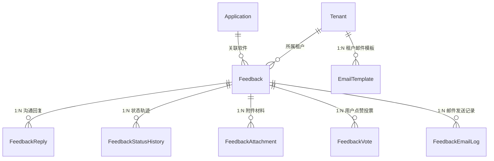

# 模块详细分析 04：工单反馈与客户管理（feedbacks / customers）

本文档详细剖析系统对企业客户关系的维护与售后反馈闭环，涵盖：
**feedbacks 模块（工单建议反馈、状态流转与 Celery 异步邮件中心）** 与 **customers 模块（多租户 CRM 客户档案与联系人关系）**。

---

## 1. feedbacks 模块详细分析

### 1.1 模块定位与核心业务
- **定位**：跨软件产品的综合工单管理与问题追溯平台，提供从终端用户公网提交、附件佐证、内部协作流转到自动异步邮件答复的全流程闭环。
- **核心业务**：
  1. **多通道工单创建**：支持登录用户（Member）与匿名终端用户提交，自动关联对应的 `Application` 与版本号；支持公网 HTML 表单直接提交（`FeedbackSubmitPageView`）。
  2. **工单多状态机推进与轨迹留痕**：状态流转涵盖待处理（`pending`）、已分配（`assigned`）、处理中（`in_progress`）、已解决（`resolved`）、已关闭（`closed`）、已拒绝（`rejected`），每次状态更迭自动在 `FeedbackStatusHistory` 中记录审计轨迹。
  3. **双层回复机制（公开回复 vs 内部备注）**：客服人员回复工单时可勾选 `is_internal_note`，内部协作讨论对普通用户不可见，对外部回复则触发异步邮件推送到客户邮箱。
  4. **异步邮件通知体系（Celery + SMTP）**：拥有完整的邮件模板系统（`EmailTemplate` 支持 Django Template 变量渲染），并在异步任务中进行邮箱地址合法性校验、重试、以及状态持久化（`FeedbackEmailLog`）。

---

### 1.2 Model 详细分析



#### `Feedback`（反馈工单主表）
- **数据表**：`feedbacks_feedback`
- **继承链**：`BaseModel`
- **核心字段**：
  - `application`: `ForeignKey('applications.Application', on_delete=models.CASCADE)`。
  - `tenant`: `ForeignKey('tenants.Tenant', on_delete=models.CASCADE)`。
  - `user`: `ForeignKey('users.Member', null=True, blank=True)`，若匿名则为空。
  - `title`: `CharField(max_length=200)`。
  - `content`: `TextField()`。
  - `feedback_type`: `choices=['bug', 'feature_request', 'improvement', 'question', 'other']`。
  - `priority`: `choices=['low', 'medium', 'high', 'urgent']`。
  - `status`: `choices=['pending', 'assigned', 'in_progress', 'resolved', 'closed', 'rejected']`。
  - `assigned_to`: `ForeignKey('users.User', null=True, blank=True)`，处理人。
  - `contact_email`: `EmailField(blank=True)`。
  - `email_notification_enabled`: `BooleanField(default=True)`。
  - `email_verified`: `BooleanField(default=False)`。
  - `vote_count`, `reply_count`, `view_count`: 冗余计数器。

#### `FeedbackReply`（回复与内部备注模型）
- **数据表**：`feedbacks_feedback_reply`
- **核心字段**：
  - `feedback`: `ForeignKey(Feedback, related_name='replies')`。
  - `user`: `ForeignKey(User, null=True, blank=True)`，管理员作者。
  - `member`: `ForeignKey(Member, null=True, blank=True)`，客户作者。
  - `content`: `TextField()`。
  - `is_internal_note`: `BooleanField(default=False)`，是否为运维内部便签。
- **业务行为**：创建回复时，自动同步递增 `Feedback.reply_count`，若非内部便签且开启邮件通知，则触发 `send_feedback_reply_email.delay(reply.id)`。

#### `FeedbackStatusHistory`（工单状态变更审计）
- **数据表**：`feedbacks_feedback_status_history`
- **核心字段**：`feedback`, `old_status`, `new_status`, `changed_by`, `reason`。

#### `EmailTemplate`（邮件通知模板）
- **数据表**：`feedbacks_email_template`
- **核心字段**：
  - `tenant`: `ForeignKey(Tenant)`。
  - `template_type`: `choices=['reply', 'status_change', 'new_feedback', 'verification']`。
  - `subject`: `CharField(max_length=200)`，支持 `{{ software_name }}` 等插值变量。
  - `body_html`, `body_text`: HTML 与纯文本双格式模版。
  - `is_active`: `BooleanField(default=True)`。

---

### 1.3 API 接口层
- **路由前缀**：`/api/v1/feedbacks/`
- **端点清单**：
  - `GET /api/v1/feedbacks/` (`FeedbackListView`): 多维度过滤与分页检索工单列表（支持状态、类型、优先级、软件代码检索）。
  - `POST /api/v1/feedbacks/` (`FeedbackListView`): 提交新反馈（支持匿名或认证提交）。
  - `GET /api/v1/feedbacks/<id>/` (`FeedbackDetailView`): 获取工单详情及全部公开回复。
  - `POST /api/v1/feedbacks/<id>/change-status/` (`FeedbackChangeStatusView`): 管理员流转状态并触发客户通知邮件。
  - `POST /api/v1/feedbacks/<id>/replies/` (`FeedbackReplyListView`): 对工单发起回复或添加内部备注。
  - `POST /api/v1/feedbacks/<id>/attachments/` (`FeedbackAttachmentListView`): 上传日志或截图证据附件。
  - `POST /api/v1/feedbacks/<id>/vote/` (`FeedbackVoteView`): 用户为工单点赞投票，驱动高优先级功能排期。
  - `GET /api/v1/feedbacks/submit/` (`FeedbackSubmitPageView`): 公开独立的反馈 HTML 表单页面。
  - `GET /api/v1/feedbacks/health/` (`SystemHealthView`): 诊断 Redis 连通性与邮件队列健康状态。

---

### 1.4 Service 与 Celery 异步任务层

- **异步任务队列**：`core/settings.py` 中显式指定：
  ```python
  CELERY_TASK_ROUTES = {
      'feedbacks.tasks.*': {'queue': 'feedbacks'},
  }
  ```
- **核心任务**：
  1. `send_feedback_reply_email(reply_id)`：
     - 查询回复与工单，验证用户邮箱格式合法性（`EmailValidator`）。
     - 加载该租户对应的 `reply` 邮件模板，用 Context 渲染 HTML 内容。
     - 发送 SMTP 邮件，记录结果至 `FeedbackEmailLog`；若发送失败自动在 300 秒后指数重试（最多 3 次）。
  2. `send_feedback_status_change_email(history_id)`：
     - 当工单状态变为 `resolved` 或 `rejected` 时，向提单人通知处理结果。
  3. `cleanup_old_email_logs(days=90)`：
     - 由 Celery Beat 定时触发（每日凌晨 2:00），清除超过 90 天的历史邮件发送日志，保障库表整洁。

---

## 2. customers 模块详细分析

### 2.1 模块定位与核心业务
- **定位**：B2B 企业客户管理（CRM）中心，维护与当前 SaaS 平台签署商业合同的外部企业档案及其与多租户之间的映射关系。
- **核心业务**：
  1. **客户企业档案管理（Customer）**：记录客户企业名称、信用代码、联系人、地址、客户等级（战略/重要/普通）与交付备注。
  2. **租户-客户商业关系（CustomerTenantRelation）**：同一客户实体可以与不同租户建立合作关系（如 `client` 客户关系、`provider` 供应商关系、`partner` 合作商关系），并记录合同签署开始与截止日期。
  3. **客户-成员关联（CustomerMemberRelation）**：打通 `Customer` 与 `Member`，指派哪些租户成员属于该客户企业的指定联系人或决策者，并标识是否为主联系人（`is_primary`）。

---

### 2.2 Model 详细分析

#### `Customer`（客户企业主表）
- **数据表**：`customers_customer`
- **继承链**：`BaseModel`
- **核心字段**：
  - `name`: `CharField(max_length=100)`，客户企业全称。
  - `code`: `CharField(max_length=50, blank=True)`，客户编码。
  - `customer_type`: `choices=['enterprise', 'individual', 'government', 'other']`。
  - `industry`: `CharField(max_length=50, blank=True)`，行业类别。
  - `level`: `choices=['vip', 'regular', 'potential']`，等级。
  - `phone`, `email`, `website`, `address`: 商务联系方式。
  - `status`: `choices=['active', 'inactive', 'archived']`。

#### `CustomerTenantRelation`（客户与租户合作关系表）
- **数据表**：`customers_customer_tenant_relation`
- **核心字段**：
  - `customer`: `ForeignKey(Customer, related_name='tenant_relations')`。
  - `tenant`: `ForeignKey('tenants.Tenant', related_name='customer_relations')`。
  - `relation_type`: `CharField(choices=[('client', '客户'), ('provider', '供应商'), ('partner', '合作伙伴')])`。
  - `start_date`, `end_date`: 协议有效周期。
  - `is_active`: `BooleanField(default=True)`。

#### `CustomerMemberRelation`（客户与成员对接人表）
- **数据表**：`customers_customer_member_relation`
- **核心字段**：
  - `customer`: `ForeignKey(Customer, related_name='member_relations')`。
  - `member`: `ForeignKey('users.Member', related_name='customer_relations')`。
  - `role`: `CharField(max_length=50)`，对接职务（如采购经理、技术支持）。
  - `is_primary`: `BooleanField(default=False)`，是否为主商务接口人。

---

### 2.3 API 接口层
- **路由前缀**：`/api/v1/customers/`
- **核心端点**：
  - `GET / POST /api/v1/customers/` (`CustomerViewSet`): 租户隔离的客户增删改查。
  - `GET / POST /api/v1/customers/tenants/relations/` (`CustomerTenantRelationViewSet`): 管理租户与外部客户的绑定关系与合同期。
  - `GET / POST /api/v1/customers/members/relations/` (`CustomerMemberRelationViewSet`): 维护企业联系人关联。
  - `GET /api/v1/customers/tenants/view/` (`TenantCustomerViewSet`): 租户视图下的活跃客户全貌聚合列表。

---

### 2.4 关键代码实录

#### 工单状态推进并触发异步通知（`feedbacks/views/feedback_api_views.py`）
```python
class FeedbackChangeStatusView(APIView):
    permission_classes = [IsTenantAdmin | IsSuperAdminUser]

    def post(self, request, pk):
        feedback = get_object_or_404(Feedback, pk=pk)
        new_status = request.data.get('status')
        reason = request.data.get('reason', '')
        
        old_status = feedback.status
        if old_status != new_status:
            feedback.status = new_status
            feedback.save(update_fields=['status', 'updated_at'])
            
            # 记录流转历史
            history = FeedbackStatusHistory.objects.create(
                feedback=feedback,
                old_status=old_status,
                new_status=new_status,
                changed_by=request.user,
                reason=reason,
                tenant=feedback.tenant
            )
            
            # 异步分发状态变更提醒邮件
            if feedback.email_notification_enabled and feedback.contact_email:
                from feedbacks.tasks import send_feedback_status_change_email
                send_feedback_status_change_email.delay(history.id)
                
        return Response({'status': 'success', 'current_status': feedback.status})
```
