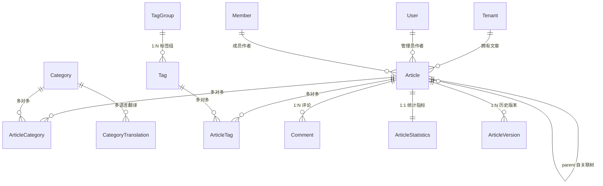

# 模块详细分析 05：内容管理与用户互动（cms / interactions）

本文档详细剖析系统的多语言知识库发布、内容层级管理与社交互动引擎，涵盖：
**cms 模块（多租户文章、无限级树、多语言分类与版本控制）** 与 **interactions 模块（点赞、收藏、关注互动体系）**。

---

## 1. cms 模块详细分析

### 1.1 模块定位与核心业务
- **定位**：企业级多租户内容管理系统（CMS），不仅支持官网博客、软件文档、帮助中心（Helpdesk）的内容编排，还支持成员端（Member）UGC 创作。
- **核心业务**：
  1. **多内容格式与多阶段发布流**：支持 Markdown、HTML、富媒体图片、代码片段等 12 种内容形态；提供草稿（`draft`）、待审（`pending`）、已发（`published`）、归档（`archived`）生命周期。
  2. **文章无限极父子层级树**：模型定义 `parent` 自关联，支持系列文章、知识库章节、电子书目录的多层级组织，并提供 `get_ancestors()` 与 `get_siblings()` 树操作。
  3. **双作者架构与数据库级硬约束**：文章作者既可以是后台管理员（`User`），也可以是前台客户成员（`Member`）。通过数据库级 CheckConstraint 强制确保 `user` 与 `member` 有且仅有一个非空。
  4. **多语言国际化分类系统（django-parler）**：分类树支持简体中文、繁体中文、英文、日文、韩文、法文等多语言翻译动态回退。
  5. **版本修订快照（ArticleVersion）**：文章每次重大保存时生成内容快照，支持随时对比与一键版本回滚。
  6. **统计计数与阅读防刷机制（ArticleStatistics）**：记录浏览量、点赞数、评论数、分享数；配合 `AccessLog` 进行 IP 和时间维度的防刷过滤。

---

### 1.2 Model 详细分析



#### `Article`（文章主表）
- **数据表**：`cms_article`
- **继承链**：`BaseModel`
- **核心字段**：
  - `title`: `CharField(max_length=255)`。
  - `slug`: `SlugField(max_length=255, unique=True)`，自动生成唯一语义化 URL。
  - `content`: `TextField()`，正文。
  - `content_type`: `choices=['markdown', 'html', 'image', 'video', 'code', ...]`。
  - `parent`: `ForeignKey('self', null=True, blank=True, related_name='children')`，父文章。
  - `user`: `ForeignKey(User, null=True, blank=True)`，管理员作者。
  - `member`: `ForeignKey(Member, null=True, blank=True)`，成员作者。
  - `status`: `choices=['draft', 'pending', 'published', 'archived']`。
  - `visibility`: `choices=['public', 'private', 'password']`。
  - `password`: `CharField(max_length=128, blank=True)`。
  - `cover_image`, `cover_image_small`: 封面大图与缩略图。
  - `is_featured`, `is_pinned`: 特色推荐与置顶。
  - `sort_order`: 排序权重。
- **数据库级约束（CheckConstraint）**：
  ```python
  CheckConstraint(
      condition=(
          models.Q(user__isnull=False, member__isnull=True) | 
          models.Q(user__isnull=True, member__isnull=False)
      ),
      name='article_one_author_required'
  )
  ```

#### `Category`（多语言分类表）
- **继承链**：`TranslatableModel`（来自 `parler.models`）
- **翻译字段（`CategoryTranslation`）**：`name`, `description`, `seo_title`, `seo_description`。
- **共享字段**：`slug`, `parent`（自关联分类树）, `sort_order`, `is_active`, `is_deleted`。

#### `ArticleStatistics`（文章统计表）
- **数据表**：`cms_article_statistics`
- **核心字段**：
  - `article`: `OneToOneField(Article, related_name='statistics')`。
  - `views_count`: 浏览总数。
  - `likes_count`: 点赞总数。
  - `comments_count`: 评论总数。
  - `favorites_count`: 收藏总数。
  - `shares_count`: 分享总数。

#### `ArticleVersion`（文章历史修订快照）
- **数据表**：`cms_article_version`
- **核心字段**：`article`, `version_number`, `title`, `content`, `change_log`, `created_by`。

---

### 1.3 API 接口层
- **路由前缀**：`/api/v1/cms/`
- **核心端点**：
  - `GET / POST /api/v1/cms/articles/` (`ArticleViewSet`): 管理端文章检索、草稿暂存与发布。
  - `GET /api/v1/cms/articles/<id>/` (`ArticleViewSet`): 查看文章详情（自动触发阅读数自增）。
  - `GET /api/v1/cms/member/articles/` (`MemberArticleViewSet`): 租户成员前台创作列表与状态查看。
  - `GET / POST /api/v1/cms/categories/` (`CategoryViewSet`): 分类管理。
  - `GET /api/v1/cms/categories/tree/` (`CategoryViewSet.get_category_tree`): 获取带当前语言翻译的分类嵌套树。
  - `GET / POST /api/v1/cms/tags/` (`TagViewSet`): 标签管理。
  - `GET / POST /api/v1/cms/comments/` (`CommentViewSet`): 针对文章提交评论与盖楼回复。

---

## 2. interactions 模块详细分析

### 2.1 模块定位与核心业务
- **定位**：轻量级社交互动与用户行为沉淀引擎，为主业务内容提供参与度激励。
- **核心业务**：
  1. **文章收藏（ArticleFavorite）**：用户收藏某篇文章，自动维护文章 `favorites_count`。
  2. **文章点赞（ArticleLike）**：支持游客或登录成员点赞文章，自动去重与幂等处理。
  3. **成员互赞（MemberLike）**：SaaS 社区内部成员之间的点赞激励。
  4. **成员互粉（MemberFollow）**：构建成员之间的社交关注网络（`follower` 与 `following`）。

---

### 2.2 Model 详细分析

#### `ArticleFavorite`（文章收藏模型）
- **数据表**：`interactions_article_favorite`
- **核心字段**：
  - `article`: `ForeignKey('cms.Article', on_delete=models.CASCADE)`。
  - `member`: `ForeignKey('users.Member', on_delete=models.CASCADE)`。
  - `created_at`: `DateTimeField(auto_now_add=True)`。
- **约束**：`unique_together = [['article', 'member']]`，防止同一用户重复收藏。

#### `ArticleLike`（文章点赞模型）
- **数据表**：`interactions_article_like`
- **核心字段**：
  - `article`: `ForeignKey('cms.Article', on_delete=models.CASCADE)`。
  - `member`: `ForeignKey('users.Member', null=True, blank=True)`。
  - `ip_address`: `CharField(max_length=50, blank=True)`，用于匿名点赞防刷去重。

#### `MemberFollow`（用户关注关系表）
- **数据表**：`interactions_member_follow`
- **核心字段**：
  - `follower`: `ForeignKey('users.Member', related_name='following_set')`，关注发起人。
  - `following`: `ForeignKey('users.Member', related_name='followers_set')`，被关注目标。
- **约束**：`unique_together = [['follower', 'following']]`。

---

### 2.3 API 接口层
- **路由前缀**：`/api/v1/interactions/`
- **核心端点**：
  - `GET / POST /api/v1/interactions/favorites/` (`ArticleFavoriteViewSet`): 获取我的收藏列表或添加收藏。
  - `DELETE /api/v1/interactions/favorites/<id>/`: 取消收藏。
  - `POST /api/v1/interactions/article-likes/` (`ArticleLikeViewSet`): 对文章执行点赞/取消点赞。
  - `GET / POST /api/v1/interactions/follows/` (`MemberFollowViewSet`): 关注某位成员或查看关注/粉丝列表。

---

### 2.4 关键代码实录

#### 文章父子树祖先回溯算法（`cms/models.py`）
```python
def get_ancestors(self):
    """
    获取所有祖先文章（从当前文章向上追溯到根文章）
    返回：[父文章, 祖父文章, ..., 根文章]
    """
    ancestors = []
    current = self.parent
    while current:
        if current in ancestors:  # 防御性规避数据库脏数据导致的循环死循环
            logger.warning(f"检测到文章循环引用: {self.id} -> {current.id}")
            break
        ancestors.append(current)
        current = current.parent
    return ancestors

def get_root(self):
    ancestors = self.get_ancestors()
    return ancestors[-1] if ancestors else self
```

#### 双作者单一性校验（`cms/models.py`）
```python
def clean(self):
    super().clean()
    has_user = self.user_id is not None
    has_member = self.member_id is not None
    
    if not has_user and not has_member:
        raise ValidationError("必须指定管理员或租户成员中的一个作为作者")
    if has_user and has_member:
        raise ValidationError("管理员与租户成员不能同时指定为作者，只能二选一")
```
