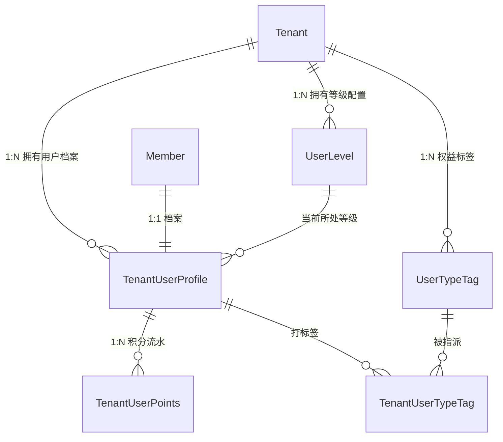

# 模块详细分析 06：用户成长、通知中心与打卡签到（points / notifications / check_system / charts）

本文档详细剖析系统的用户促活、会员等级积分、全站通知广播、任务打卡以及可视化仪表盘模块，涵盖：
**points 模块（积分引擎与 VIP 等级）**、**notifications 模块（站内消息与已读追踪）**、**check_system 模块（多租户签到任务与打卡周期）** 与 **charts 模块（运营大屏统计）**。

---

## 1. points 模块详细分析

### 1.1 模块定位与核心业务
- **定位**：多租户客户忠诚度、成长值与会员权益中心。
- **核心业务**：
  1. **多租户租户用户档案（TenantUserProfile）**：为每个租户下的成员维护成长值（`growth_points`）、当前可用积分（`current_points`）、累计赚取积分与历史消耗积分。
  2. **VIP 会员梯度系统（UserLevel）**：租户可自主配置等级阶梯（如“青铜/白银/黄金/钻石”），配置升级所需最低成长值、积分倍率加成（`points_multiplier`）及专属权益图标。
  3. **积分流水记账（TenantUserPoints）**：完整记录每笔积分交易的流水号、收支方向（`income` 增发 / `expense` 扣减）、业务场景类型（签到、发帖、购买软件、后台调整）、变动前/后余额与过期时间。
  4. **会员类型与权益标签（UserTypeTag）**：支持为成员打上“年费会员”、“极客开发者”、“早鸟体验官”等标签，实现差异化功能授权。

---

### 1.2 Model 详细分析

#### `TenantUserProfile`（租户用户积分档案主表）
- **数据表**：`points_tenantuserprofile`
- **核心字段**：
  - `tenant`: `ForeignKey('tenants.Tenant')`。
  - `member`: `ForeignKey('users.Member')`。
  - `level`: `ForeignKey(UserLevel, null=True, blank=True)`，当前会员级别。
  - `growth_points`: `PositiveIntegerField(default=0)`，历史成长值（只增不减）。
  - `current_points`: `PositiveIntegerField(default=0)`，当前可用积分。
  - `total_earned_points`: `PositiveIntegerField(default=0)`。
  - `total_consumed_points`: `PositiveIntegerField(default=0)`。
  - `status`: `choices=['active', 'frozen']`。

#### `TenantUserPoints`（积分交易流水表）
- **数据表**：`points_tenantuserpoints`
- **核心字段**：
  - `user_profile`: `ForeignKey(TenantUserProfile, related_name='points_records')`。
  - `transaction_type`: `choices=['income', 'expense']`。
  - `amount`: `PositiveIntegerField()`，变动数额。
  - `balance_after`: `PositiveIntegerField()`，变动后结存余额。
  - `action_type`: `choices=['checkin', 'article_post', 'comment', 'purchase', 'admin_adjust', ...]`。
  - `reference_id`: 业务关联外部单据 ID。
  - `description`: 变更摘要。

---

### 1.3 API 接口层
- **路由前缀**：`/api/v1/points/`
- **端点清单**：
  - `GET / POST /api/v1/points/user-levels/` (`UserLevelViewSet`): 租户会员等级配置增删改查。
  - `GET / POST /api/v1/points/user-type-tags/` (`UserTypeTagViewSet`): 权益标签字典管理。
  - `GET /api/v1/points/profiles/` (`TenantUserProfileViewSet`): 查看成员成长画像与当前积分。
  - `GET / POST /api/v1/points/points-records/` (`TenantUserPointsViewSet`): 检索积分流水或执行人工积分奖惩调整。
  - `GET /api/v1/points/statistics/` (`PointsStatisticsViewSet`): 统计租户当前积分总发行量、沉淀量与消耗分布。

---

## 2. notifications 模块详细分析

### 2.1 模块定位与核心业务
- **定位**：全站即时站内信与公告发布系统，支持点对点业务提醒与全员广播。
- **核心业务**：
  1. **双通道消息下发**：
     - **系统广播公告（Broadcast）**：管理员向全租户广播通知，接收人表动态惰性生成。
     - **定向私信（Direct Message）**：工单答复、许可证即将过期、打卡提醒等一对一通知。
  2. **已读/未读状态追踪（NotificationRecipient）**：记录每位受众成员的 `is_read` 状态、读取时间（`read_at`）与删除标记。
  3. **双路由严格隔离**：
     - 管理端发信与全量审计：`/api/v1/admin/notifications/`。
     - 成员端收信与标为已读：`/api/v1/notifications/`。

---

### 2.2 Model 详细分析

#### `Notification`（通知主表）
- **数据表**：`notifications_notification`
- **继承链**：`BaseModel`
- **核心字段**：
  - `tenant`: `ForeignKey('tenants.Tenant')`。
  - `sender`: `ForeignKey(User, null=True, blank=True)`，管理员发件人。
  - `title`: `CharField(max_length=200)`。
  - `content`: `TextField()`。
  - `notification_type`: `choices=['system', 'announcement', 'reminder', 'activity']`。
  - `priority`: `choices=['low', 'normal', 'high', 'urgent']`。
  - `is_broadcast`: `BooleanField(default=False)`，是否全员广播。

#### `NotificationRecipient`（消息接收明细与已读状态）
- **数据表**：`notifications_recipient`
- **核心字段**：
  - `notification`: `ForeignKey(Notification, related_name='recipients')`。
  - `member`: `ForeignKey(Member, related_name='notifications')`，目标接收成员。
  - `is_read`: `BooleanField(default=False)`。
  - `read_at`: `DateTimeField(null=True, blank=True)`。
  - `is_deleted`: `BooleanField(default=False)`，成员个人收件箱层面的删除。

---

### 2.3 API 接口层
- **管理端（`/api/v1/admin/notifications/`）**：
  - `GET / POST`: 查看全量发送清单，发布全员公告或指定租户广播。
- **成员端（`/api/v1/notifications/`）**：
  - `GET`: 获取我的收件箱消息列表（可按 `is_read=false` 过滤未读）。
  - `POST /<id>/mark-read/`: 单条标为已读。
  - `POST /mark-all-read/`: 一键全标已读。
  - `GET /unread-count/`: 获取未读消息角标数。

---

## 3. check_system 模块详细分析

### 3.1 模块定位与核心业务
- **定位**：多租户任务签到与日常打卡系统，适用于学习打卡、习惯培养、员工排班或考勤场景。
- **核心业务**：
  1. **多语言打卡分类（TaskCategory）**：利用 `django-parler` 提供分类名称与描述的多语言本地化。
  2. **打卡任务实体（Task）**：定义任务标题、重复频次（每日/工作日/周末/自定义周期）、目标完成量与单次打卡成长奖励。
  3. **打卡记录留痕（CheckRecord）**：记录用户签到打卡时间、打卡心得文本、附带照片、GPS 地理经纬度位置信息。
  4. **打卡周期（CheckinCycle）**：按月或按周跟踪统计连续打卡天数（Streak Days），计算全勤奖励。

---

### 3.2 Model 详细分析
- `TaskCategory`（多语言分类表）: 支持 `translations = TranslatedFields(name=..., description=...)`。
- `Task`（打卡任务主表）: `tenant`, `title`, `frequency`, `points_reward`, `is_active`。
- `CheckRecord`（签到明细表）: `task`, `member`, `checkin_time`, `note`, `image_url`, `latitude`, `longitude`。
- `CheckinCycle`: `member`, `start_date`, `end_date`, `continuous_days`, `total_days`。

---

### 3.3 API 接口层
- **路由前缀**：`/api/v1/check-system/`
- **端点清单**：
  - `GET /api/v1/check-system/tasks/`: 查看可参与的打卡任务。
  - `POST /api/v1/check-system/tasks/<id>/check/`: 执行打卡并返回连续天数与奖励积分。
  - `GET /api/v1/check-system/records/`: 查看历史签到轨迹打卡日历。

---

## 4. charts 模块详细分析

### 4.1 模块定位与核心业务
- **定位**：管理后台数据可视化与统计大屏 API 聚合层。
- **核心业务**：
  1. **租户全局看板**：统计累计租户数、当月新增租户增长曲线。
  2. **许可证商业化看板**：统计全平台发卡总量、在线激活数、即将到期预警设备分布。
  3. **内容运营趋势**：统计 CMS 文章阅读 PV/UV、每日发布数及热门文章榜单。
- **API 路径**：`/api/v1/admin/charts/`
  - `GET /api/v1/admin/charts/dashboard/`: 运营总览看板数据。
  - `GET /api/v1/admin/charts/licenses/`: 授权激活态势图。
  - `GET /api/v1/admin/charts/tenant-growth/`: 租户增长趋势。
