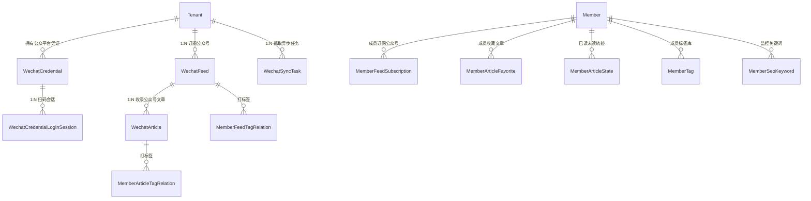

# 模块详细分析 07：微信生态与内容抓取聚合（wechat / we_rss）

本文档详细剖析系统与微信生态的深度集成，涵盖：
**wechat 模块（微信小程序登录、会话与素材草稿同步）** 与 **we_rss 模块（微信公众号凭证扫码托管、自动化抓取、RSS 聚合订阅、防盗链图片代理与 Markdown 导出）**。

---

## 1. wechat 模块详细分析

### 1.1 模块定位与核心业务
- **定位**：微信小程序原生生态接入适配器，主要面向移动端轻量级用户。
- **核心业务**：
  1. **小程序静默/授权登录**：通过客户端传递的 `js_code`，调用微信开放平台 `code2session` 接口换取 `openid`、`unionid` 与 `session_key`。
  2. **微信身份与 SaaS 账号绑定（WechatUser）**：将微信 OpenID 与系统的 `User`（管理员）或 `Member`（租户成员）实现双向映射。
  3. **全局 AccessToken 缓存托管**：在 Redis 中维护中控 `access_token`，设置合理的自刷新与过期倒计时（默认 7000 秒），避免频繁调用触发微信流控配额。
  4. **草稿箱与媒体素材同步**：支持将平台内文章内容及配套图片一键推送至微信公众号后台草稿箱（Draft）与永久素材库（Material）。

---

### 1.2 Model 详细分析

#### `WechatUser`（微信用户映射表）
- **数据表**：`wechat_user`
- **核心字段**：
  - `openid`: `CharField(max_length=64, unique=True, db_index=True)`，小程序唯一标识。
  - `unionid`: `CharField(max_length=64, null=True, blank=True, db_index=True)`，开放平台跨应用统一标识。
  - `session_key`: `CharField(max_length=128)`。
  - `user`: `OneToOneField('users.User', null=True, blank=True)`。
  - `member`: `OneToOneField('users.Member', null=True, blank=True)`。
  - `nickname`, `avatar_url`, `gender`, `country`, `province`, `city`。

---

### 1.3 API 接口层
- **路由前缀**：`/api/v1/wechat/`
- **端点清单**：
  - `POST /api/v1/wechat/login/` (`WechatLoginView`): 接收 `code`，完成登录或自动注册，签发系统 JWT Token。
  - `GET /api/v1/wechat/accounts/` (`wechat_accounts`): 查询已绑定的微信公众平台应用账号。
  - `POST /api/v1/wechat/media/uploadimg/` (`wechat_media_uploadimg`): 上传图文消息正文内的图片。
  - `POST /api/v1/wechat/draft/add/` (`wechat_draft_add`): 将平台文章打包推送到微信公众号草稿箱。

---

## 2. we_rss 模块详细分析

### 2.1 模块定位与核心业务
- **定位**：全功能的企业级微信公众号内容监控、爬取、知识提炼、RSS 分发与文献存档引擎。
- **核心业务**：
  1. **微信公众平台登录凭证（Credential）托管**：模拟微信公众平台网页端扫码登录流程，通过轮询登录会话（`WechatCredentialLoginSession`）获取二维码，捕获并保存 Token 与 Cookie 快照。
  2. **公众号订阅库（WechatFeed）**：按租户和成员建立订阅清单，记录关注的公众号 FakeID、名称、头像与历史更新时间。
  3. **自动化历史文章抓取（WechatSyncTask + Celery）**：通过历史接口或搜狗微信搜索引擎批量抓取公众号往期文章正文、HTML 结构及阅读量/点赞量指标。
  4. **微信图片防盗链流式反向代理（Image Proxy）**：解决微信图片在外部网页 403 访问受限问题。基于严格的主机白名单（`mmbiz.qpic.cn`, `mmbiz.qlogo.cn`），伪造真实浏览器 UA 与 Referer，支持 25MB 熔断保护与分块流式转发（Chunk Stream）。
  5. **富文本转 Markdown 与打包导出**：提供将微信公众号排版文章自动清洗、修复排版并转换为标准 Markdown；支持将文章内嵌的所有远程图片一并离线打包为 ZIP 压缩包下载。
  6. **标准 RSS XML 输出源**：为每个租户、标签或单个公众号提供符合标准 RSS 2.0 / Atom 协议的 XML 订阅源。

---

### 2.2 Model 详细分析



#### `WechatCredential`（公众号管理凭证表）
- **数据表**：`we_rss_credential`
- **继承链**：`BaseModel`
- **核心字段**：
  - `name`: 凭证名称（如“主编个人微信”）。
  - `token`: 微信公众平台管理后台 Token。
  - `cookies`: 经过加密保存的登录 Cookie 串。
  - `status`: `choices=['active', 'expired', 'invalid']`。
  - `is_default`: `BooleanField(default=False)`。

#### `WechatCredentialLoginSession`（扫码登录轮询会话）
- **数据表**：`we_rss_credential_login_session`
- **核心字段**：
  - `session_id`: 唯一会话 UUID。
  - `qr_code_url`, `qr_code_image`: 二维码图片及链接。
  - `scan_status`: `choices=['waiting', 'scanned', 'confirmed', 'expired', 'failed']`。
  - `token_snapshot`, `cookie_snapshot`: 扫码成功后捕获的数据包。

#### `WechatFeed`（公众号主表）
- **数据表**：`we_rss_feed`
- **核心字段**：
  - `fakeid`: 微信公众号底层唯一代号。
  - `name`: 公众号显示名称。
  - `avatar`: 公众号头像。
  - `description`: 简介。
  - `last_sync_at`: 上次全量拉取时间。

#### `WechatArticle`（公众号文章详情表）
- **数据表**：`we_rss_article`
- **核心字段**：
  - `feed`: `ForeignKey(WechatFeed, related_name='articles')`。
  - `title`: 文章标题。
  - `link`: 微信原文永久链接。
  - `cover_image`: 封面图。
  - `publish_time`: 公众号发布时间戳。
  - `content_html`: 抓取的 HTML 正文。
  - `read_count`, `like_count`: 抓取到的真实阅读量与点赞数。

#### `WechatSyncTask`（异步拉取任务追踪）
- **数据表**：`we_rss_sync_task`
- **核心字段**：`tenant`, `task_type`, `status` (`pending/running/success/failed/partial_success`), `celery_task_id`, `result_payload`。

---

### 2.3 API 接口层
- **路由前缀**：`/api/v1/we-rss/`
- **核心端点**：
  1. `GET /api/v1/we-rss/image-proxy/?url=<encoded_url>` (`image_proxy`): 微信图片防盗链流式反代。
  2. `POST /api/v1/we-rss/credentials/login-sessions/` (`CredentialLoginSessionViewSet`): 初始化并获取扫码登录二维码。
  3. `GET /api/v1/we-rss/credentials/login-sessions/<session_id>/`: 前端轮询扫码确认状态。
  4. `GET / POST /api/v1/we-rss/feeds/` (`FeedViewSet`): 查看已收录公众号或添加新关注。
  5. `POST /api/v1/we-rss/feeds/<id>/sync_by_history/`: 触发异步任务抓取该公众号历史全部文章。
  6. `GET /api/v1/we-rss/articles/` (`ArticleViewSet`): 多条件检索文章库。
  7. `GET /api/v1/we-rss/articles/<id>/markdown-with-images/`: 读取文章并转换为内嵌防盗链代理 URL 的标准 Markdown。
  8. `POST /api/v1/we-rss/articles/export-markdown-images/`: 批量打包导出为 ZIP 文件（含本地图片与 Markdown 文档）。
  9. `GET /api/v1/we-rss/rss/<feed_id>/` (`FeedRssView`): 为第三方阅读器（如 NetNewsWire/Reeder）输出标准 RSS XML 订阅流。

---

### 2.4 关键代码实录

#### 微信防盗链图片代理实现（`we_rss/services/image_proxy_service.py`）
```python
class ImageProxyService:
    @classmethod
    def proxy_image(cls, target_url: str):
        # 1. 严格域名白名单安全核验（防 SSRF）
        parsed = urlparse(target_url)
        allowed_hosts = settings.WE_RSS_IMAGE_PROXY['ALLOWED_HOSTS']
        if parsed.hostname not in allowed_hosts:
            raise PermissionDenied("Host not allowed for image proxy")
            
        # 2. 伪造浏览器 UA 与特定 Referer 绕过微信防盗链拦截
        headers = {
            'User-Agent': settings.WE_RSS_IMAGE_PROXY['USER_AGENT'],
            'Referer': settings.WE_RSS_IMAGE_PROXY['REFERER'],
        }
        
        # 3. 流式请求，严格限制最大字节数（25MB）防内存打爆
        response = requests.get(
            target_url, 
            headers=headers, 
            stream=True, 
            timeout=settings.WE_RSS_IMAGE_PROXY['TIMEOUT']
        )
        
        # 4. 构建 Django StreamingHttpResponse 流式返回给浏览器
        return StreamingHttpResponse(
            response.iter_content(chunk_size=8192),
            content_type=response.headers.get('Content-Type', 'image/jpeg')
        )
```
