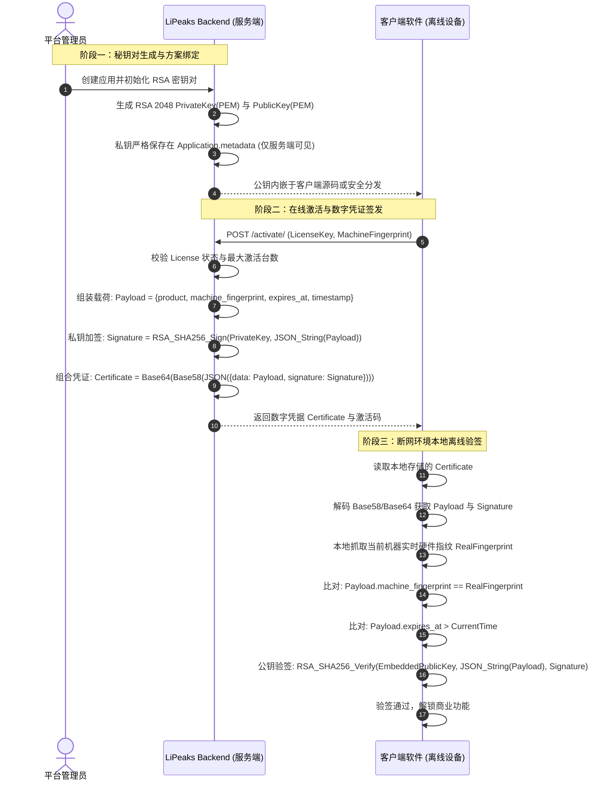
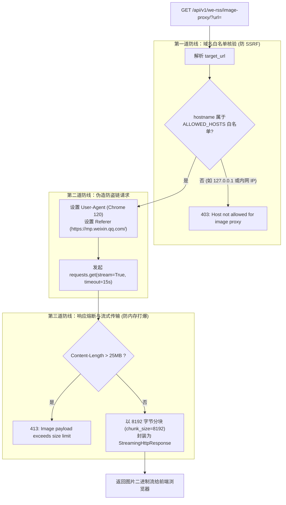

# 附录 03：核心业务算法与安全机制原理（Core Algorithms & Security Mechanisms）

本文档深入剖析 LiPeaks Backend 核心底层算法实现、密码学防护机制与高可用容灾逻辑，包含完整伪代码、时序交互与关键数学/密码学原理。

---

## 1. 软件许可证非对称加密签发与验签算法（RSA 2048）

系统为了保障商业桌面端软件在断网或离线环境下依然能够可信验证授权，设计了基于 **RSA 2048 非对称数字签名与 Base58/Base64 双重编解码** 的离线激活体系。



### 1.1 核心算法实现细节（`licenses/services/license_service.py`）
- **密钥生成**：利用 `cryptography.hazmat.primitives.asymmetric.rsa` 生成 2048 位密钥对，公钥指数设为 65537。
- **签名算法**：采用 `PKCS1v15` 填充标准搭配 `SHA256` 摘要算法。
- **序列化规范化**：签名前必须对 JSON 字符串做确定性排序（`separators=(',', ':'), sort_keys=True`），杜绝因键序或空格引起的验签失败。

---

## 2. 机器硬件指纹采集与混淆计算算法（Machine Fingerprint）

客户端软件部署在用户设备上，必须能够精准绑定设备，同时避免明文传输物理硬件信息造成隐私泄露。

```mermaid
flowchart LR
    subgraph ClientHardware ["客户端硬件原始采集"]
        CPU["CPU 序列号 (CPUID)"]
        MAC["主网卡 MAC 地址"]
        BIOS["主板 UUID / BIOS 序列号"]
        DISK["主硬盘序列号"]
    end

    subgraph Obfuscation ["混淆与规范化处理"]
        Clean["转大写、去空格与特殊符号"]
        Combine["确定性拼接: CPU + ':' + MAC + ':' + BIOS + ':' + DISK"]
        Salt["注入产品专属 Salt 盐值"]
    end

    subgraph HashGeneration ["指纹生成"]
        SHA256["SHA-256 哈希计算"]
        HexEncode["输出 64 位十六进制机器指纹"]
    end

    ClientHardware --> Clean
    Clean --> Combine
    Combine --> Salt
    Salt --> SHA256
    SHA256 --> HexEncode
    HexEncode --> MachineFingerprint["machine_fingerprint (64 chars)"]
```



### 关键防伪特性：
1. **抗篡改**：采用 SHA-256 不可逆单向散列，服务端数据库仅存储 64 位十六进制哈希与 AES 加密备份的硬件摘要，即便库表泄露也无法逆向出物理主板号。
2. **多网卡飘移容差**：`MachineFingerprintService` 会优先提取物理以太网卡与 Wi-Fi 网卡，排除 Docker/VMware/VPN 等虚拟网卡造成的指纹突变。

---

## 3. 多租户动态分流与线程隔离执行树

系统针对四类不同访问身份，在中间件层构建了清晰的执行判定决策树：

```mermaid
flowchart TD
    Req[客户端 HTTP 请求] --> PathCheck{请求路径属于<br>TENANT_ISOLATED_API_PATHS?}
    PathCheck -- 否 (Admin/Common) --> Bypass[跳过租户校验，直接放行]
    PathCheck -- 是 --> WhitelistCheck{在 TENANT_PUBLIC_API_PATHS<br>白名单中?}
    WhitelistCheck -- 是 (激活/验签/公开表单) --> PublicAccess[允许匿名访问，跳过租户上下文]
    WhitelistCheck -- 否 --> ExtractHeader[提取 Header: X-Tenant-ID]
    
    ExtractHeader --> AuthCheck{用户是否已通过 JWT 认证?}
    
    AuthCheck -- 是 (登录状态) --> RoleSwitch{用户角色身份}
    
    RoleSwitch -- SuperAdmin (超管) --> SARule{是否携带 X-Tenant-ID?}
    SARule -- 是 --> SetSAHeader[锁定指定租户上下文]
    SARule -- 否 --> SetSANull[全局无租户上下文 (看所有数据)]
    
    RoleSwitch -- TenantAdmin (租户管理员) --> TARule{是否携带 X-Tenant-ID?}
    TARule -- 携带且不匹配自身 --> Reject403[403: 拒绝跨租户越权操作]
    TARule -- 携带且一致/未携带 --> SetTAContext[绑定用户所属租户上下文]
    
    RoleSwitch -- Member (租户普通成员) --> MemberRule{是否携带 X-Tenant-ID?}
    MemberRule -- 不携带 --> Reject400[400: Member 必须携带 X-Tenant-ID Header]
    MemberRule -- 携带且不匹配自身租户 --> Reject403
    MemberRule -- 携带且匹配自身租户 --> SetMemberContext[绑定租户上下文]
    
    AuthCheck -- 否 (匿名状态) --> AnonCheck{是否为 GET 只读请求?}
    AnonCheck -- 非 GET --> Reject401[401: 匿名写操作被拒绝]
    AnonCheck -- 是 GET --> HeaderExist{是否携带合法 X-Tenant-ID?}
    HeaderExist -- 否 --> Reject400
    HeaderExist -- 是 --> SetAnonContext[绑定该租户上下文供公共浏览]
    
    SetSAHeader --> InjectThread[threading.local: set_current_tenant]
    SetSANull --> InjectThread
    SetTAContext --> InjectThread
    SetMemberContext --> InjectThread
    SetAnonContext --> InjectThread
    
    InjectThread --> NextMW[流转至下一中间件与 ViewSet]
```

---

## 4. 微信防盗链图片代理与 SSRF 安全熔断机制

微信公众号正文图片（`mmbiz.qpic.cn` / `mmbiz.qlogo.cn`）存在严格的防盗链机制，非微信客户端域名加载直接返回 HTTP 403。系统通过反向流式代理解决了该问题，同时针对 SSRF（服务端请求伪造）和内存溢出建立了三重防御：



---

## 5. 异步任务容灾与 EAGER 降级执行模型

在面对虚拟主机环境（如 cPanel 共享主机无法持久运行 Celery Worker 与 Redis）时，系统通过配置解耦实现了双模运行：

```mermaid
graph TD
    Trigger[业务事件: 工单状态变更 / 用户催单回复] --> TaskCall["Task.delay(...) 异步分发"]
    
    TaskCall --> ModeCheck{settings.CELERY_ENABLED ?}
    
    ModeCheck -- True (标准生产环境) --> RedisBroker[推入 Redis 消息队列: 'feedbacks' 队列]
    RedisBroker --> Worker[Celery Worker 异步消费]
    Worker --> SMTPExec[执行 SMTP 邮件投递与网络请求]
    Worker --> LogSuccess[写入 FeedbackEmailLog 成功日志]
    Worker -. 异常重试 .-> Retry[指数退避重试 (最多3次)]
    
    ModeCheck -- False (轻量/cPanel环境) --> EagerMode["CELERY_TASK_ALWAYS_EAGER = True"]
    EagerMode --> SyncExec[在当前 Web 请求线程中直接同步执行 Task]
    SyncExec --> SMTPExec
```
- **架构优势**：业务开发者仅需编写一套 `@shared_task` 代码，无需在视图层书写 `if-else` 分支判断运行模式，兼顾了高吞吐（生产）与零门槛快速交付（测试/虚拟主机）。
