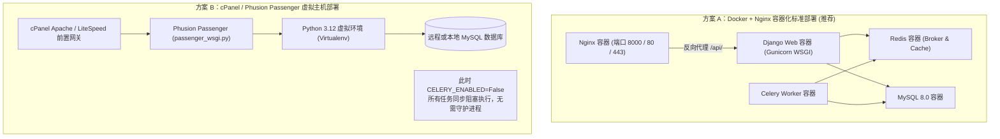

# 附录 04：生产部署、运维编排与全站安全审计（Deployment & Security Audit）

本文档面向运维工程师（SRE）、后端架构师与安全审计人员，系统阐述 LiPeaks Backend 项目在真实生产环境中的部署拓扑、双模运行机制、环境变量全表以及安全加固规范。

---

## 1. 部署架构方案与选型

系统支持两种截然不同但深度经过生产检验的部署形态：



---

## 2. Nginx 反向代理配置剖析（`nginx/default.conf`）

生产环境前置网关承担了动静分离、前端 SPA 路由回退、代理请求头透传以及开发环境域名重写的关键职责：

```nginx
server {
    listen 8000;
    server_name localhost;
    
    # 1. 前端 SPA 静态资源路由回退
    location / {
        root /usr/share/nginx/html;
        index index.html;
        try_files $uri $uri/ /index.html;
        
        # 使用 sub_filter 自动适配反代端口
        sub_filter 'http://localhost:8000' '';
        sub_filter_once off;
        sub_filter_types application/javascript text/javascript;
    }
    
    # 2. API 接口反向代理至后端 Gunicorn 进程 (web:8000)
    location /api/v1/ {
        proxy_pass http://web:8000/api/v1/;
        proxy_set_header Host $host;
        proxy_set_header X-Real-IP $remote_addr;
        proxy_set_header X-Forwarded-For $proxy_add_x_forwarded_for;
        proxy_set_header X-Forwarded-Proto $scheme;
    }
    
    # 3. 后端 Django 收集的后台管理静态资源
    location /backend-static/ {
        proxy_pass http://web:8000/static/;
        proxy_set_header Host $host;
    }
    
    # 4. 用户上传的媒体文件 (Media)
    location /media/ {
        proxy_pass http://web:8000/media/;
        proxy_set_header Host $host;
        proxy_set_header X-Real-IP $remote_addr;
    }
}
```

---

## 3. 全局环境变量矩阵（Environment Variables）

系统配置完全遵从 **12-Factor App** 准则，所有密钥与环境依赖均提取至 `.env` 文件。

| 环境变量键名 | 典型取值示例 | 默认值 | 作用域与说明 |
| :--- | :--- | :--- | :--- |
| `SECRET_KEY` | `django-insecure-w7&3bz...` | 框架默认值 | **必须修改！** 用于 JWT 签名与密码加密哈希的私钥 |
| `INFO` | `False` | `True` | 是否开启 DEBUG 模式（生产必须强制设为 `False`） |
| `LOG_TO_CONSOLE` | `False` | 跟随 DEBUG | 控制日志输出位置；生产设为 `False` 写入 `logs/` 轮转文件 |
| `ALLOWED_HOSTS` | `api.lipeaks.com,admin.lipeaks.com` | `*` | HTTP Host 标头安全白名单（防 HTTP Host 头攻击） |
| `DB_NAME` | `lipeaks_multi_tenant` | `multi_tenant_db_dev` | MySQL 数据库名称 |
| `DB_USER` | `root` | `root` | MySQL 认证用户 |
| `DB_PASSWORD` | `P@ssw0rd2026!` | `password` | MySQL 认证密码 |
| `DB_HOST` | `127.0.0.1` | `localhost` | MySQL 主机地址 |
| `DB_PORT` | `3306` | `3306` | MySQL 服务端口 |
| `CELERY_ENABLED` | `true` (或 `false`) | `true` | 是否启用 Celery 异步队列。在 cPanel 环境必须设为 `false` |
| `CELERY_BROKER_URL` | `redis://127.0.0.1:6379/0` | `redis://...` | Celery 消息投递代理 |
| `CELERY_RESULT_BACKEND`| `redis://127.0.0.1:6379/0` | `redis://...` | Celery 任务执行结果缓存 |
| `EMAIL_USE_CONSOLE` | `false` | `false` | 若设为 `true`，邮件直接在控制台输出打印，用于离线调试 |
| `EMAIL_HOST_USER` | `service@lipeaks.com` | `''` | SMTP 邮件发信账号 |
| `EMAIL_HOST_PASSWORD` | `授权码 (App Password)` | `''` | SMTP 授权密码（非邮箱登录密码） |
| `SITE_URL` | `https://api.lipeaks.com` | `''` | 邮件中用于拼接重置链接与激活回调的基准 URL |
| `FRONTEND_URL` | `https://admin.lipeaks.com` | `http://localhost:3000` | 前端管理控制台的基准地址 |
| `WECHAT_APPID` | `wx1234567890abcdef` | `''` | 微信小程序 AppID |
| `WECHAT_SECRET` | `32位十六进制密钥` | `''` | 微信小程序 AppSecret（严格保密） |

---

## 4. 全站安全审计与生产加固规范（Security Audit Checklist）

### 4.1 多租户越权攻击防范（Tenant Isolation Defense）
- [x] **横向越权（IDOR）防护**：
  - 核心表强制继承 `BaseModel` 并接入 `TenantManager`，默认全局追加 `tenant=current_tenant` 过滤。
  - `TenantModelViewSet` 在执行 `perform_create` 时强制覆盖前端传入的 `tenant_id`，杜绝恶意抓包修改租户外键归属。
- [x] **Header 注入与越权攻击防护**：
  - 管理员账号登录后携带 `X-Tenant-ID` 企图操作其他租户数据时，`TenantMiddleware` 与 `TenantModelViewSet` 协同进行防御性断言拦截，直接抛出 `TenantHeaderInvalidOrMissing` 403 异常。

### 4.2 认证与密码学安全（Authentication & Crypto）
- [x] **Token 时效与双向分流**：
  - Access Token 具备严格的过期时间（`settings.JWT_AUTH['JWT_EXPIRATION_DELTA']`）；
  - 解密时核验用户账号 `status == 'active'` 与所属租户 `tenant.status == 'active'`，租户一旦暂停立即导致其下所有 Token 失效；
  - 禁止子账号（`parent != None`）通过 API 接口直接登录，杜绝后门登录。
- [x] **密码强度约束（Password Validators）**：
  - 启用 `MinimumLengthValidator`（最低 6 位）；生产建议追加 `CommonPasswordValidator` 与 `NumericPasswordValidator`。

### 4.3 跨域与网络攻击防范（Network & CSRF）
- [x] **CORS 跨域精细化控制**：
  - 生产环境必须将 `CORS_ALLOW_ALL_ORIGINS` 调整为 `False`，并严格限制 `CORS_ALLOWED_ORIGINS` 白名单域。
- [x] **SSRF 漏洞防范（反向图片代理）**：
  - `we_rss/services/image_proxy_service.py` 严格校验目标 URL 域名必须命中 `WE_RSS_IMAGE_PROXY['ALLOWED_HOSTS']` 白名单，严禁代理任意内网 IP（如 `127.0.0.1`, `169.254.169.254`, `10.0.0.0/8` 等）。
- [x] **流式 DoS 内存防打爆**：
  - 图片代理设置了单次请求最大读取限制 `MAX_CONTENT_LENGTH = 25MB`，并以 8KB 分块流式透传，避免一次性将超大文件读入内存导致 OOM。
