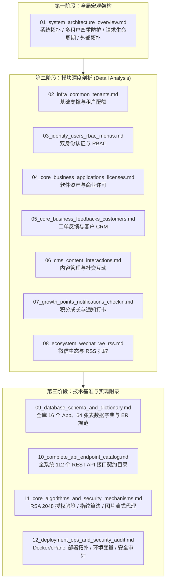

# LiPeaks Backend 架构与系统详析全书（Architecture Dossier）

本文档集由资深软件架构师基于 `lipeaks_backend` 代码库的静态代码、数据模型、中间件管道、业务服务与底层密码学实现整理编写，全方位构建了从**全局宏观架构 → 模块业务剖析 → 数据字典规范 → REST API 契约 → 核心算法原理 → 生产部署与安全加固**的完整认知链路。

---

## 知识体系全景图

---

## 文档完整目录索引

### 阶段一：系统全局宏观分析
- [**01_system_architecture_overview.md**](file:///d:/GitHub/lipeaks_backend/docs/01_system_architecture_overview.md)
  - 系统模块全景拓扑图（Client → Nginx → Middleware → CoreBase → CoreBusiness → MySQL/Redis/Celery/WeChat）
  - 16 个业务模块依赖矩阵
  - 多租户（Multi-Tenancy）四重安全隔离机制详解（路由层、上下文层、ORM 层、配额层）
  - 双身份认证体系（User 管理端 vs Member 客户端）与多态 RBAC
  - 核心业务数据 ER 关系图
  - 一次典型请求在系统中的全链路调用时序图（以创建 CMS 文章为例）
  - 外部服务、缓存与 Celery 异步任务拓扑

---

### 阶段二：模块深度详析（Detail Analysis）
按 `模块 → 核心业务 → Model → API → Service → Permission → 数据关系 → 关键代码` 的标准展开：

1. [**02_infra_common_tenants.md** - 基础支撑与多租户体系](file:///d:/GitHub/lipeaks_backend/docs/02_infra_common_tenants.md)
   - 涵盖模块：`common`, `tenants`
   - 核心要点：`BaseModel` 软删除、`TenantManager` 自动查询过滤、`_thread_local.tenant` 线程安全上下文、`TenantQuota` 资源配额拦截器、标准 JSON 渲染器与 API 审计日志。

2. [**03_identity_users_rbac_menus.md** - 双身份用户、认证与 RBAC 权限](file:///d:/GitHub/lipeaks_backend/docs/03_identity_users_rbac_menus.md)
   - 涵盖模块：`users`, `rbac`, `menus`
   - 核心要点：`User`（管理端）与 `Member`（SaaS 客户端）物理分表与配额约束、统一 JWT Payload（`model_type`）与签发、`UserRole` 多态角色挂载、权限代码去重与树状动态路由过滤。

3. [**04_core_business_applications_licenses.md** - 软件资产与商业授权许可](file:///d:/GitHub/lipeaks_backend/docs/04_core_business_applications_licenses.md)
   - 涵盖模块：`applications`, `licenses`
   - 核心要点：统一软件实体资产中心、RSA 2048 非对称密钥元数据托管、25 位易读 License 序列号与 SHA-256 索引哈希、CPU/MAC/BIOS 硬件指纹混淆与绑定（`MachineBinding`）、客户端在线激活/离线验签/定期心跳保活、租户成员授权划拨。

4. [**05_core_business_feedbacks_customers.md** - 工单反馈、邮件中心与 CRM 客户管理](file:///d:/GitHub/lipeaks_backend/docs/05_core_business_feedbacks_customers.md)
   - 涵盖模块：`feedbacks`, `customers`
   - 核心要点：多通道工单提交与附件上传、工单状态推进与状态轨迹审计（`FeedbackStatusHistory`）、内部便签 vs 公开答复、Celery 异步队列模板渲染与 SMTP 邮件投递、多租户 CRM 客户档案与联系人映射。

5. [**06_cms_content_interactions.md** - 内容管理系统与社交互动](file:///d:/GitHub/lipeaks_backend/docs/06_cms_content_interactions.md)
   - 涵盖模块：`cms`, `interactions`
   - 核心要点：Markdown/HTML 富文本支持、无限极文章父子自关联树形算法、数据库级双作者互斥 CheckConstraint、`django-parler` 多语言分类、文章版本修订快照与防刷统计、文章点赞/收藏/关注社交互动。

6. [**07_growth_points_notifications_checkin.md** - 用户积分成长、消息通知与任务打卡](file:///d:/GitHub/lipeaks_backend/docs/07_growth_points_notifications_checkin.md)
   - 涵盖模块：`points`, `notifications`, `check_system`, `charts`
   - 核心要点：多租户用户积分账户与收支明细记账、VIP 等级成长梯度引擎、广播公告与定向私信已读追踪、多语言打卡签到任务与周期天数、运营大屏数据可视化聚合。

7. [**08_ecosystem_wechat_we_rss.md** - 微信生态、公众平台扫码托管与 RSS 抓取](file:///d:/GitHub/lipeaks_backend/docs/08_ecosystem_wechat_we_rss.md)
   - 涵盖模块：`wechat`, `we_rss`
   - 核心要点：小程序静默登录 `code2session` 与 AccessToken 缓存、公众号扫码轮询登录与 Cookie/Token 凭据托管、公众号文章自动化批量抓取、微信防盗链图片流式反代（Image Proxy）、文章 Markdown 格式化与打包 ZIP 导出、标准 RSS 2.0 / Atom XML 订阅源。

---

### 阶段三：技术基准与实现附录
8. [**09_database_schema_and_dictionary.md** - 全库数据模型与数据字典规范](file:///d:/GitHub/lipeaks_backend/docs/09_database_schema_and_dictionary.md)
   - 覆盖 16 个 App、64 张数据表的物理表名、字段类型、索引、主外键、软删除与约束明细。

9. [**10_complete_api_endpoint_catalog.md** - 全系统 REST API 接口契约与端点目录](file:///d:/GitHub/lipeaks_backend/docs/10_complete_api_endpoint_catalog.md)
   - 覆盖 10 大业务群组、112 个 RESTful API 端点的方法、路径、视图类、权限类、租户 Header 规则与功能说明。

10. [**11_core_algorithms_and_security_mechanisms.md** - 核心业务算法与安全机制原理](file:///d:/GitHub/lipeaks_backend/docs/11_core_algorithms_and_security_mechanisms.md)
    - RSA 2048 非对称防伪数字签名与离线验签时序
    - CPU/MAC/BIOS 硬件指纹混淆计算
    - 多租户中间件与上下文动态分流决策树
    - 微信防盗链图片反代流式传输与 SSRF 熔断保护
    - Celery 异步任务与 Eager 同步降级机制

11. [**12_deployment_ops_and_security_audit.md** - 生产部署、运维编排与全站安全审计](file:///d:/GitHub/lipeaks_backend/docs/12_deployment_ops_and_security_audit.md)
    - Docker + Nginx 容器化标准部署方案与 Nginx 规则剖析
    - cPanel / Phusion Passenger 虚拟主机部署与脚本解读
    - 环境变量全量配置表
    - 多租户横向越权防御与全站安全加固 Checklist

---

### 阶段四：代码审查与缺陷报告（Code Review Issues）
由专业代码审查员（`agency-engineering-code-reviewer`）对全系统源码进行静态审计与运行时隐患排查生成的报告集，保存在 `docs/issue/` 目录下：

12. [**issue/01_code_review_overview.md** - 代码审查综述与质量评估报告](file:///d:/GitHub/lipeaks_backend/docs/issue/01_code_review_overview.md)
    - 全代码库质量健康度评分（各模块雷达评分）
    - 缺陷等级分布统计（4 🔴 阻塞项 / 3 🟡 建议项 / 4 💭 小改进）
    - 缺陷风险评估矩阵（影响度 vs 发生概率）与上线阻断建议
13. [**issue/02_blocking_defects_and_security.md** - 🔴 阻塞项与高危漏洞深度分析](file:///d:/GitHub/lipeaks_backend/docs/issue/02_blocking_defects_and_security.md)
    - ISSUE-B01：`feedbacks/tasks.py` 关联字段名不匹配导致 Celery 任务全线报 `FieldError` 崩溃
    - ISSUE-B02：`licenses` 模块重构遗留 `product` 属性导致管理后台与授权核心方法报 `AttributeError` 崩溃
    - ISSUE-B03：超级管理员租户 Header 强制校验在 ViewSet 中发生逻辑互斥死锁
    - ISSUE-B04：`BrowserConsoleLoggingMiddleware` 多线程竞态与生产环境未授权敏感凭证外泄 (CWE-200)
14. [**issue/03_logic_flaws_and_performance.md** - 🟡 建议项与 💭 小改进优化方案](file:///d:/GitHub/lipeaks_backend/docs/issue/03_logic_flaws_and_performance.md)
    - ISSUE-W01：密码找回验证码频限将 10 分钟误写为 6 秒，防爆破与短信轰炸保护失效
    - ISSUE-W02：生产环境关键安全配置硬编码覆盖（`ALLOWED_HOSTS=['*']`, 全局 CORS）
    - ISSUE-W03：`tenant_resolver.py` Query 参数优先级过高导致越权穿透隐患
    - ISSUE-N01~N04：多语言模型 N+1 查询优化、核心鉴权异常堆栈捕获、外部 RSS 抓取熔断与 JWT 周期治理
15. [**issue/04_remediation_roadmap.md** - 缺陷修复路线图与工程质量保障指南](file:///d:/GitHub/lipeaks_backend/docs/issue/04_remediation_roadmap.md)
    - P0 / P1 / P2 阶段式推进计划
    - 针对 4 大阻塞项的自动化回归测试用例清单（Test Cases）
    - 静态类型检查（django-stubs）与 CI/CD 质量防线治理建议
