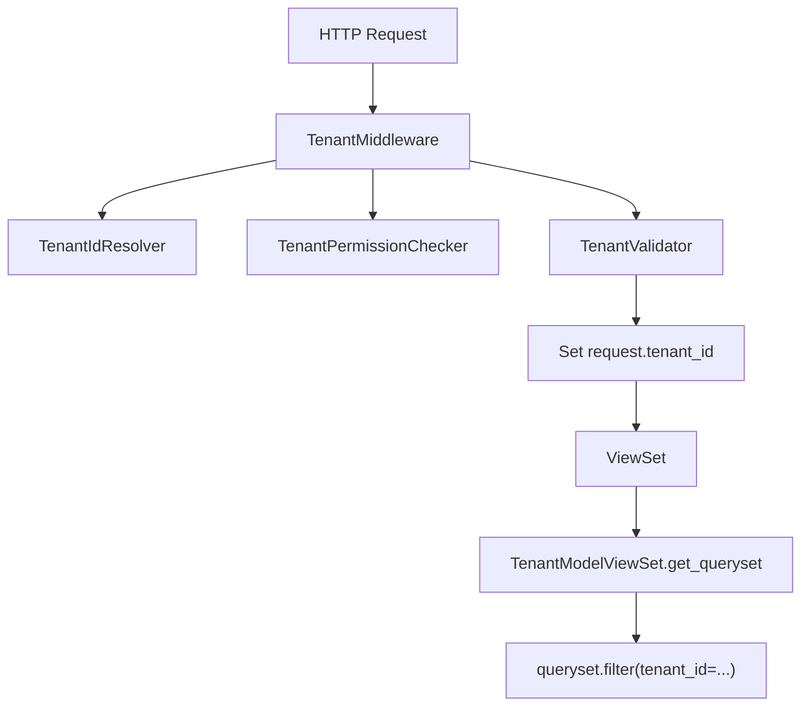

# 租户隔离架构说明

## 概述

本项目采用多层次的租户隔离架构，确保不同租户的数据完全隔离。

## 架构组件

## 组件职责

### 1. TenantMiddleware
- **位置**: `common/middleware/tenant_middleware.py`
- **职责**: 拦截所有API请求，解析和验证租户信息

### 2. TenantIdResolver
- **位置**: `common/services/tenant_resolver.py`
- **职责**: 从请求中提取租户ID
- **来源优先级**:
  1. HTTP Header: `X-Tenant-ID`
  2. 用户关联的租户: `request.user.tenant_id`

### 3. TenantPermissionChecker
- **位置**: `common/services/permission_checker.py`
- **职责**: 验证用户是否有权访问指定租户

### 4. TenantValidator
- **位置**: `common/services/tenant_validator.py`
- **职责**: 验证租户存在且处于活跃状态

### 5. TenantModelViewSet
- **位置**: `common/viewsets.py`
- **职责**: 
  - 自动过滤 queryset 按租户
  - 创建记录时自动设置 tenant_id
  - 更新/删除时验证租户所有权

### 6. BaseModel
- **位置**: `common/models.py`
- **职责**: 
  - 提供 `tenant` 外键字段
  - 提供 `TenantManager` 默认按租户过滤

## 用户角色与权限

| 角色 | 租户访问权限 |
|------|-------------|
| Super Admin | 可访问所有租户，需通过 X-Tenant-ID 指定目标租户 |
| Tenant Admin | 只能访问自己所属的租户 |
| Member | 只能访问自己所属的租户 |

## Feature Flag

`FEATURE_ENFORCE_TENANT_HEADER_FOR_MEMBER` 控制 Member 用户的租户解析行为：
- `True` (默认): 优先使用 X-Tenant-ID Header
- `False`: 使用中间件注入的 request.tenant_id

## 最佳实践

1. 所有需要租户隔离的 ViewSet 应继承 `TenantModelViewSet`
2. 所有需要租户隔离的 Model 应继承 `BaseModel`
3. 不要在 ViewSet 中手动过滤 tenant，让基类处理
4. 创建新记录时无需手动设置 tenant_id，基类会自动处理
