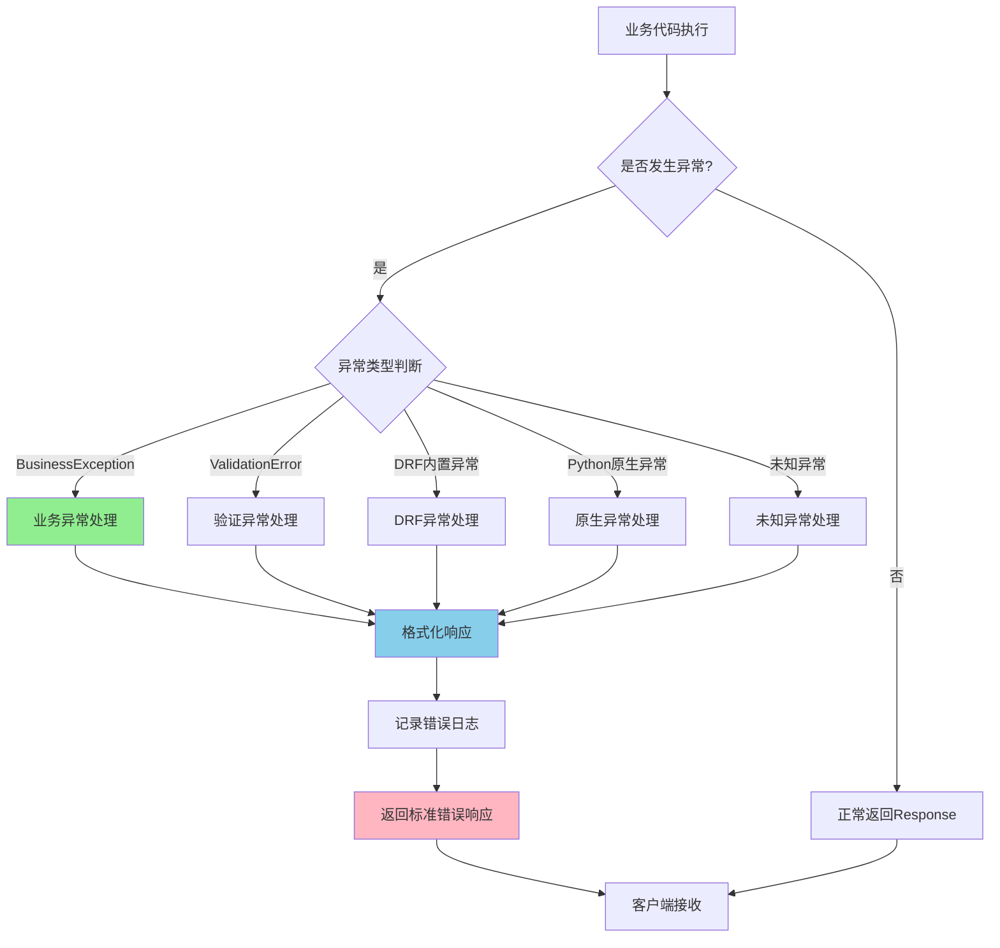
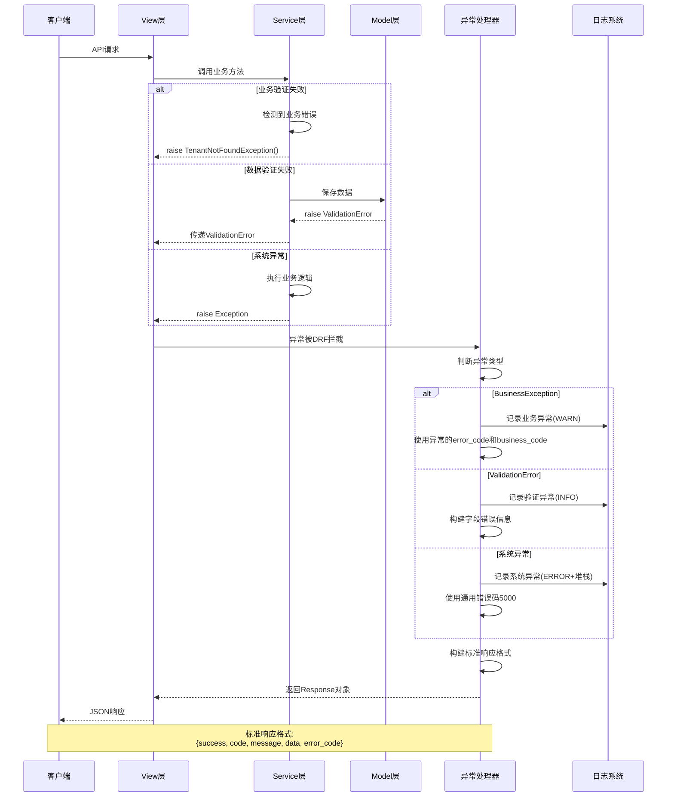
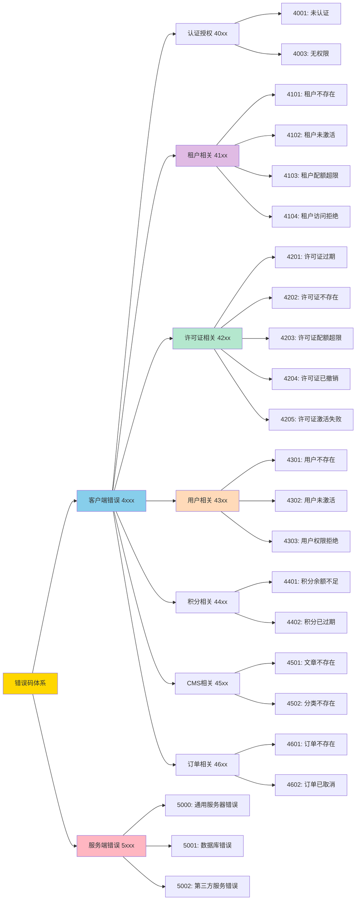
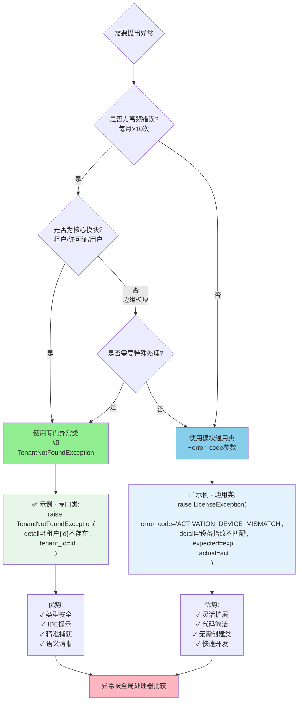

# 异常处理流程图

本文档包含异常处理系统的各种流程图和架构图，帮助理解整个系统的工作原理。

## 目录

1. [整体异常处理流程图](#1-整体异常处理流程图)
2. [异常类继承体系图](#2-异常类继承体系图)
3. [Service到View层异常处理序列图](#3-service到view层异常处理序列图)
4. [错误码分配规则图](#4-错误码分配规则图)
5. [异常使用决策树](#5-异常使用决策树)

---

## 1. 整体异常处理流程图

此流程图展示了从业务代码执行到最终返回错误响应的完整流程。



### 流程说明

1. **业务代码执行** - Service层或View层执行业务逻辑
2. **异常类型判断** - 全局异常处理器判断异常类型
3. **分类处理** - 根据异常类型选择不同的处理逻辑：
   - **BusinessException** - 业务异常，使用异常自带的错误码和消息
   - **ValidationError** - 数据验证异常，构建字段级错误信息
   - **DRF内置异常** - 认证、权限等异常，使用DRF默认处理
   - **Python原生异常** - ValueError、TypeError等，转换为业务异常
   - **未知异常** - 捕获所有未预期的异常，返回通用错误
4. **格式化响应** - 将异常转换为标准JSON格式
5. **记录日志** - 根据异常严重程度记录日志（INFO/WARN/ERROR）
6. **返回响应** - 返回统一格式的错误响应给客户端

---

## 2. 异常类继承体系图

此图展示了完整的异常类继承关系和错误码分配。

```mermaid
graph TD
    APIException[DRF APIException] --> BusinessException[BusinessException<br/>业务异常基类]
    
    BusinessException --> TenantException[TenantException<br/>租户异常基类<br/>code: 41xx]
    BusinessException --> LicenseException[LicenseException<br/>许可证异常基类<br/>code: 42xx]
    BusinessException --> UserException[UserException<br/>用户异常基类<br/>code: 43xx]
    BusinessException --> PointsException[PointsException<br/>积分异常基类<br/>code: 44xx]
    BusinessException --> CMSException[CMSException<br/>CMS异常基类<br/>code: 45xx]
    
    TenantException --> TenantNotFound[TenantNotFoundException<br/>code: 4101<br/>HTTP: 404]
    TenantException --> TenantInactive[TenantInactiveException<br/>code: 4102<br/>HTTP: 403]
    TenantException --> TenantQuotaExceeded[TenantQuotaExceededException<br/>code: 4103<br/>HTTP: 429]
    TenantException --> TenantAccess[TenantAccessDeniedException<br/>code: 4104<br/>HTTP: 403]
    TenantException --> TenantGeneric[使用通用类+error_code<br/>低频错误]
    
    LicenseException --> LicenseExpired[LicenseExpiredException<br/>code: 4201<br/>HTTP: 400]
    LicenseException --> LicenseNotFound[LicenseNotFoundException<br/>code: 4202<br/>HTTP: 404]
    LicenseException --> LicenseQuotaExceeded[LicenseQuotaExceededException<br/>code: 4203<br/>HTTP: 429]
    LicenseException --> LicenseRevoked[LicenseRevokedException<br/>code: 4204<br/>HTTP: 400]
    LicenseException --> LicenseActivation[LicenseActivationFailedException<br/>code: 4205<br/>HTTP: 400]
    LicenseException --> LicenseGeneric[使用通用类+error_code<br/>低频错误]
    
    UserException --> UserNotFound[UserNotFoundException<br/>code: 4301<br/>HTTP: 404]
    UserException --> UserInactive[UserInactiveException<br/>code: 4302<br/>HTTP: 403]
    UserException --> UserPermission[UserPermissionDeniedException<br/>code: 4303<br/>HTTP: 403]
    UserException --> UserGeneric[使用通用类+error_code<br/>低频错误]
    
    PointsException --> PointsInsufficient[PointsInsufficientException<br/>code: 4401<br/>HTTP: 400]
    PointsException --> PointsExpired[PointsExpiredException<br/>code: 4402<br/>HTTP: 400]
    PointsException --> PointsGeneric[使用通用类+error_code<br/>低频错误]
    
    CMSException --> ArticleNotFound[ArticleNotFoundException<br/>code: 4501<br/>HTTP: 404]
    CMSException --> CategoryNotFound[CategoryNotFoundException<br/>code: 4502<br/>HTTP: 404]
    CMSException --> CMSGeneric[使用通用类+error_code<br/>低频错误]
    
    style BusinessException fill:#FFE4B5
    style TenantException fill:#E0BBE4
    style LicenseException fill:#B4E7CE
    style UserException fill:#FFDAB9
    style PointsException fill:#C7CEEA
    style CMSException fill:#FFC8DD
```



### 继承层次说明

- **第一层（基类层）**：`BusinessException` - 所有业务异常的根基
- **第二层（模块层）**：按业务模块划分（Tenant、License、User等）
- **第三层（具体层）**：具体的异常类型（高频错误）或通用类使用（低频错误）

---

## 3. Service到View层异常处理序列图

此序列图展示了异常从Service层抛出到最终返回客户端的完整过程。



### 序列说明

1. **请求阶段** - 客户端发起API请求，View层调用Service层
2. **异常产生** - 可能在不同层级产生异常：
   - Service层：业务逻辑验证失败
   - Model层：数据验证失败
   - 系统层：未预期的异常
3. **异常拦截** - DRF框架自动拦截所有异常，传递给全局处理器
4. **异常处理** - 根据异常类型采取不同处理策略
5. **日志记录** - 根据严重程度记录不同级别的日志
6. **响应返回** - 构建统一格式的JSON响应返回客户端

---

## 4. 错误码分配规则图

此图展示了错误码的分配规则和各模块的错误码范围。



### 错误码规则

#### 4位数字结构

```
4XXX
│││└─ 具体错误序号 (01-99)
││└── 业务模块标识 (0-9)
│└─── 固定为0
└──── 错误类别 (4=客户端, 5=服务端)
```

#### 模块分配表

| 第2位 | 模块 | 错误码范围 | 示例 |
|-------|------|-----------|------|
| 0 | 认证授权 | 4000-4099 | 4001, 4003 |
| 1 | 租户 | 4100-4199 | 4101, 4102, 4103 |
| 2 | 许可证 | 4200-4299 | 4201, 4202, 4203 |
| 3 | 用户 | 4300-4399 | 4301, 4302, 4303 |
| 4 | 积分 | 4400-4499 | 4401, 4402 |
| 5 | CMS | 4500-4599 | 4501, 4502 |
| 6 | 订单 | 4600-4699 | 4601, 4602 |
| 7-9 | 预留 | 4700-4999 | 未来扩展 |

---

## 5. 异常使用决策树

此决策树帮助开发者选择使用专门异常类还是通用异常类。



### 决策指南

#### 使用专门异常类的场景

✅ **应该创建专门类：**
1. **高频错误** - 预计每月出现超过10次
2. **核心模块** - 租户、许可证、用户等核心业务
3. **需要特殊处理** - 需要在某些地方专门捕获和处理
4. **清晰语义** - 异常名称能清楚表达业务含义

**示例：**
```python
# 租户不存在 - 高频核心错误
raise TenantNotFoundException(
    detail=f'租户ID {tenant_id} 不存在',
    tenant_id=tenant_id
)

# 许可证过期 - 高频核心错误
raise LicenseExpiredException(
    detail=f'许可证已于 {expired_at} 过期',
    license_id=license_id,
    expired_at=expired_at.isoformat()
)
```

#### 使用通用类+错误码的场景

✅ **应该使用通用类：**
1. **低频错误** - 预计每月出现少于10次
2. **边缘场景** - 非核心业务流程
3. **临时错误** - 可能很快会修改或删除
4. **快速开发** - 不值得花时间创建新类

**示例：**
```python
# 设备指纹不匹配 - 低频错误
raise LicenseException(
    error_code='ACTIVATION_DEVICE_MISMATCH',
    detail='设备指纹不匹配，无法激活许可证',
    expected_fingerprint=expected,
    actual_fingerprint=actual
)

# 导出格式不支持 - 边缘场景
raise CMSException(
    error_code='EXPORT_FORMAT_UNSUPPORTED',
    detail=f'不支持的导出格式: {format}',
    requested_format=format,
    supported_formats=['pdf', 'docx', 'html']
)
```

---

## 响应格式示例

### 业务异常响应

```json
{
    "success": false,
    "code": 4101,
    "message": "租户ID 123 不存在",
    "data": null,
    "error_code": "TENANT_NOT_FOUND"
}
```

### 验证异常响应

```json
{
    "success": false,
    "code": 4000,
    "message": "数据验证失败",
    "data": {
        "name": ["该字段不能为空"],
        "email": ["请输入有效的邮箱地址"]
    },
    "error_code": "VALIDATION_ERROR"
}
```

### 服务器异常响应

```json
{
    "success": false,
    "code": 5000,
    "message": "服务器内部错误",
    "data": null,
    "error_code": "INTERNAL_SERVER_ERROR"
}
```

---

## 总结

这些流程图和决策树帮助开发者：

1. **理解系统** - 清楚异常从产生到响应的完整流程
2. **选择方案** - 知道何时用专门类，何时用通用类
3. **统一规范** - 遵循错误码分配规则
4. **提高质量** - 构建一致的错误处理逻辑

建议将这些图表打印或显示在开发环境中，作为日常开发的参考。

