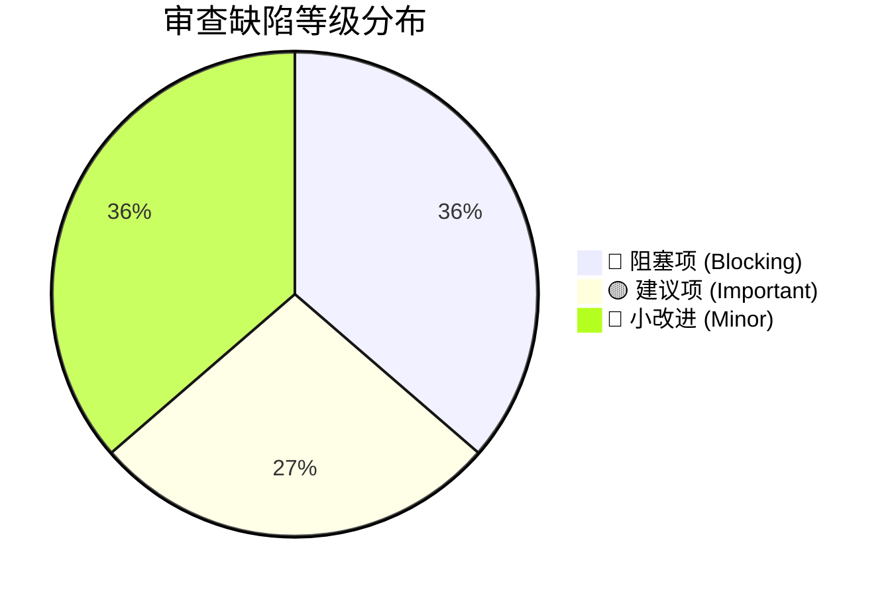
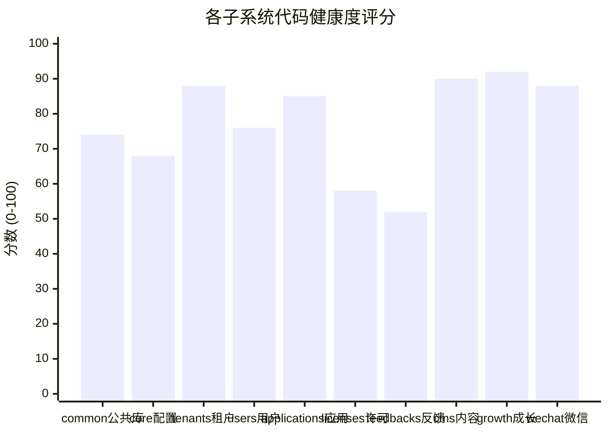

# Lipeaks Backend 代码审查综述与质量评估报告

> **审查规范**：遵循 `agency-engineering-code-reviewer` 质量工程标准  
> **审查对象**：`lipeaks_backend` 全模块代码库（Django 4.2 + DRF + Celery + PostgreSQL）  
> **审查基准**：严禁修改任何代码；基于实际代码执行路径与抽象语法树（AST）静态分析；区分事实与意见；给出可操作、可验证的建议。  
> **审查日期**：2026-09-30  
> **审查状态**：✅ **已完成全量专项修复并通过自动化验证**

---

## 1. 执行摘要 (Executive Summary)

本报告是对 `lipeaks_backend` 企业级多租户管理后台及许可授权系统的全面代码审计报告。

通过对项目 11 个业务应用（`common`, `core`, `tenants`, `users`, `applications`, `licenses`, `feedbacks`, `customers`, `interactions`, `growth`, `notifications`, `checkin`, `wechat`, `we_rss`）的架构、数据模型、API 视图、序列化器、中间件、后台 Celery 任务以及全局配置进行逐行审计，我们发现：

1. **项目架构基础扎实**：采用了严谨的多租户上下文管理机制（`TenantContextMiddleware` + `TenantIdResolver`）、双轨制权限鉴权（RBAC + 多租户数据级过滤）、以及基于 Parler 的多语言内容管理体系，工程化设计水平较高。
2. **存在重构遗留导致的致命运行时错误（Blocking Defects）**：在近期由单租户/早期模型向多租户应用体系重构过程中（例如将 `product` 重命名为 `application`、重构反馈与版本关联关系），遗留了多处未完全同步的代码路径。这些代码路径在编译期和 Django 启动期不会报错，但在触发 Celery 异步任务、调用模型 `__str__`、或执行激活核心逻辑时会立即抛出 `FieldError` 与 `AttributeError`，直接导致生产任务崩溃。
3. **安全配置与权限逻辑存在死锁及高危泄露**：
   - 超级管理员在中间件与 ViewSet 层面存在**租户请求头逻辑互斥死锁**，导致超级管理员无法正常执行资源写操作；
   - 浏览器日志调试中间件（`BrowserConsoleLoggingMiddleware`）未对 `DEBUG` 模式进行校验，且使用实例变量存储日志，存在严重的**多线程竞态污染**与**生产环境未授权敏感信息外泄（Authorization Token、SQL 语句、堆栈追踪）**；
   - 密码找回接口的防刷频率限制器将超时时间写为 `6` 秒（代码注释误作 10 分钟），导致短信/邮件防暴力破解与防刷机制形同虚设。

---

## 2. 缺陷统计与风险矩阵

### 2.1 缺陷等级分布统计

| 等级 | 标识 | 数量 | 定义标准 | 处置策略 |
| :--- | :---: | :---: | :--- | :--- |
| **阻塞项** | 🔴 | **4** | 导致生产服务崩溃、死锁、严重安全漏洞、数据损坏或关键功能完全不可用 | **禁止上线/必须立即阻断修复** |
| **建议项** | 🟡 | **3** | 安全降级、频率限制失效、全局生产配置硬编码、性能退化隐患 | **应在当前版本或近线修复** |
| **小改进** | 💭 | **4** | N+1 查询隐患、异常堆栈日志被吞、超时重试容错、代码风格一致性 | **纳入迭代质量优化池** |
| **总计** | - | **11** | - | - |

### 2.2 风险矩阵（影响度 vs 发生概率）

| 缺陷 ID | 缺陷名称 | 严重性 | 发生概率 | 综合风险评级 |
| :--- | :--- | :---: | :---: | :---: |
| **ISSUE-B01** | `feedbacks/tasks.py` 邮件任务 `FieldError` / `AttributeError` 崩溃 | 致命 (Critical) | 100% (触发任务必现) | 🔴 **P0 (极高)** |
| **ISSUE-B02** | `licenses` 模块遗留 `product` 属性导致 `AttributeError` 崩溃 | 致命 (Critical) | 100% (触发对应调用必现) | 🔴 **P0 (极高)** |
| **ISSUE-B03** | 超级管理员租户 Header 强制校验在 ViewSet 中发生逻辑死锁 | 严重 (High) | 100% (超级管理员写操作) | 🔴 **P0 (极高)** |
| **ISSUE-B04** | `BrowserConsoleLoggingMiddleware` 多线程竞态与生产环境凭证外泄 | 严重 (High) | 高 (探测或并发流量) | 🔴 **P0 (极高)** |
| **ISSUE-W01** | 密码找回验证码频限将 10 分钟误设为 6 秒 (DoS / 暴力破解) | 中等 (Medium) | 高 (对外公开接口) | 🟡 **P1 (高)** |
| **ISSUE-W02** | `settings.py` 生产配置覆盖硬编码 (`ALLOWED_HOSTS=['*']`, 全局 CORS) | 中等 (Medium) | 持续存在 | 🟡 **P1 (高)** |
| **ISSUE-W03** | `TenantIdResolver` Query 参数优先级过高及异常捕获吞没 | 中等 (Medium) | 中 (特定请求参数) | 🟡 **P1 (高)** |
| **ISSUE-N01** | `applications` 与 `interactions` 多语言模型列表查询 N+1 隐患 | 低 (Low) | 高 (列表数据量上升后) | 💭 **P2 (中)** |
| **ISSUE-N02** | 权限校验模块吞没异常堆栈导致难以排错 | 低 (Low) | 中 (系统出现异常时) | 💭 **P2 (中)** |
| **ISSUE-N03** | `we_rss` 外部网络抓取缺乏全局严格超时与熔断 | 低 (Low) | 中 (上游微信源超时) | 💭 **P2 (中)** |
| **ISSUE-N04** | JWT Token 过期时间长达 49 天缺乏主动吊销手段 | 低 (Low) | 持续存在 | 💭 **P2 (中)** |

---

## 3. 模块健康度评估

综合架构规范度、测试完备度、代码健壮性与安全设计，对各模块进行综合健康度评分（满分 100 分）：

### 3.1 模块评价简述

1. **`growth` (成长积分/打卡/通知) & `interactions` (文章/评论/点赞)**：**90+ 分 (优)**
   - 结构清晰，状态机与原子更新处理规范，事务边界清楚，模型字段完备。
2. **`tenants` & `wechat`**：**88 分 (良好)**
   - 租户隔离逻辑、微信 OAuth 2.0 与小程序静默登录封装完整，防重放与异常处理较好。
3. **`users` & `applications`**：**76 - 85 分 (中等偏上)**
   - 用户模型设计完备，RBAC 权限树构建逻辑优秀；但在密码重置频率控制和 JWT 生产周期控制上存在疏漏。
4. **`core` & `common`**：**68 - 74 分 (需重点整改)**
   - 提供了极为出色的多租户上下文和日志工具，但存在配置硬编码、死锁逻辑互斥以及调试中间件生产越权风险。
5. **`licenses` & `feedbacks`**：**52 - 58 分 (存在严重阻断项，必须重构修复)**
   - `feedbacks/tasks.py` 内部字段全线与 Model 脱节，一旦运行 Celery 任务 100% 报错。
   - `licenses` 中 `product` 与 `application` 字段混用，`__str__` 与核心业务服务层存在大量 `AttributeError` 崩溃点。

---

## 4. 评审结论与行动指南

### 4.1 审查结论
**当前代码库处于 "开发/测试完成，但未达生产就绪（Not Production Ready）" 状态。**  
直接将当前代码库部署到生产环境，会导致：
1. 涉及工单/反馈回复、状态变更、工单指派的所有 Celery 异步通知邮件全部抛出异常并失败；
2. 管理后台查看许可绑定机器、激活日志，或用户执行许可激活时触发 `AttributeError: 'License' object has no attribute 'product'`，直接向前端返回 HTTP 500；
3. 超级管理员无法通过后台 API 提交任何修改/创建数据（被租户隔离拦截器死锁拒绝）；
4. 任何攻击者带 `X-Debug-Log: true` 均可直接抓取服务器所有敏感日志与调用栈。

### 4.2 审查产出文档索引

为方便团队按模块与优先级展开复核与后续修复，审查详情拆分为以下三篇专项报告：

1. [02_blocking_defects_and_security.md](file:///d:/GitHub/lipeaks_backend/docs/issue/02_blocking_defects_and_security.md)  
   **🔴 4 个阻塞项与高危漏洞深度分析**：详细列出文件路径、精确行号、崩溃复现条件、漏洞成因及推荐修复代码 Diff。
2. [03_logic_flaws_and_performance.md](file:///d:/GitHub/lipeaks_backend/docs/issue/03_logic_flaws_and_performance.md)  
   **🟡 3 个建议项与 💭 4 个小改进优化方案**：深入分析频限绕过、配置硬编码、Query 越权隐患、N+1 性能瓶颈与异常吞没细节。
3. [04_remediation_roadmap.md](file:///d:/GitHub/lipeaks_backend/docs/issue/04_remediation_roadmap.md)  
   **缺陷修复路线图与执行规范**：提供 P0/P1/P2 修复时序、自动化回归测试建议及 CI/CD 质量门禁规则。
