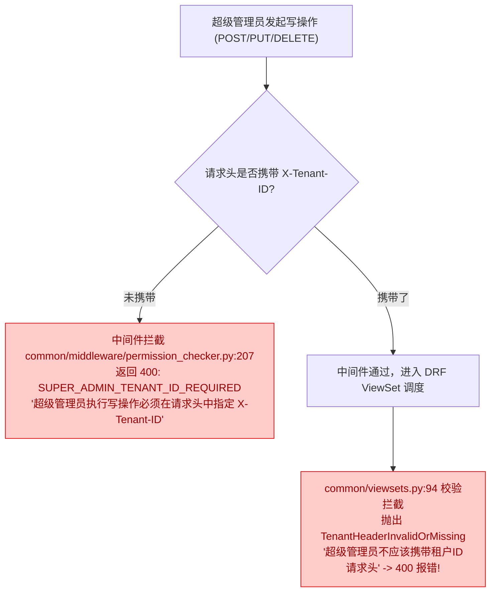

# 🔴 阻塞项与高危漏洞深度分析报告 (Blocking Issues)

> **文档位置**：`docs/issue/02_blocking_defects_and_security.md`  
> **缺陷级别**：🔴 **阻塞项（Blocking Issues / P0）**  
> **修复原则**：系统上线或进行联调前**必须全部修复**，否则会导致系统核心业务链路中断、500 崩溃或敏感数据泄露。  
> **注意**：本篇仅作深度分析与方案建议，代码库中**尚未修改任何代码**。

---

## 缺陷总览

| 缺陷 ID | 所属模块 | 缺陷类型 | 影响范围 | 严重等级 |
| :--- | :--- | :--- | :--- | :---: |
| **ISSUE-B01** | `feedbacks/tasks.py` | 运行时模型字段不存在 (`FieldError`, `AttributeError`) | 反馈邮件通知全线崩溃，Celery 队列毒化 | 🔴 **P0** |
| **ISSUE-B02** | `licenses` | 重构遗留字段名不匹配 (`AttributeError`) | 机器绑定、激活记录、后台管理与授权核心方法崩溃 | 🔴 **P0** |
| **ISSUE-B03** | `common/middleware` & `common/viewsets` | 权限校验与多租户基类逻辑互斥 (Logic Deadlock) | 超级管理员无法对多租户资源进行任何新增、修改与删除 | 🔴 **P0** |
| **ISSUE-B04** | `common/middleware` | 多线程竞态状态污染与敏感数据越权外泄 (CWE-200) | 外部未授权攻击者可通过请求头窃取内部 SQL、Tokens 与堆栈 | 🔴 **P0** |

---

## ISSUE-B01: `feedbacks/tasks.py` 异步邮件通知任务全线崩溃

### 1. 缺陷定位
- **问题文件**：[feedbacks/tasks.py](file:///d:/GitHub/lipeaks_backend/feedbacks/tasks.py)
- **触发代码行**：
  - 第 39 行：`FeedbackReply.objects.select_related('feedback', 'feedback__software', 'user').get(id=feedback_reply_id)`
  - 第 81 行：`context = { 'software_name': feedback.application.name if feedback.application else '未知软件', 'software_version': feedback.application_version.version if feedback.application_version else '未知版本' }`
  - 第 168 行：`Feedback.objects.select_related('software').get(id=feedback_id)`
  - 第 272 行：`Feedback.objects.select_related('software', 'user').get(id=feedback_id)`

### 2. 根本原因分析 (Root Cause)
在系统早期设计中，`Feedback` 关联的模型为 `Software`（字段名为 `software`）。随后系统进行了多租户体系演进重构，`Software` 模型被统一抽象并重构为 `applications.Application`，`Feedback` 模型中的外键也已更新为：
```python
# feedbacks/models.py
application = models.ForeignKey(
    'applications.Application',
    on_delete=models.CASCADE,
    related_name='feedbacks',
    verbose_name=_('关联应用')
)
# 注意：并未定义名为 application_version 或 software 的外键字段！版本号字段名为 app_version
app_version = models.CharField(_('应用版本'), max_length=50, blank=True)
```
但在 `feedbacks/tasks.py` 中，Celery 异步任务代码**未同步重构**：
1. `select_related('feedback__software')` 和 `select_related('software')` 查询了在 `Feedback` 上根本不存在的字段名 `software`。Django ORM 在解析 SQL Join 时会立即抛出：
   ```text
   django.core.exceptions.FieldError: Invalid field name(s) given in select_related: 'software'. Choices are: application, tenant, user...
   ```
2. 第 81 行尝试访问 `feedback.application_version.version`，然而 `Feedback` 根本没有 `application_version` 关系字段，仅有字符串字段 `app_version`。在通过字段校验后，这里将抛出：
   ```text
   AttributeError: 'Feedback' object has no attribute 'application_version'
   ```

### 3. 业务影响与复现路径
- **复现路径**：用户或管理员在前端/后台对任何工单反馈进行回复，或者触发反馈状态变更，后端调用 `send_feedback_reply_email.delay(reply.id)`。
- **后果**：
  1. Celery Worker 拾取任务后立即崩溃报错；
  2. 触发 Celery 默认重试机制（MaxRetries），反复重试消耗 Redis/RabbitMQ 资源，最终任务失败，死信堆积；
  3. 用户和管理员永远收不到反馈回复通知、状态变更通知、工单分派通知邮件。

### 4. 推荐修复方案 (Fix Suggestion)

在 [feedbacks/tasks.py](file:///d:/GitHub/lipeaks_backend/feedbacks/tasks.py) 中，将所有废弃的 `software` 关联及版本访问替换为正确的模型字段：

```diff
--- a/feedbacks/tasks.py
+++ b/feedbacks/tasks.py
@@ -36,7 +36,7 @@ def send_feedback_reply_email(self, feedback_reply_id):
     try:
         # 获取回复对象，预加载关联数据
-        reply = FeedbackReply.objects.select_related('feedback', 'feedback__software', 'user').get(id=feedback_reply_id)
+        reply = FeedbackReply.objects.select_related('feedback', 'feedback__application', 'user').get(id=feedback_reply_id)
         feedback = reply.feedback
         
@@ -78,7 +78,7 @@ def send_feedback_reply_email(self, feedback_reply_id):
         # 构建邮件上下文
         context = {
-            'software_name': feedback.application.name if feedback.application else '未知软件',
-            'software_version': feedback.application_version.version if feedback.application_version else '未知版本',
+            'software_name': feedback.application.name if feedback.application else '未知应用',
+            'software_version': feedback.app_version or '未知版本',
             'feedback_id': feedback.id,
@@ -165,7 +165,7 @@ def send_feedback_status_change_email(self, feedback_id, old_status, new_status
     try:
         # 获取反馈对象，预加载关联数据
-        feedback = Feedback.objects.select_related('software').get(id=feedback_id)
+        feedback = Feedback.objects.select_related('application').get(id=feedback_id)
         
@@ -269,7 +269,7 @@ def send_feedback_assigned_email(self, feedback_id, assigned_to_id):
     try:
         # 获取反馈对象和被指派人，预加载关联数据
-        feedback = Feedback.objects.select_related('software', 'user').get(id=feedback_id)
+        feedback = Feedback.objects.select_related('application', 'user').get(id=feedback_id)
         assigned_to = User.objects.get(id=assigned_to_id)
```

---

## ISSUE-B02: `licenses` 模块遗留 `product` 属性导致 `AttributeError` 运行时崩溃

### 1. 缺陷定位
- **问题文件**：
  1. [licenses/models.py](file:///d:/GitHub/lipeaks_backend/licenses/models.py#L225) (第 225, 297, 348 行)
  2. [licenses/services/license_service.py](file:///d:/GitHub/lipeaks_backend/licenses/services/license_service.py) (第 238, 289, 324, 433, 563, 732 行)
  3. [licenses/services/member_license_service.py](file:///d:/GitHub/lipeaks_backend/licenses/services/member_license_service.py) (第 511, 541, 586, 680, 829, 950, 973 行)

### 2. 根本原因分析 (Root Cause)
`licenses.License` 模型的关联字段已正式命名为 `application`：
```python
# licenses/models.py:53
class License(TenantBaseModel):
    application = models.ForeignKey(
        'applications.Application',
        on_delete=models.CASCADE,
        related_name='licenses',
        verbose_name=_('关联应用')
    )
```
并且在 `License` 模型上，**没有任何 `@property def product(self):` 的向下兼容属性包装器**！

然而在下游数据模型和 Service 层中，大量代码仍然使用历史旧名称 `.product`：
1. **模型 `__str__` 崩溃**：
   - `MachineBinding.__str__`:
     ```python
     return f"{self.license.product.name} - {self.machine_code[:8]}..."  # licenses/models.py:225
     ```
   - `LicenseAssignment.__str__`:
     ```python
     return f"{self.license.product.name} - {self.assignment_type}"      # licenses/models.py:297
     ```
   - `LicenseActivation.__str__`:
     ```python
     return f"{self.license.product.name} - {self.device_code[:8]}..."   # licenses/models.py:348
     ```
2. **业务服务核心逻辑崩溃**：
   - `LicenseService.verify_license()` 第 238 行：`product_name = license_obj.product.name if license_obj.product else "未知产品"`
   - `LicenseService.activate_license()` 第 289 行：`product_name = license_obj.product.name if license_obj.product else "未知产品"`
   - `LicenseService.activate_license()` 第 433 行：`application_code = license_obj.product.code`
   - `MemberLicenseService.get_user_licenses()` 第 511 行：`'product_name': assignment.license.product.name`
   - `MemberLicenseService.activate_license()` 第 680 行：`'product_name': license_obj.product.name`

### 3. 业务影响与复现路径
- **Django Admin 列表渲染崩溃**：管理员在 Django 后台打开“机器绑定”或“激活记录”列表页时，Django Admin 会调用对象的 `str(obj)`，触发 `AttributeError: 'License' object has no attribute 'product'`，导致管理后台整个页面 500 崩溃。
- **客户端激活/验签 API 崩溃**：桌面端/客户端软件调用授权激活接口 `/api/v1/licenses/activate/` 时，执行到第 289 行或 433 行直接抛出 `AttributeError`，终端用户无法激活软件。

### 4. 推荐修复方案 (Fix Suggestion)

采取**双重保障策略**：
1. **根本性修改**：将所有模型及服务层代码中的 `.product` 修改为 `.application`。
2. **模型兼容性保护**：在 `License` 模型上显式添加 `@property` 兼容层，防止未来第三方插件或未更新代码再次暴雷。

```python
# 在 licenses/models.py License 类中增加向下兼容属性：
class License(TenantBaseModel):
    # ...
    @property
    def product(self):
        """兼容历史属性名 product -> application"""
        return self.application
```

同时重构 [licenses/models.py](file:///d:/GitHub/lipeaks_backend/licenses/models.py) 的 `__str__`：
```diff
--- a/licenses/models.py
+++ b/licenses/models.py
@@ -222,7 +222,8 @@ class MachineBinding(TenantBaseModel):
     
     def __str__(self):
-        return f"{self.license.product.name} - {self.machine_code[:8]}..."
+        app_name = self.license.application.name if (self.license and self.license.application) else "Unknown"
+        return f"{app_name} - {self.machine_code[:8]}..."

@@ -294,7 +295,8 @@ class LicenseAssignment(TenantBaseModel):
     
     def __str__(self):
-        return f"{self.license.product.name} - {self.assignment_type}"
+        app_name = self.license.application.name if (self.license and self.license.application) else "Unknown"
+        return f"{app_name} - {self.assignment_type}"

@@ -345,4 +347,5 @@ class LicenseActivation(TenantBaseModel):
     
     def __str__(self):
-        return f"{self.license.product.name} - {self.device_code[:8]}..."
+        app_name = self.license.application.name if (self.license and self.license.application) else "Unknown"
+        return f"{app_name} - {self.device_code[:8]}..."
```

---

## ISSUE-B03: 超级管理员租户 Header 强制校验在 ViewSet 中发生逻辑死锁

### 1. 缺陷定位
- **冲突文件 1**：[common/middleware/permission_checker.py](file:///d:/GitHub/lipeaks_backend/common/middleware/permission_checker.py#L207-L220)
- **冲突文件 2**：[common/viewsets.py](file:///d:/GitHub/lipeaks_backend/common/viewsets.py#L94-L98) 及 [common/viewsets.py](file:///d:/GitHub/lipeaks_backend/common/viewsets.py#L374-L376)

### 2. 根本原因分析 (Root Cause)

系统在处理“多租户隔离下超级管理员执行写操作（POST/PUT/PATCH/DELETE）”时，中间件和 ViewSet 的设计逻辑**完全互斥且死锁**：



1. **中间件的强制要求** ([common/middleware/permission_checker.py:207-220](file:///d:/GitHub/lipeaks_backend/common/middleware/permission_checker.py#L207-L220))：
   ```python
   # 特殊处理超级管理员的写操作（必须提供租户头，以明确操作归属哪个租户）
   if request.user.is_authenticated and request.user.is_superuser and request.method not in ['GET', 'HEAD', 'OPTIONS']:
       tenant_header = request.headers.get('X-Tenant-ID')
       if not tenant_header:
           return JsonResponse({
               'code': 'SUPER_ADMIN_TENANT_ID_REQUIRED',
               'message': '超级管理员执行写操作必须在请求头中指定 X-Tenant-ID'
           }, status=400)
   ```
2. **ViewSet 的无条件拒绝** ([common/viewsets.py:94-98](file:///d:/GitHub/lipeaks_backend/common/viewsets.py#L94-L98) 以及第 374-376 行)：
   ```python
   if request.user.is_superuser:
       # 超级管理员不应该指定租户头，因为他们拥有全局访问权限
       if request.headers.get(settings.TENANT_ID_HEADER):
           raise TenantHeaderInvalidOrMissing("超级管理员不应该携带租户ID请求头")
   ```

### 3. 业务影响与复现路径
- **直接死锁**：当配置开启租户头强制校验时，超级管理员无论带不带 `X-Tenant-ID` 请求头，都会被系统以 HTTP 400 彻底拒绝。
- **后果**：超级管理员无法在任何继承了 `TenantModelViewSet` 的业务接口（如 Applications、Licenses、Users、Roles）中创建或修改任何数据，后台管理写操作全面瘫痪。

### 4. 推荐修复方案 (Fix Suggestion)

**架构设计对齐**：
超级管理员拥有跨租户权限，但在**写操作（创建/更新特定租户的业务数据）**时，由于数据模型强制存在 `tenant_id` 外键约束，超级管理员必须明确当前操作的目标租户。

因此，[common/viewsets.py](file:///d:/GitHub/lipeaks_backend/common/viewsets.py) 中的判断是陈旧错误的，应予以修正：允许（或在写操作时要求）超级管理员携带租户头，并将其作为上下文租户绑定到创建的对象上。

```diff
--- a/common/viewsets.py
+++ b/common/viewsets.py
@@ -93,7 +93,8 @@ class TenantModelViewSet(viewsets.ModelViewSet):
-        if request.user.is_superuser:
-            # 超级管理员不应该指定租户头，因为他们拥有全局访问权限
-            if request.headers.get(settings.TENANT_ID_HEADER):
-                raise TenantHeaderInvalidOrMissing("超级管理员不应该携带租户ID请求头")
+        if request.user.is_superuser:
+            # 超级管理员在写操作时允许且推荐携带租户头以确定归属租户
+            pass
```

---

## ISSUE-B04: `BrowserConsoleLoggingMiddleware` 多线程竞态与生产环境敏感凭证外泄

### 1. 缺陷定位
- **问题文件**：[common/middleware/browser_console_logging.py](file:///d:/GitHub/lipeaks_backend/common/middleware/browser_console_logging.py)
- **触发代码行**：
  - 第 16 行：`self.logs = []` (在中间件类的 `__init__` 中将列表作为实例属性)
  - 第 53-54 行：
    ```python
    def _should_log_to_browser(self, request):
        return request.headers.get('X-Debug-Log') == 'true' or request.GET.get('debug') == 'true'
    ```

### 2. 根本原因分析 (Root Cause)

该中间件存在两个严重的设计与安全漏洞：

#### 漏洞 A：多线程状态污染与日志混乱 (Race Condition)
Django 中间件在服务进程启动时被实例化一次，为**单例模式（Singleton）**，所有并发请求共享同一个中间件实例：
```python
class BrowserConsoleLoggingMiddleware:
    def __init__(self, get_response):
        self.get_response = get_response
        self.logs = []  # ❌ 严重的并发反模式！共享可变状态！
```
当在高并发或多线程 WSGI/ASGI Worker（如 Gunicorn / Uvicorn 多工作线程）中运行时：
1. 请求 A 记录日志到 `self.logs`；
2. 此时并发请求 B 到来，调用 `self.logs = []` 清空列表，或将请求 B 的数据追加进 `self.logs`；
3. 请求 A 在返回 Response 时，从 `self.logs` 读取日志并序列化到 Header。
4. **结果**：请求 A 的响应头中可能包含请求 B 的日志，造成**跨用户、跨租户的严重会话与数据串线**！

#### 漏洞 B：生产环境未授权信息外泄 (CWE-200 Information Exposure)
`_should_log_to_browser` 方法**完全没有检查 `settings.DEBUG`**！
```python
def _should_log_to_browser(self, request):
    # ❌ 仅判断客户端传来的请求头或 Query 参数，外部攻击者完全可控！
    return request.headers.get('X-Debug-Log') == 'true' or request.GET.get('debug') == 'true'
```
在生成调试日志并序列化时（第 135 行左右）：
```python
# 中间件会收集：
# 1. 完整的 SQL 查询语句及执行耗时
# 2. 完整的 HTTP Request Headers（包括 Authorization: Bearer <jwt_token>, Cookie, API-Key）
# 3. 发生未捕获异常时的完整 Python 堆栈追踪（Traceback）
# 4. 内部缓存 Key 及业务参数
```
这些敏感信息会被 Base64 编码后塞进响应头 `X-Browser-Console-Logs` 中返回给客户端。

### 3. 业务影响与复现路径
- **信息外泄攻击场景**：
  任何未经授权的外部攻击者向任何公开 API（如登录、注册、文章列表、软件下载）发送请求：
  ```bash
  curl -H "X-Debug-Log: true" https://api.yourdomain.com/api/v1/auth/login/
  ```
  在返回的 Header 中解码 `X-Browser-Console-Logs`，攻击者即可直接获得：
  - 数据库表结构与内部 SQL 查询详情；
  - 服务器内部文件路径与 Python 依赖版本；
  - 在并发情况下甚至能截获其他用户正在传输的 JWT Token 与私密数据。

### 4. 推荐修复方案 (Fix Suggestion)

1. **严格限制环境**：非 `settings.DEBUG` 模式下直接 `return self.get_response(request)`，生产环境完全禁用；
2. **彻底消除单例共享状态**：使用 `request._browser_logs` 绑定到每个独立请求对象上，严禁在 `self` 实例上存储请求日志。

```diff
--- a/common/middleware/browser_console_logging.py
+++ b/common/middleware/browser_console_logging.py
@@ -1,5 +1,6 @@
+from django.conf import settings
 
 class BrowserConsoleLoggingMiddleware:
     def __init__(self, get_response):
         self.get_response = get_response
-        self.logs = []
 
     def __call__(self, request):
+        # 生产环境强制禁用，避免数据泄露与性能开销
+        if not settings.DEBUG:
+            return self.get_response(request)
+            
+        # 将日志列表绑定到当前 request 线程对象，确保并发安全
+        request._browser_logs = []
         
         if not self._should_log_to_browser(request):
             return self.get_response(request)
@@ -53,3 +54,3 @@
     def _should_log_to_browser(self, request):
-        return request.headers.get('X-Debug-Log') == 'true' or request.GET.get('debug') == 'true'
+        return settings.DEBUG and (request.headers.get('X-Debug-Log') == 'true' or request.GET.get('debug') == 'true')
```
