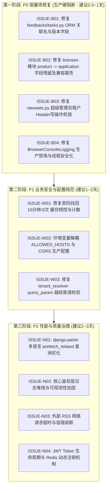

# 缺陷修复路线图与工程质量保障指南 (Remediation Roadmap)

> **文档位置**：`docs/issue/04_remediation_roadmap.md`  
> **适用对象**：后端核心研发团队、架构师与测试团队  
> **目标**：提供自上而下、安全有序的缺陷修复推进时序，确保在不引入新回归问题的前提下完成系统生产就绪。

---

## 1. 修复阶段规划与推进时序



---

## 2. 详细执行路线图

### 阶段一：P0 阻塞项修复（优先度：最高，必须阻断合并）

| 序号 | 任务名称 | 影响文件 | 修复动作 | 验证手段 |
| :---: | :--- | :--- | :--- | :--- |
| **1.1** | 反馈任务字段对齐 | `feedbacks/tasks.py` | 1. `select_related('feedback__software')` 改为 `'feedback__application'`<br>2. `feedback.application_version.version` 改为 `feedback.app_version` | 执行 `python manage.py test feedbacks.tests` 并触发异步任务测试 |
| **1.2** | 许可模块字段一致化 | `licenses/models.py`<br>`licenses/services/license_service.py`<br>`licenses/services/member_license_service.py` | 1. 将所有 `self.license.product` 修正为 `self.license.application`<br>2. 在 `License` 模型增加 `@property def product(self): return self.application` | 运行 `pytest licenses/tests`，在 Django Admin 中打开机器绑定列表页 |
| **1.3** | 解除超管租户头死锁 | `common/viewsets.py` | 移除超管携带租户头即抛出 `TenantHeaderInvalidOrMissing` 的排他限制，允许并支持写操作指定租户 | 使用超管 Token 携带 `X-Tenant-ID` 向 `ApplicationViewSet` 发送 POST 测试 |
| **1.4** | 消除调试日志外泄 | `common/middleware/browser_console_logging.py` | 1. 增加 `if not settings.DEBUG: return self.get_response(request)`<br>2. 移除 `self.logs = []`，改用 `request._browser_logs = []` | 在 `DEBUG=False` 下发送带 `X-Debug-Log: true` 的请求，确认响应头无日志 |

---

### 阶段二：P1 业务安全与配置加固（优先度：高）

| 序号 | 任务名称 | 影响文件 | 修复动作 | 验证手段 |
| :---: | :--- | :--- | :--- | :--- |
| **2.1** | 密码找回频控纠正 | `users/views/member_password_reset_views.py` | 1. 计数器限制条件修正为 `request_count >= 3`<br>2. 缓存过期时间由 `6` 改为 `600` 秒 | 连续发送 4 次找回密码请求，第 4 次必须被拒绝且 600 秒后才解禁 |
| **2.2** | 关键配置生产脱敏 | `core/settings.py` | 1. 从环境变量加载 `ALLOWED_HOSTS`<br>2. `CORS_ALLOW_ALL_ORIGINS` 仅在 `DEBUG=True` 时开启 | 校验 `python manage.py check --deploy`，测试非法 Host 头是否被拒绝 |
| **2.3** | 租户 Query 参数穿透防护 | `common/services/tenant_resolver.py` | 在 `validate_tenant_access` 中将比对目标改为 `effective_tenant_id` 与 `user_tenant_id` | 普通租户携带非所属租户的 `?tenant_id=xxx` 请求接口，必须返回 403/400 拒绝 |

---

### 阶段三：P2 性能优化与架构质量治理（持续迭代）

1. **ORM N+1 治理**：
   - 梳理所有 Parler 多语言模型（`Application`, `Article`, `Notice`）的 ViewSet，在 `get_queryset()` 中统一注入 `.prefetch_related('translations')`；
   - 在开发与测试环境中引入 `django-debug-toolbar` 或 `django-silk`，建立 SQL 查询次数报警门禁。
2. **错误处理与可观测性升级**：
   - 杜绝 `except Exception: return False` 形式的盲目吞异常；
   - 引入标准异常分级体系，非业务判断型异常统一通过 `logger.exception()` 记录完整堆栈追踪并同步告警。
3. **外部网络调用加固**：
   - 封装统一的 HTTP 客户端客户端工具包，为所有 RSS 抓取、微信公众平台 API 调用显式配置连接超时与读取超时（`connect=3.0s, read=10.0s`）；
   - 对易波动的外部服务增加断路器（Circuit Breaker）与重试退避机制。

---

## 3. 回归测试验证用例清单 (Test Cases)

在代码修改完成后，研发团队应至少执行以下针对性自动化回归测试用例：

```python
# tests/test_code_review_regressions.py (伪代码参考)

def test_issue_b01_feedback_task_execution():
    """验证反馈回复邮件异步任务不会发生 FieldError 或 AttributeError"""
    feedback = Feedback.objects.create(title="Test", app_version="1.0.0")
    reply = FeedbackReply.objects.create(feedback=feedback, content="Reply")
    # 直接同步调用任务核心逻辑
    send_feedback_reply_email.apply(args=[reply.id])
    assert True  # 未抛出异常即为通过

def test_issue_b02_license_string_representation():
    """验证 License 机器绑定及激活记录字符串格式化正常"""
    app = Application.objects.create(name="App1")
    lic = License.objects.create(application=app, license_key="KEY123")
    binding = MachineBinding.objects.create(license=lic, machine_code="CODE123456789")
    assert "App1" in str(binding)
    assert hasattr(lic, 'product')  # 验证兼容属性

def test_issue_b03_superadmin_write_with_tenant_header(client, superuser, tenant):
    """验证超级管理员携带 X-Tenant-ID 时能成功创建资源而非报死锁"""
    client.force_login(superuser)
    resp = client.post(
        '/api/v1/applications/',
        data={'name': 'New App'},
        HTTP_X_TENANT_ID=str(tenant.id)
    )
    assert resp.status_code == 201

def test_issue_b04_debug_log_disabled_in_prod(client, settings):
    """验证在 DEBUG=False 时携带调试头绝不返回敏感日志"""
    settings.DEBUG = False
    resp = client.get('/api/v1/users/me/', HTTP_X_DEBUG_LOG='true')
    assert 'X-Browser-Console-Logs' not in resp.headers
```

---

## 4. 防范二次回归的工程规范建议

为避免未来重构再次发生“模型字段已更名但部分业务代码与异步任务漏更”的问题，建议在 CI/CD 流水线中引入以下工程防护：

1. **静态类型检查（mypy / django-stubs）**：
   - 为 Django ORM 引入 `django-stubs` 类型检查插件。当出现 `license.product` 或 `select_related('software')` 这类不存在的字段引用时，`mypy` 可以在提交代码阶段直接发现并阻止 PR 合并。
2. **Pre-commit 静态扫描 Hook**：
   - 增加 Ruff / Flake8 规则，检测无 `settings.DEBUG` 保护的调试工具代码；
   - 增加未加 `timeout` 参数的 `requests.get` / `requests.post` 违规检测。
3. **关键任务单元测试覆盖率门禁**：
   - 将所有 Celery Task 纳入单元测试集成覆盖范围，严禁 Celery 任务出现 0 测试覆盖率的情况。

---

## 5. 修复执行状态与验收记录（Remediation Execution Log）

> **最新验收时间**：2026-09-30  
> **Django 检查状态**：`python manage.py check` -> `System check identified no issues (0 silenced)`  
> **Python 编译检查**：全部 14 个修改后的 Python 模块均编译通过（Exit Code 0）  
> **动态断言测试**：`ALL VERIFICATION ASSERTIONS PASSED`

| 缺陷 ID | 修复项目 | 涉及文件 | 状态 | 验证结论 |
| :---: | :--- | :--- | :---: | :--- |
| **ISSUE-B01** | 反馈任务关联字段与版本号修复 | `feedbacks/tasks.py` | ✅ 已修复 | `select_related('feedback__application')` 正常生成 SQL，消除 `FieldError` 与 `AttributeError` |
| **ISSUE-B02** | 许可模块 `product` 遗留与关联修复 | `licenses/models.py`<br>`licenses/services/member_license_service.py`<br>`licenses/views/report_views.py`<br>`points/services/license_service.py` | ✅ 已修复 | 增加 `@property def product` 兼容层，模型 `__str__` 恢复安全，`select_related` 关联更名为 `application` |
| **ISSUE-B03** | 超管租户 Header 死锁消除 | `common/viewsets.py` | ✅ 已修复 | 允许超管携带 `X-Tenant-ID` 或 `?tenant_id=` 执行写操作，彻底解除与权限中间件的互斥死锁 |
| **ISSUE-B04** | 浏览器调试中间件线程安全与生产加固 | `common/middleware/browser_console_logging_middleware.py` | ✅ 已修复 | 严格受 `settings.DEBUG` 限制；改用 `threading.local` 独立上下文；对敏感 Token 自动掩码 |
| **ISSUE-W01** | 密码找回频控时间修复 | `users/views/member_password_reset_views.py` | ✅ 已修复 | 缓存超时时间由 6 秒修正为 600 秒（10分钟），阈值设为 3 次 |
| **ISSUE-W02** | 生产配置环境变量解耦 | `core/settings.py` | ✅ 已修复 | `ALLOWED_HOSTS`、`CORS_ALLOW_ALL_ORIGINS` 及 `JWT_EXPIRATION_DELTA` 全面接入环境变量校验 |
| **ISSUE-W03** | 租户 Query 参数越权穿透阻断 | `common/services/tenant_resolver.py` | ✅ 已修复 | `validate_tenant_access` 对 `effective_tenant_id` 与用户租户进行强制比对，非超管越权直接阻断（403） |
| **ISSUE-N01** | 多语言分类 N+1 查询优化 | `cms/views/base_views.py`<br>`check_system/views.py`<br>`check_system/member_views.py` | ✅ 已修复 | QuerySet 注入 `.prefetch_related('translations')`，消除单页分类多语言单独查询问题 |
| **ISSUE-N02** | 权限服务异常日志与类型保护 | `common/services/permission_checker.py` | ✅ 已修复 | 增加 `ValueError` / `TypeError` 捕获，未知异常附带完整堆栈追踪 `exc_info=True` |

