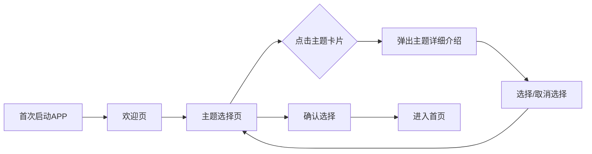
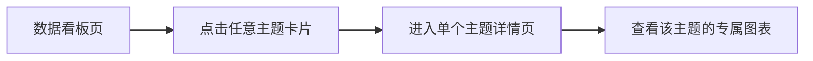
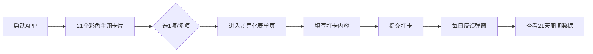

# 21天自律打卡 APP 完整需求文档 (增强版)

> 基于原始PRD并参考市场同类产品研究整理

---

## 一、文档基础信息

| 项目 | 内容 |
|------|------|
| 产品名称 | 21天自律打卡 |
| 产品版本 | V1.0 |
| 产品定位 | 21天周期轻量化打卡工具，支持自选主题打卡，各主题适配专属打卡内容，以色彩区分视觉体验 |
| 目标用户 | 追求灵活自律计划、注重打卡内容针对性的人群 |
| 核心价值 | 自选主题降低执行门槛，专属打卡内容提升记录价值，色彩视觉强化主题区分 |

---

## 二、竞品分析参考

### 2.1 相似产品功能亮点

| 应用名称 | 平台 | 核心特点 |
|----------|------|----------|
| **Streaks** | iOS/macOS/watchOS | 极简设计、一键签到、与Apple Health集成、支持每日/每周/每月习惯 |
| **Loop** | Android | Material Design、桌面小组件快速签到、免费开源、支持跳过天数 |
| **Momentum** | iOS | 极简设计、一键签到、支持备注、高效体验 |
| **时间痕迹** | iOS | 轻点开关记录时间、时间线绘制、自定义卡片颜色图标 |
| **HabitMark** | iOS | 极简打卡追踪、培养自律好习惯 |
| **Habitify** | iOS/Android/Web | 情绪追踪、Apple Health/Google Fit集成、跨平台同步 |
| **Habitica** | iOS/Android | 游戏化习惯养成、奖励机制、社区功能 |
| **Simple Time Tracker** | Android | 极简界面、一键启动活动、历史记录统计、离线可用 |

### 2.2 设计参考要点

- ✅ **极简操作**: 最少步骤完成打卡（参考Streaks/Momentum的一键签到）
- ✅ **色彩区分**: 卡片颜色自定义增强视觉辨识（参考时间痕迹）
- ✅ **进度可视化**: 连续打卡天数、饼图、日历视图（通用最佳实践）
- ✅ **离线支持**: 本地存储数据，无网络可正常使用
- ✅ **快速时间输入**: 一键输入当前时间 + 快速选择器

---

## 三、核心需求

### 3.1 主题自选
- 21个固定自律主题支持**单选/多选**
- 非每日强制完成全部，灵活选择

### 3.2 专属打卡内容
- 每个主题匹配差异化的核心打卡内容
- 输入形式/字段根据主题特性定制

### 3.3 色彩视觉区分
- 为21个主题分配专属颜色
- 颜色贯穿界面设计（卡片、表单、按钮）

### 3.4 21天周期反馈
- 以21天为周期展示打卡数据
- 每日打卡后即时反馈结果

### 3.5 极简操作
- **选主题 → 填内容 → 提交**，三步完成打卡
- 无冗余功能，专注核心体验

---

## 四、核心功能需求

### 4.0 ⭐ 首次进入引导模块 (新增)

> **用户需求**: 第一次进入APP时要求选择几个打卡的主题，或者全选，每个打卡主题点进去都要详细的介绍

#### 4.0.1 引导流程



#### 4.0.2 欢迎页设计

```
┌────────────────────────────────────┐
│                                    │
│              🌟                    │
│                                    │
│       21天自律打卡                 │
│                                    │
│   「坚持 21 天，养成一个好习惯」     │
│                                    │
│   选择你想要坚持的自律主题          │
│   开启属于你的 21 天挑战之旅        │
│                                    │
│    ┌─────────────────┐            │
│    │   开始选择 →      │            │
│    └─────────────────┘            │
│                                    │
└────────────────────────────────────┘
```

#### 4.0.3 主题选择页

```
┌──────────────────────────────────────────────┐
│  选择你的自律主题           全选 ☐  │
├──────────────────────────────────────────────┤
│                                              │
│  ┌──────────┐ ┌──────────┐ ┌──────────┐  │
│  │██████████│ │██████████│ │          │  │
│  │ 觉醒的   │ │ 早睡    │ │ 健康    │  │
│  │ 自我  ✓  │ │ 早起  ✓ │ │ 饮食     │  │
│  └──────────┘ └──────────┘ └──────────┘  │
│   紫罗兰色       天蓝色         草绿色      │
│                                              │
│  ┌──────────┐ ┌──────────┐ ┌──────────┐  │
│  │          │ │          │ │          │  │
│  │ 坚持    │ │ 养成    │ │ 精进    │  │
│  │ 运动     │ │ 阅读习惯 │ │ 专业技能 │  │
│  └──────────┘ └──────────┘ └──────────┘  │
│   橙红色         明黄色         藏青色      │
│        ... 更多主题向下滚动 ...              │
│                                              │
├──────────────────────────────────────────────┤
│  已选择 2 个主题                              │
│  ┌──────────────────────────────────────┐  │
│  │         确认并开始 21 天挑战         │  │
│  └──────────────────────────────────────┘  │
└──────────────────────────────────────────────┘
```

**交互说明**：
- 点击主题卡片 → 弹出详细介绍弹窗
- 在弹窗中点击「选择这个主题」或「取消」
- 右上角「全选」复选框，一键选中/取消所有主题
- 底部显示已选择数量，至少选择 1 个才能确认

---

#### 4.0.4 主题详细介绍弹窗

```
┌──────────────────────────────────────────────┐
│                                              │
│  ┌──────────────────────────────────────┐  │
│  │                                  × │  │
│  │         🏃 坚持运动                  │  │
│  │         橙红色主题                    │  │
│  │                                      │  │
│  │  「生命在于运动，运动赋予生命活力」  │  │
│  │                                      │  │
│  │  🎯 主题目标                        │  │
│  │  通过21天的运动打卡，养成规律锻炼    │  │
│  │  的习惯，提升身体素质与精神状态    │  │
│  │                                      │  │
│  │  📝 打卡内容                        │  │
│  │  • 选择运动类型（跑步/瑜伽/游泳...)│  │
│  │  • 记录运动时长（分钟）            │  │
│  │  • 是否托延                        │  │
│  │                                      │  │
│  │  💡 小贴士                          │  │
│  │  建议每天30分钟中等强度运动，      │  │
│  │  逐步增加时长和强度                │  │
│  │                                      │  │
│  │  ┌────────────────────────────┐    │  │
│  │  │    ✓ 选择这个主题            │    │  │
│  │  └────────────────────────────┘    │  │
│  └──────────────────────────────────────┘  │
│                                              │
└──────────────────────────────────────────────┘
```

#### 4.0.5 21个主题详细介绍内容

| 主题 | 主题目标 | 打卡内容简介 | 小贴士 |
|------|----------|--------------|--------|
| 觉醒的自我 | 提升自我认知，了解内心真实想法 | 每日反思50字内 | 找一个安静的时间进行自省 |
| 早睡早起 | 规律作息，精力充沛 | 记录入睡/起床时间 | 建议22:30前入睡，保证7-8小时睡眠 |
| 健康饮食 | 均衡营养，感受食物能量 | 三餐照片/饮食记录 | 多吃绿叶菜，少油少盐 |
| 坚持运动 | 规律锻炼，提升身体素质 | 运动类型+时长 | 每天至少30分钟中等强度运动 |
| 养成阅读习惯 | 拓展知识，滋养心灵 | 书籍名称+阅读页数 | 每天至少20页，早晚固定时间阅读 |
| 精进专业技能 | 持续进步，增强竞争力 | 学习内容+笔记截图 | 制定学习计划，分解目标 |
| 时间管理 | 高效利用时间，提升效率 | 完成任务数+时间小结 | 使用番茄工作法，集中精力 |
| 整理与收纳 | 整洁环境，清晰思维 | 整理后照片+耗时 | 每天整理一个小区域 |
| 培养积极心态 | 发现生活中的美好 | 3件开心的事 | 关注积极面，感受当下 |
| 积极社交 | 拓展人脉，增进连接 | 社交场景与内容 | 主动与他人交流 |
| 理财规划 | 培养财富意识 | 收支金额+理财计划 | 记录每笔消费，量入为出 |
| 勇于突破自我 | 走出舒适区，不断成长 | 突破事件与感受 | 每天做一件以前不敢做的事 |
| 自我关爱 | 善待自己，充电恢复 | 关爱行为/照片 | 可以是敷面膜、泡澡、看电影 |
| 感恩之心 | 培养感恩心态，提升幸福感 | 感恩的人/事 | 每天发现一件值得感恩的事 |
| 持续学习 | 终身学习，不断进步 | 非专业类学习内容 | 学外语/摄影/绘画等 |
| 高效工作 | 提升工作产出 | 完成工作项+效率自评 | 每日三件事，专注重要任务 |
| 拓宽眼界 | 拓展视野，别样体验 | 球展视野的行为 | 看纪录片、读新闻、参观展览 |
| 情绪管理 | 掌控情绪，保持平和 | 情绪状态+调节方法 | 深呼吸、运动、明想或写日记 |
| 提升表达能力 | 清晰表达，有效沟通 | 表达练习场景与表现 | 练习当众讲话或跟朋友交流 |
| 数字排毒 | 减少屏幕时间，回归真实 | 远离电子设备时长+活动 | 离开手机，阅读/散步/运动 |
| 学会复盘 | 总结经验，持续优化 | 21天的收获与不足 | 真诚面对自己，计划下一个周期 |

---

### 4.1 主题选择模块

#### 主题列表展示
- 以**彩色卡片**形式展示21个自律主题
- 每张卡片标注：主题名称 + 专属颜色
- 支持单选/多选模式
- **点击卡片可查看主题详细介绍**

#### 选中状态视觉
- **选中**: 高亮（加深颜色 + 勾选标识）
- **未选中**: 浅色调展示

#### 确认打卡项
- 选好后点击「确定」
- 跳转至所选主题的打卡表单页面
- 未选主题不展示

---

### 4.2 差异化打卡表单模块

#### 21个主题详细定义

| 天数 | 打卡主题 | 专属颜色 | 核心打卡内容（输入形式） | 辅助字段 |
|------|----------|----------|--------------------------|----------|
| 1 | 觉醒的自我 | 紫罗兰色 `#8B5CF6` | 文本输入：今日自我认知反思（50字内） | 是否拖延（√/×） |
| 2 | 早睡早起 | 天蓝色 `#38BDF8` | ⏰ 时间选择：实际入睡时间+起床时间 | 是否拖延（√/×） |
| 3 | 健康饮食 | 草绿色 `#4ADE80` | 图片上传+文本：当日三餐照片/饮食记录 | 是否拖延（√/×） |
| 4 | 坚持运动 | 橙红色 `#F97316` | 下拉选择+数字：运动类型+时长 | 是否拖延（√/×） |
| 5 | 养成阅读习惯 | 明黄色 `#FACC15` | 文本+数字：书籍名称+当日阅读页数 | 是否拖延（√/×） |
| 6 | 精进专业技能 | 藏青色 `#1E3A5F` | 文本+图片：学习内容+笔记/作业截图 | 是否拖延（√/×） |
| 7 | 时间管理 | 深灰色 `#4B5563` | 数字+文本：完成任务数+时间利用小结 | 是否拖延（√/×） |
| 8 | 整理与收纳 | 浅粉色 `#FBCFE8` | 图片+数字：整理后照片+耗时（分钟） | 是否拖延（√/×） |
| 9 | 培养积极心态 | 蜜桃色 `#FDBA74` | 文本输入：当日3件开心的事 | 是否拖延（√/×） |
| 10 | 积极社交 | 青柠色 `#A3E635` | 文本输入：当日社交场景与内容 | 是否拖延（√/×） |
| 11 | 理财规划 | 金黄色 `#EAB308` | 数字+文本：当日收支金额+理财计划 | 是否拖延（√/×） |
| 12 | 勇于突破自我 | 玫红色 `#EC4899` | 文本输入：突破舒适区的事件与感受 | 是否拖延（√/×） |
| 13 | 自我关爱 | 淡紫色 `#C4B5FD` | 文本+图片：自我关爱行为/照片 | 是否拖延（√/×） |
| 14 | 感恩之心 | 暖橙色 `#FB923C` | 文本输入：当日感恩的人/事 | 是否拖延（√/×） |
| 15 | 持续学习 | 湖蓝色 `#06B6D4` | 文本输入：非专业类学习内容 | 是否拖延（√/×） |
| 16 | 高效工作 | 炭黑色 `#1F2937` | 文本+数字：完成工作项+效率自评(1-5星) | 是否拖延（√/×） |
| 17 | 拓宽眼界 | 靛蓝色 `#4F46E5` | 文本+链接：拓展视野的行为 | 是否拖延（√/×） |
| 18 | 情绪管理 | 柔粉色 `#FDA4AF` | 下拉选择+文本：情绪状态+调节方法 | 是否拖延（√/×） |
| 19 | 提升表达能力 | 翠绿色 `#10B981` | 文本输入：表达练习场景与表现 | 是否拖延（√/×） |
| 20 | 数字排毒 | 茶褐色 `#A16207` | ⏰ 数字+文本：远离电子设备时长+活动 | 是否拖延（√/×） |
| 21 | 学会复盘 | 深紫色 `#7C3AED` | 文本输入：21天的收获与不足 | 是否拖延（√/×） |

> ⏰ 标记的字段需要**时间输入**功能

---

### 4.3 ⭐ 时间输入增强功能 (新增)

> **用户需求**: 时间输入字段可以一键输入当前时间，也可以快速选择时间

#### 时间输入组件设计

```
┌─────────────────────────────────────────┐
│  实际入睡时间                              │
├─────────────────────────────────────────┤
│  ┌─────────────┐  ┌───────────────────┐ │
│  │ 22:30       │  │ 🕐 现在          │ │
│  └─────────────┘  └───────────────────┘ │
│                                          │
│  快速选择:                                │
│  ┌────┐ ┌────┐ ┌────┐ ┌────┐ ┌────┐    │
│  │21:00│ │21:30│ │22:00│ │22:30│ │23:00│ │
│  └────┘ └────┘ └────┘ └────┘ └────┘    │
│  ┌────┐ ┌────┐ ┌────┐ ┌────┐ ┌────┐    │
│  │23:30│ │00:00│ │00:30│ │01:00│ │01:30│ │
│  └────┘ └────┘ └────┘ └────┘ └────┘    │
└─────────────────────────────────────────┘
```

#### 功能说明

| 功能 | 描述 |
|------|------|
| **一键「现在」按钮** | 点击自动填入当前时间（HH:mm 格式） |
| **快速时间选择** | 预设常用时间点按钮，点击即填入 |
| **手动输入** | 支持直接输入或滚轮选择时间 |
| **时间滚轮** | 点击输入框弹出原生时间选择器 |

#### 适用场景

- 早睡早起主题：入睡时间/起床时间
- 数字排毒主题：远离电子设备时长
- 其他涉及时间记录的场景

#### 交互细节

1. **默认状态**: 显示占位符 "点击选择时间"
2. **点击「现在」**: 立即填入当前时间，带轻微震动反馈
3. **点击快速选择**: 直接填入对应时间
4. **点击输入框**: 弹出时间滚轮选择器
5. **时间格式**: 统一使用 24 小时制 `HH:mm`

---

### 4.4 表单交互规则

#### 视觉一致性
- 表单边框、按钮、输入框高亮色沿用主题专属颜色
- 保持整体视觉风格统一

#### 提交反馈
- 填写完成后点击「提交打卡」
- 即时弹出每日反馈弹窗

```
示例反馈：
✅ 已完成「坚持运动」打卡
📊 今日累计打卡 2 项
🔥 21天周期已完成 5 天～
```

---

### 4.5 21天周期数据模块

#### 进度可视化

| 组件 | 描述 |
|------|------|
| **顶部进度条** | 按已过天数填充，标注「周期第X天/共21天」 |
| **彩色卡片矩阵** | 已完成=主题色实色填充，未完成=主题色描边 |

#### 极简图表反馈

| 图表类型 | 展示内容 |
|----------|----------|
| **饼图** | 按主题颜色展示各打卡项的完成次数占比 |
| **日历视图** | 21天日历，每日格子标注对应打卡主题的颜色小色块 |

---

### 4.6 个人中心模块

#### 核心数据展示

- 当前周期进度
- 累计打卡项数
- 连续打卡天数

#### ⭐ 主题管理 (新增)

> **用户需求**: 个人中心页里面可以更新打卡主题

| 功能 | 说明 |
|------|------|
| **管理打卡主题** | 查看当前已选主题，支持添加/移除主题 |
| **查看主题详情** | 点击已选主题查看详细介绍 |
| **添加新主题** | 从未选主题中添加新的打卡项 |
| **移除主题** | 移除已选主题（保留历史数据） |

```
┌──────────────────────────────────────┐
│  管理打卡主题                          │
├──────────────────────────────────────┤
│  当前已选 (3个)                         │
│  ┌──────────┐ ┌──────────┐ ┌────────┐│
│  │█ 早睡早起│ │█ 坚持运动│ │█ 阅读  ││
│  │   ⊖      │ │   ⊖      │ │   ⊖    ││
│  └──────────┘ └──────────┘ └────────┘│
│                                      │
│  ⣿ 添加更多主题...                     │
└──────────────────────────────────────┘
```

**交互说明**：
- 点击主题卡片查看详细介绍
- 点击⊖移除主题（确认弹窗）
- 点击「添加更多主题」进入主题选择页面

#### 极简设置

| 设置项 | 功能 |
|--------|------|
| **打卡提醒** | 开启/关闭 + 时间设置 |
| **重置周期** | 清空当前周期数据，开始新周期 |

---

### 4.7 ⭐ 单个主题数据可视化模块 (新增)

> **用户需求**: 可以根据每个打卡种类查看图表，如几天打卡的图

#### 设计参考

| 参考应用 | 可视化特点 |
|----------|------------|
| **Loop Habit Tracker** | 详细图表统计、习惯强度评分、完整历史记录 |
| **Habit Heat** | GitHub风格热力图、年度视图、数值型颜色强度 |
| **Habitify** | 趋势分析、平均完成率、连续天数追踪 |
| **GitHub Contributions** | 热力图日历、色彩深浅表示频率 |

---

#### 4.7.1 入口与交互流程



**入口方式**：
- 在数据看板页，点击任意一个主题的彩色卡片
- 右上角显示「详情」按钮或直接点击卡片进入
- 或在主题列表长按卡片进入详情

---

#### 4.7.2 单个主题详情页布局

```
┌────────────────────────────────────────────────┐
│  ← 返回                  坚持运动 🏃            │
│                          橙红色主题              │
├────────────────────────────────────────────────┤
│                                                 │
│  ┌──────────────────────────────────────────┐  │
│  │        📊 核心数据卡片                     │  │
│  │  ┌─────────┐ ┌─────────┐ ┌─────────┐    │  │
│  │  │  12天   │ │  8天    │ │  57%    │    │  │
│  │  │ 累计打卡 │ │ 当前连续 │ │ 完成率  │    │  │
│  │  └─────────┘ └─────────┘ └─────────┘    │  │
│  └──────────────────────────────────────────┘  │
│                                                 │
│  ┌──────────────────────────────────────────┐  │
│  │        📅 21天热力图日历                   │  │
│  │  ┌─┬─┬─┬─┬─┬─┬─┐                         │  │
│  │  │█│█│░│█│█│█│░│ 第1周                   │  │
│  │  ├─┼─┼─┼─┼─┼─┼─┤                         │  │
│  │  │█│░│█│█│█│░│█│ 第2周                   │  │
│  │  ├─┼─┼─┼─┼─┼─┼─┤                         │  │
│  │  │█│█│█│░│░│░│░│ 第3周                   │  │
│  │  └─┴─┴─┴─┴─┴─┴─┘                         │  │
│  │  █ 已打卡  ░ 未打卡  ○ 今日               │  │
│  └──────────────────────────────────────────┘  │
│                                                 │
│  ┌──────────────────────────────────────────┐  │
│  │        📈 完成率趋势折线图                  │  │
│  │     100%│    ╭─╮                          │  │
│  │      80%│╭─╮ │ ╰╮  ╭╮                    │  │
│  │      60%││ ╰─╯  │  ││                    │  │
│  │      40%│╯      ╰──╯╰───                 │  │
│  │       0%└────────────────                │  │
│  │         W1   W2   W3                      │  │
│  └──────────────────────────────────────────┘  │
│                                                 │
│  ┌──────────────────────────────────────────┐  │
│  │        📋 打卡历史记录                     │  │
│  │  Day 21 - 01/13  ✓ 跑步 30分钟            │  │
│  │  Day 20 - 01/12  ✓ 瑜伽 45分钟            │  │
│  │  Day 19 - 01/11  ✗ 未打卡                 │  │
│  │  Day 18 - 01/10  ✓ 游泳 60分钟            │  │
│  │  ...                                      │  │
│  └──────────────────────────────────────────┘  │
└────────────────────────────────────────────────┘
```

---

#### 4.7.3 可视化组件详解

##### A. 核心数据卡片

| 数据项 | 说明 |
|--------|------|
| **累计打卡天数** | 该主题在21天周期内总共打卡的天数 |
| **当前连续天数** | 从今天往前推，连续打卡的天数（Streak） |
| **最长连续天数** | 历史最长连续打卡记录 |
| **完成率** | 累计打卡天数 / 已过天数 × 100% |

##### B. 21天热力图日历 (GitHub风格)

```
设计规范：
┌─────────────────────────────────────┐
│   日  一  二  三  四  五  六        │
│  ┌──┬──┬──┬──┬──┬──┬──┐            │
│  │██│██│░░│██│██│██│░░│            │
│  ├──┼──┼──┼──┼──┼──┼──┤            │
│  │██│░░│██│██│██│░░│██│            │
│  ├──┼──┼──┼──┼──┼──┼──┤            │
│  │██│██│◉│  │  │  │  │ ← 今日      │
│  └──┴──┴──┴──┴──┴──┴──┘            │
│                                     │
│  颜色说明:                          │
│  ██ = 已打卡 (主题色实色填充)        │
│  ░░ = 未打卡 (灰色/主题色淡色)       │
│  ◉  = 今日 (圆圈高亮)               │
│     = 未来日期 (空白/虚线)          │
└─────────────────────────────────────┘
```

**交互**：
- 点击任一日期格子，显示该日打卡详情（Tooltip/弹窗）
- 已打卡的格子使用主题专属颜色填充
- 未来日期显示为空白或虚线边框

##### C. 完成率趋势折线图

| 维度 | 说明 |
|------|------|
| **X轴** | 时间维度（按周 W1/W2/W3，或按天 D1-D21） |
| **Y轴** | 完成率百分比（0%-100%）或打卡次数 |
| **线条颜色** | 使用主题专属颜色 |
| **数据点** | 每周计算一次平均完成率 |

**图表类型选项**：
- 📈 **折线图**: 显示完成率趋势变化
- 📊 **柱形图**: 每周打卡次数对比
- 可切换显示模式

##### D. 打卡历史记录列表

| 字段 | 说明 |
|------|------|
| **日期** | 显示"Day X - MM/DD"格式 |
| **状态** | ✓ 已完成 / ✗ 未打卡 |
| **详情摘要** | 显示该日打卡的核心内容（如"跑步 30分钟"） |
| **展开** | 点击可查看完整打卡内容 |

---

#### 4.7.4 特殊主题增强可视化

某些主题可以根据其打卡内容类型，提供增强的数据可视化：

| 主题 | 增强可视化 |
|------|------------|
| **早睡早起** | 入睡时间/起床时间趋势图，显示作息规律变化 |
| **坚持运动** | 运动类型饼图占比，运动时长累计统计 |
| **养成阅读习惯** | 阅读页数累计曲线，书籍完成进度 |
| **理财规划** | 收支趋势图，累计收支统计 |
| **高效工作** | 效率自评（星级）趋势，平均效率分数 |

---

#### 4.7.5 空状态设计

当某个主题尚未有打卡记录时：

```
┌────────────────────────────────────┐
│                                    │
│       📊                          │
│                                    │
│    还没有打卡记录哦～              │
│                                    │
│    完成第一次「坚持运动」打卡      │
│    开始你的自律之旅吧！            │
│                                    │
│    ┌─────────────────┐            │
│    │   去打卡 →       │            │
│    └─────────────────┘            │
│                                    │
└────────────────────────────────────┘
```

---

## 五、非功能需求

### 5.1 性能需求

| 指标 | 要求 |
|------|------|
| APP启动时间 | ≤ 3秒 |
| 打卡提交反馈 | ≤ 1秒 |
| 图表加载 | ≤ 2秒 |
| 离线支持 | 本地存储打卡数据，无网络环境下可正常打卡 |

### 5.2 兼容性需求

| 平台 | 最低版本 |
|------|----------|
| Android | 8.0+ |
| iOS | 12.0+ |

### 5.3 视觉需求

- 主题颜色需保证辨识度，避免相近色混淆
- 表单与数据模块的色彩应用需统一
- 强化主题关联

---

## 六、核心业务流程



**简化流程**: 启动 → 选主题 → 填内容 → 提交 → 查看进度

---

## 七、页面结构

### 7.1 主要页面

```
21天自律打卡 APP
├── 首页（主题选择）
│   ├── 21个主题彩色卡片网格
│   ├── 多选/单选切换
│   └── 确定按钮
├── 打卡表单页
│   ├── 主题标题 + 颜色标识
│   ├── 差异化输入表单
│   │   ├── 文本输入
│   │   ├── ⏰ 时间选择（一键当前/快速选择）
│   │   ├── 图片上传
│   │   ├── 数字输入
│   │   ├── 下拉选择
│   │   └── 是否拖延（√/×）
│   └── 提交打卡按钮
├── 数据看板页
│   ├── 21天进度条
│   ├── 彩色卡片矩阵（点击进入主题详情）
│   ├── 饼图统计
│   └── 日历视图
├── 📊 主题详情页（单个主题数据可视化）
│   ├── 核心数据卡片（累计/连续/完成率）
│   ├── 21天热力图日历（GitHub风格）
│   ├── 完成率趋势折线图
│   └── 打卡历史记录列表
└── 个人中心页
    ├── 核心数据展示
    ├── 打卡提醒设置
    └── 重置周期
```

### 7.2 导航方式

- 底部 Tab 导航（3-4个Tab）
- 或侧滑抽屉导航

---

## 八、原型设计建议

### 8.1 设计风格

- **极简主义**: 专注核心功能，去除冗余
- **色彩丰富**: 21种主题色，视觉愉悦
- **卡片式布局**: 现代感，易于操作
- **微动效**: 点击反馈、进度动画

### 8.2 关键交互

1. **主题选择**: 点击卡片切换选中状态，带轻微缩放动效
2. **时间输入**: 一键「现在」+ 快速时间按钮 + 滚轮选择
3. **提交打卡**: 成功弹窗 + 庆祝动效（可选confetti）
4. **进度查看**: 卡片翻转或滑动切换视图

### 8.3 设计工具推荐

- Figma / Sketch / Adobe XD
- Framer（带交互原型）

---

## 九、实现优先级

### P0 - 必须有

- [ ] 21个主题卡片展示与选择
- [ ] 差异化打卡表单
- [ ] 时间输入（一键当前 + 快速选择）
- [ ] 打卡提交与反馈
- [ ] 本地数据存储

### P1 - 重要

- [ ] 21天进度可视化
- [ ] 日历视图
- [ ] 打卡提醒
- [ ] 📊 单个主题数据可视化（热力图+折线图+历史记录）

### P2 - 增强

- [ ] 饼图统计
- [ ] 数据导出
- [ ] 深色模式

---

## 十、附录

### 10.1 参考竞品链接

- [Streaks](https://streaksapp.com/) - iOS极简习惯追踪
- [Loop Habit Tracker](https://github.com/iSoron/uhabits) - Android开源习惯追踪
- [Habitify](https://www.habitify.me/) - 跨平台习惯追踪
- [Momentum](https://apps.apple.com/app/momentum-habit-tracker) - iOS极简打卡

### 10.2 设计资源

- 主题配色方案：基于 Tailwind CSS 调色板
- 图标库：Lucide Icons / SF Symbols
- 字体：系统默认 / Inter / Noto Sans SC

---

*文档版本: V1.0 Enhanced*  
*更新日期: 2026-01-13*
