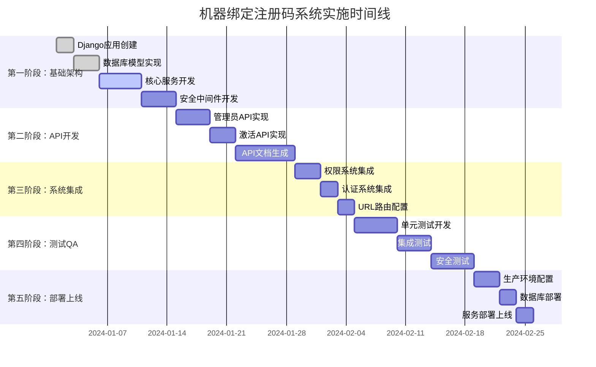

# 机器绑定注册码系统实施计划

## 1. 项目概述

### 1.1 项目目标
在现有Django多租户后端系统中集成机器绑定注册码功能，为macOS软件提供安全可靠的许可证管理系统。

### 1.2 关键成功指标
- **安全性**: RSA-2048签名验证，AES-256数据加密
- **可靠性**: 99.9%系统可用性，支持在线/离线激活
- **性能**: 激活响应时间<500ms，支持并发激活1000/分钟
- **兼容性**: 完全集成现有认证、权限和多租户系统

### 1.3 项目范围
**包含功能:**
- 许可证密钥生成与管理
- 机器硬件指纹绑定
- 在线/离线激活验证
- 使用监控与报告
- 管理员控制面板
- API接口与文档

**不包含功能:**
- macOS客户端软件开发
- 第三方支付集成
- 客户门户界面

## 2. 实施阶段规划

### 第一阶段：基础架构搭建（2周）

#### 2.1 Django应用创建
**时间**: 第1-2天
**负责人**: 后端开发工程师
**任务清单:**
```bash
# 1. 创建licenses应用
python manage.py startapp licenses

# 2. 基础目录结构
licenses/
├── __init__.py
├── admin.py
├── apps.py
├── models.py
├── serializers.py
├── views/
│   ├── __init__.py
│   ├── admin_views.py
│   ├── activation_views.py
│   └── report_views.py
├── services/
│   ├── __init__.py
│   ├── license_service.py
│   ├── activation_service.py
│   ├── security_service.py
│   └── fingerprint_service.py
├── utils/
│   ├── __init__.py
│   ├── crypto_utils.py
│   ├── validation_utils.py
│   └── format_utils.py
├── middleware/
│   ├── __init__.py
│   ├── security_middleware.py
│   └── rate_limit_middleware.py
├── management/
│   └── commands/
│       ├── __init__.py
│       ├── generate_keypair.py
│       ├── rotate_keys.py
│       └── cleanup_expired.py
├── migrations/
├── tests/
│   ├── __init__.py
│   ├── test_models.py
│   ├── test_services.py
│   ├── test_views.py
│   └── test_security.py
└── fixtures/
    └── initial_data.json
```

#### 2.2 数据库模型实现
**时间**: 第3-5天
**依赖**: 应用创建完成
**任务清单:**
```python
# models.py 实现顺序
1. BaseModel 集成
2. SoftwareProduct 模型
3. LicensePlan 模型  
4. License 模型
5. MachineBinding 模型
6. LicenseActivation 模型
7. LicenseUsageLog 模型
8. TenantLicenseQuota 模型
9. SecurityAuditLog 模型

# 数据库迁移
python manage.py makemigrations licenses
python manage.py migrate licenses
```

#### 2.3 核心服务开发
**时间**: 第6-10天
**依赖**: 数据库模型完成
**任务清单:**
```python
# services/ 目录实现
1. security_service.py
   - RSA密钥对生成
   - 数字签名验证
   - AES数据加密解密
   
2. fingerprint_service.py
   - 硬件信息收集
   - 机器指纹生成
   - 指纹相似度比较
   
3. license_service.py
   - 许可证生成算法
   - 许可证验证逻辑
   - 格式化处理
   
4. activation_service.py
   - 激活流程控制
   - 在线/离线模式
   - 状态管理
```

#### 2.4 安全中间件开发
**时间**: 第11-14天
**依赖**: 核心服务完成
**任务清单:**
```python
# middleware/ 目录实现
1. security_middleware.py
   - 请求签名验证
   - 异常行为检测
   - 安全日志记录
   
2. rate_limit_middleware.py
   - API频率限制
   - IP黑名单管理
   - 动态限流调整
```

### 第二阶段：API接口开发（2周）

#### 2.1 管理员API实现
**时间**: 第15-18天
**依赖**: 基础架构完成
**任务清单:**
```python
# views/admin_views.py
1. ProductViewSet
   - CRUD操作
   - 密钥对管理
   - 权限控制
   
2. LicensePlanViewSet
   - 方案配置
   - 配额管理
   
3. LicenseViewSet
   - 许可证生成
   - 批量操作
   - 状态管理
   
4. ReportViewSet
   - 使用统计
   - 安全报告
   - 数据导出
```

#### 2.2 激活API实现
**时间**: 第19-21天
**依赖**: 管理员API完成
**任务清单:**
```python
# views/activation_views.py
1. ActivationView
   - 许可证激活
   - 机器绑定
   - 错误处理
   
2. VerificationView
   - 在线验证
   - 离线验证
   - 状态更新
   
3. HeartbeatView
   - 使用记录
   - 状态同步
   - 异常检测
```

#### 2.3 API文档生成
**时间**: 第22-28天
**依赖**: 所有API完成
**任务清单:**
```python
# drf-spectacular 集成
1. OpenAPI规范配置
2. 接口文档生成
3. 交互式文档界面
4. API测试工具集成
```

### 第三阶段：系统集成与配置（1周）

#### 2.4 权限系统集成
**时间**: 第29-31天
**依赖**: API开发完成
**任务清单:**
```python
# 权限集成
1. 扩展现有Permission系统
2. 角色权限定义
3. 多租户数据隔离
4. 权限验证装饰器
```

#### 2.5 认证系统集成
**时间**: 第32-33天
**依赖**: 权限集成完成
**任务清单:**
```python
# JWT认证集成
1. 扩展JWTAuthentication
2. 用户类型识别
3. 令牌验证增强
4. 会话管理
```

#### 2.6 URL路由配置
**时间**: 第34-35天
**依赖**: 所有集成完成
**任务清单:**
```python
# URL配置
1. licenses/urls.py 路由定义
2. core/urls.py 主路由集成
3. API版本控制
4. 路由测试验证
```

### 第四阶段：测试与质量保证（2周）

#### 4.1 单元测试开发
**时间**: 第36-40天
**依赖**: 系统集成完成
**任务清单:**
```python
# tests/ 目录实现
1. test_models.py
   - 模型字段验证
   - 关系约束测试
   - 数据完整性检查
   
2. test_services.py
   - 加密算法测试
   - 业务逻辑验证
   - 异常处理测试
   
3. test_views.py
   - API接口测试
   - 权限验证测试
   - 响应格式验证
   
4. test_security.py
   - 安全功能测试
   - 攻击防护测试
   - 日志审计测试
```

#### 4.2 集成测试
**时间**: 第41-44天
**依赖**: 单元测试完成
**任务清单:**
```python
# 集成测试场景
1. 完整激活流程测试
2. 多租户隔离测试
3. 并发操作测试
4. 异常恢复测试
5. 性能压力测试
```

#### 4.3 安全测试
**时间**: 第45-49天
**依赖**: 集成测试完成
**任务清单:**
```bash
# 安全测试项目
1. 渗透测试
   - SQL注入检测
   - XSS攻击防护
   - CSRF令牌验证
   
2. 加密强度测试
   - 密钥安全性
   - 算法实现验证
   - 随机数质量检查
   
3. 权限绕过测试
   - 越权访问检测
   - 多租户隔离验证
   - API安全测试
```

### 第五阶段：部署与上线（1周）

#### 5.1 生产环境配置
**时间**: 第50-52天
**依赖**: 测试完成
**任务清单:**
```python
# 生产配置
1. settings/production.py
   - 安全配置优化
   - 性能参数调优
   - 监控集成
   
2. 环境变量配置
   - 密钥管理
   - 数据库连接
   - 缓存配置
   
3. Docker镜像构建
   - Dockerfile优化
   - 多阶段构建
   - 安全扫描
```

#### 5.2 数据库部署
**时间**: 第53-54天
**依赖**: 环境配置完成
**任务清单:**
```sql
-- 数据库部署
1. 生产数据库创建
2. 迁移脚本执行
3. 初始数据导入
4. 索引优化
5. 备份策略配置
```

#### 5.3 服务部署上线
**时间**: 第55-56天
**依赖**: 数据库部署完成
**任务清单:**
```bash
# 部署流程
1. 代码部署
2. 服务启动
3. 健康检查
4. 负载均衡配置
5. SSL证书配置
6. 监控告警配置
```

## 3. 技术实施细节

### 3.1 开发环境要求
```python
# 依赖包版本
Django>=4.2.0
djangorestframework>=3.14.0
drf-spectacular>=0.26.0
cryptography>=3.4.8
PyJWT>=2.4.0
redis>=4.3.0
celery>=5.2.0
psycopg2-binary>=2.9.0
```

### 3.2 数据库配置
```sql
-- 生产数据库配置
-- MySQL 8.0+ 或 PostgreSQL 13+
-- 连接池: 20-50 连接
-- 事务隔离级别: READ_COMMITTED
-- 字符集: utf8mb4
-- 时区: UTC
```

### 3.3 缓存策略
```python
# Redis配置
CACHES = {
    'default': {
        'BACKEND': 'django_redis.cache.RedisCache',
        'LOCATION': 'redis://127.0.0.1:6379/1',
        'OPTIONS': {
            'CLIENT_CLASS': 'django_redis.client.DefaultClient',
        }
    }
}

# 缓存使用场景
1. 许可证验证结果缓存 (TTL: 5分钟)
2. 机器指纹缓存 (TTL: 1小时)  
3. API频率限制计数器 (TTL: 1小时)
4. 用户权限缓存 (TTL: 30分钟)
```

### 3.4 异步任务处理
```python
# Celery任务配置
CELERY_BROKER_URL = 'redis://localhost:6379/0'
CELERY_RESULT_BACKEND = 'redis://localhost:6379/0'

# 异步任务类型
1. 许可证密钥生成
2. 大批量许可证创建
3. 使用日志统计分析
4. 安全报告生成
5. 数据清理和归档
```

## 4. 风险管理与应对

### 4.1 技术风险
| 风险类型 | 风险等级 | 影响描述 | 应对措施 |
|---------|---------|---------|---------|
| 加密算法实现错误 | 高 | 安全漏洞，许可证被破解 | 使用成熟加密库，代码审查，安全测试 |
| 性能瓶颈 | 中 | 激活延迟，用户体验差 | 压力测试，缓存优化，异步处理 |
| 数据库迁移失败 | 中 | 数据丢失，服务中断 | 备份策略，灰度迁移，回滚方案 |
| 第三方依赖漏洞 | 中 | 安全风险 | 定期更新，漏洞扫描，安全监控 |

### 4.2 业务风险
| 风险类型 | 风险等级 | 影响描述 | 应对措施 |
|---------|---------|---------|---------|
| 需求变更 | 中 | 开发延期，成本增加 | 敏捷开发，分阶段交付，需求冻结 |
| 人员流失 | 中 | 进度延迟，知识断层 | 文档完善，知识分享，备份人员 |
| 测试不充分 | 高 | 生产故障，用户投诉 | 完整测试计划，自动化测试，QA评审 |

### 4.3 安全风险
| 风险类型 | 风险等级 | 影响描述 | 应对措施 |
|---------|---------|---------|---------|
| 密钥泄露 | 高 | 系统被完全破解 | 密钥轮换，HSM存储，访问控制 |
| DDoS攻击 | 中 | 服务不可用 | 限流保护，CDN防护，监控告警 |
| 内部威胁 | 中 | 数据泄露，权限滥用 | 权限最小化，操作审计，行为监控 |

## 5. 质量保证措施

### 5.1 代码质量控制
```python
# 代码规范
1. PEP 8 Python编码规范
2. Django最佳实践
3. RESTful API设计规范
4. 安全编码指南

# 代码审查流程
1. 功能实现审查
2. 安全代码审查  
3. 性能影响评估
4. 文档完整性检查
```

### 5.2 测试覆盖率要求
```bash
# 测试覆盖率指标
- 单元测试覆盖率: ≥ 90%
- 集成测试覆盖率: ≥ 80%
- API测试覆盖率: 100%
- 安全测试覆盖率: 100%

# 测试自动化
- 提交时自动运行单元测试
- 构建时自动运行集成测试
- 部署前自动运行全量测试
```

### 5.3 性能基准测试
```python
# 性能指标要求
1. API响应时间
   - 激活接口: < 500ms (95%ile)
   - 验证接口: < 200ms (95%ile)
   - 查询接口: < 100ms (95%ile)

2. 并发处理能力
   - 激活并发: 1000 req/min
   - 验证并发: 10000 req/min
   - 系统并发用户: 1000

3. 资源使用限制
   - CPU使用率: < 70%
   - 内存使用: < 4GB
   - 数据库连接: < 50
```

## 6. 监控与运维

### 6.1 监控指标定义
```python
# 业务监控指标  
1. 许可证激活成功率
2. 激活响应时间分布
3. 机器绑定数量统计
4. 异常激活检测次数
5. API调用量统计

# 技术监控指标
1. 服务可用性
2. 响应时间监控
3. 错误率统计
4. 系统资源使用
5. 数据库性能
```

### 6.2 日志管理策略
```python
# 日志级别配置
LOGGING_CONFIG = {
    'version': 1,
    'disable_existing_loggers': False,
    'handlers': {
        'security_file': {
            'level': 'INFO',
            'class': 'logging.handlers.RotatingFileHandler',
            'filename': 'logs/security.log',
            'maxBytes': 1024*1024*50,  # 50MB
            'backupCount': 10,
        },
        'business_file': {
            'level': 'INFO', 
            'class': 'logging.handlers.RotatingFileHandler',
            'filename': 'logs/business.log',
            'maxBytes': 1024*1024*50,
            'backupCount': 10,
        }
    },
    'loggers': {
        'licenses.security': {
            'handlers': ['security_file'],
            'level': 'INFO',
            'propagate': False,
        },
        'licenses.business': {
            'handlers': ['business_file'],
            'level': 'INFO', 
            'propagate': False,
        }
    }
}
```

### 6.3 备份与恢复策略
```bash
# 数据备份计划
1. 全量备份: 每日凌晨2点
2. 增量备份: 每4小时
3. 事务日志备份: 每15分钟
4. 备份保留期: 30天

# 恢复测试
- 月度恢复演练
- RTO目标: < 4小时  
- RPO目标: < 15分钟
```

## 7. 交付物清单

### 7.1 代码交付物
```
licenses/                    # Django应用代码
├── models.py               # 数据模型定义
├── serializers.py          # API序列化器
├── views/                  # API视图实现
├── services/               # 业务服务层
├── utils/                  # 工具函数
├── middleware/             # 中间件
├── management/commands/    # 管理命令
├── tests/                  # 测试代码
└── fixtures/               # 初始数据

docs/                       # 文档目录
├── api_documentation.html  # API文档
├── deployment_guide.md     # 部署指南
├── user_manual.md          # 用户手册
└── troubleshooting.md      # 故障排除

scripts/                    # 部署脚本
├── deploy.sh              # 部署脚本
├── backup.sh              # 备份脚本
└── monitor.sh             # 监控脚本
```

### 7.2 配置文件
```python
# 配置文件清单
1. settings/production.py   # 生产环境配置
2. docker-compose.yml       # Docker编排配置
3. nginx.conf              # Web服务器配置
4. requirements.txt        # Python依赖
5. .env.example           # 环境变量模板
```

### 7.3 测试报告
```
tests/reports/
├── unit_test_report.html      # 单元测试报告
├── integration_test_report.html # 集成测试报告
├── security_test_report.pdf   # 安全测试报告
├── performance_test_report.pdf # 性能测试报告
└── coverage_report.html       # 代码覆盖率报告
```

## 8. 项目时间线总览



**项目总工期: 8周 (56个工作日)**  
**关键里程碑:**
- 第2周末: 基础架构完成
- 第4周末: API开发完成  
- 第5周末: 系统集成完成
- 第7周末: 测试验证完成
- 第8周末: 生产部署完成

---

*实施计划制定时间: 2024-09-05*  
*计划制定原则: 系统化、可执行、风险可控*
