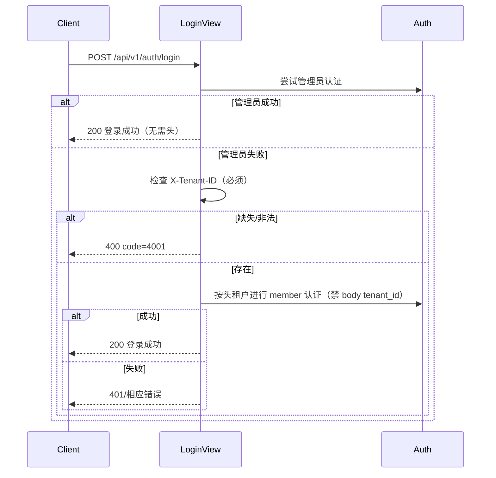
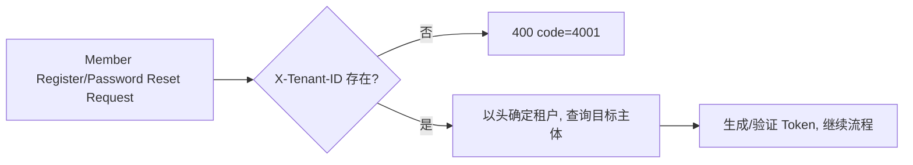
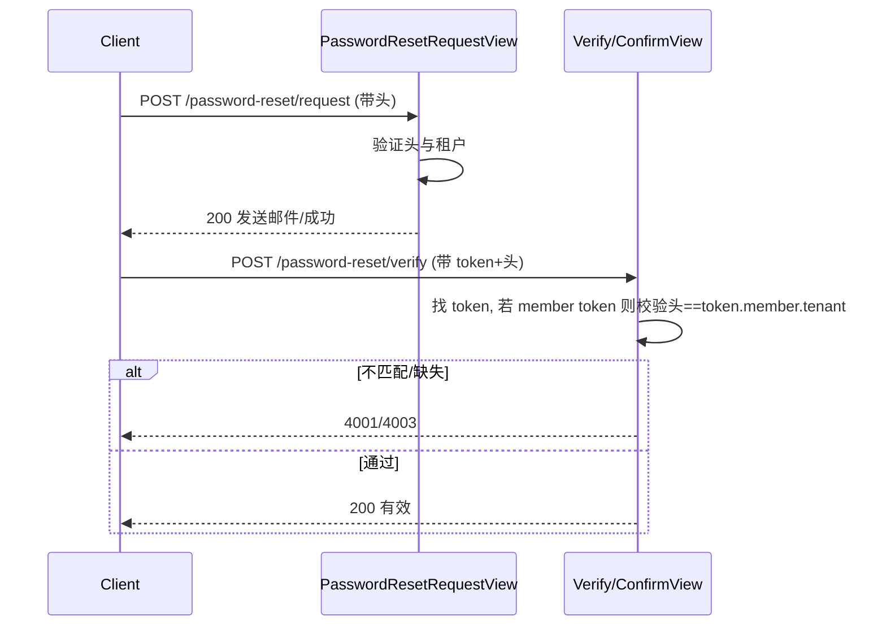

# Member API Tenant Header Enforcement — Deep Design Doc

作者: Cascade
更新时间: 2025-08-26 18:26 (GMT+8)

## 1. 目标与范围
- 目标：在不影响管理员（含租户管理员与超管）既有行为的前提下，对成员用户（Member）调用任意 API 强制携带 `X-Tenant-ID`，并保证与其所属租户一致；对匿名与管理员按既定策略处理。
- 影响范围：
  - 所有已认证的 Member 调用的路径（/api/v1/** 任意）
  - 认证端点：登录、成员自助注册、密码重置（request/verify/confirm）
  - 允许匿名访问的 CMS GET 接口（可带头以选择租户上下文）

## 2. 术语与角色
- Member：普通成员用户（含子账号，仅 member 类型可登录前台）。
- User：管理员用户（租户管理员或超级管理员）。
- 匿名：未认证请求。
- X-Tenant-ID：HTTP 请求头中的租户标识（整数，数据库中存在、启用的租户）。

## 3. 统一规则矩阵（强制与兼容）
- 成员用户（已认证 Member）
  - 必须携带 `X-Tenant-ID`，且等于 `request.user.tenant.id`。
  - 缺失：400，code=4001；不一致：403，code=4003。
- 租户管理员（User，非超管）
  - 不允许携带 `X-Tenant-ID`。若携带：400，code=4001（管理员不应携带租户头）。
- 超级管理员（User，超管）
  - 不允许携带 `X-Tenant-ID`。若携带：400，code=4001（超管不应携带租户头）。
- 匿名
  - 不强制 `X-Tenant-ID`；允许在开放的匿名接口（如 CMS 公共 GET）携带头以指定租户上下文；其余需鉴权接口仍按鉴权失败处理。
- 认证端点
  - 登录：管理员登录不需要头；成员登录必须头，且仅接受头（禁用 body 的 tenant_id）。
  - 成员注册、密码重置 request/verify/confirm：必须头，且仅接受头（禁止从 body 读取 tenant_id）。

关键原则：
- 只要带了 `X-Tenant-ID` 的调用，一律视为“member 或匿名用户调用”的语义前提成立。
- 若请求已认证为管理员/超管，但带了 `X-Tenant-ID`，则属于不合法用法，直接返回 400（code=4001）。

说明：为避免混淆，成员请求一律以头为唯一真源，忽略 query/body 的 tenant_id（记录告警日志，不报错）。

## 4. 决策与架构选择
- 不在全局中间件对所有路径“强行绑定租户”，而是：
  - 在“已认证后”的早期阶段统一校验“Member 必须头且匹配”。该位置可选：
    - 方案 A：新建轻量中间件，置于认证中间件之后（能拿到 `request.user`）。
    - 方案 B：DRF 自定义权限类，在视图层统一应用。
  - 认证端点的“成员路径强制头、仅头来源”在视图内精细控制。
- 选型：
  - 全局一致性与漏网风险考虑，更推荐方案 A（中间件）+ 局部权限类兜底/补强（个别视图无需加载 DRF 权限时仍有保障）。
  - 对现有 `TenantMiddleware` 不做大改，避免影响既有路径规则；新增一个“MemberHeaderEnforceMiddleware”。

## 5. 请求分类与判定流程（线框/时序图）

### 5.1 顶层判定（所有请求）
```mermaid
flowchart TD
  A[收到请求] --> B{是否已认证?}
  B -- 否 --> C{是否匿名可访问?}
  C -- 是 --> D{是否携带 X-Tenant-ID?}
  D -- 是 --> E[设置租户上下文(匿名)] --> Z[进入视图]
  D -- 否 --> Z
  C -- 否 --> Z
  B -- 是 --> F{用户类型}
  F -- Member --> G{X-Tenant-ID 存在?}
  G -- 否 --> H[400 code=4001] --> X[结束]
  G -- 是 --> I{是否等于用户租户?}
  I -- 否 --> J[403 code=4003] --> X
  I -- 是 --> Z[进入视图]
  F -- 租户管理员 --> K{是否携带 X-Tenant-ID?}
  K -- 否 --> Z
  K -- 是 --> H
  F -- 超级管理员 --> M{是否携带 X-Tenant-ID?}
  M -- 否 --> Z
  M -- 是 --> H
```

### 5.2 登录接口判定


### 5.3 成员注册与密码重置




## 6. 错误处理与返回规范
- 400（code=4001）：缺少或非法 `X-Tenant-ID`，或不允许从 body/query 指定租户（成员登录/注册/密码重置）。
- 403（code=4003）：`X-Tenant-ID` 与成员所属租户不匹配。
- 响应结构统一：
```json
{
  "success": false,
  "code": 4001,
  "message": "缺少或非法的租户ID",
  "data": null
}
```

## 7. 关键集成点与拟修改文件清单（不立即编码）
- 中间件：
  - 新增 `common/middleware/member_header_enforce.py`：执行 5.1 顶层判定中的规则：
    - 已认证 Member：必须头且匹配；
    - 已认证管理员/超管：若带头则直接 4001；
    - 匿名：带头可设匿名租户上下文。
  - 现有 `TenantMiddleware`（位于 `common/middleware/`）保持现状，仅微调“Vary: X-Tenant-ID”必要处或留给视图层处理。
- 权限类（兜底与局部视图专用）：
  - `common/permissions.py`：新增 `RequireTenantHeaderForMember`，供需要的 DRF 视图快速标注。
- 视图：
  - `users/views/auth_views.py`：`LoginView`（成员路径强制头、禁 body tenant_id），`MemberRegisterView`（仅头），`PasswordReset*`（仅头，校验 token 与头的一致性）。
  - `users/views/member_views.py`：在成员自操作接口上补充权限类（若中间件已全局保障，可作为冗余安全）。
- 序列化器：
  - `users/serializers.py`：移除或忽略相关 body `tenant_id` 字段；增加从 `request.headers` 或上下文读取租户的逻辑。
- 文档与示例：
  - `temp2/member_api_integration.md`：补充“必须携带 X-Tenant-ID”的说明与错误示例。
  - 本设计文档：`temp2/member_tenant_header_enforcement_design.md`。

## 8. 兼容性与缓存
- 兼容性：现有成员侧客户端需统一在任意 API 调用中加入头；管理员端无需修改。
- 缓存：对受 `X-Tenant-ID` 影响的响应添加 `Vary: X-Tenant-ID`，避免跨租户缓存污染（中间件或视图统一处理）。

## 9. 测试计划（重点场景）
- 成员任意 API：缺头 4001；错头 4003；正确通过。
- 登录：
  - 管理员无头成功；管理员带头 4001；
  - 成员无头 4001；成员头与 body 冲突 4001；仅头成功。
- 成员注册：仅头成功；无头 4001；body 中包含 tenant_id 则 4001。
- 密码重置：
  - request：无头 4001；带头成功。
  - verify/confirm：member token 无头或错头失败；user token 无需头通过。
- 匿名 CMS GET：
  - 无头与带头均可（带头应呈现对应租户内容）。
- 管理员（非超管）带任何租户头：4001。
- 超级管理员带任何租户头：4001。

## 10. 实施分批与回滚
- Batch 1：中间件 + 权限类 + 文档更新 + 基本回归测试。
- Batch 2：登录/注册强制“仅头”与冲突处理；测试补充。
- Batch 3：密码重置全链路“仅头”与 token-租户一致性；测试补充。
- 回滚策略：按批次提交，可独立回滚；中间件开关可通过设置项 Feature Flag 控制。

## 11. 配置与 Feature Flag（可选）
- `settings.py` 中增加 `FEATURE_ENFORCE_TENANT_HEADER_FOR_MEMBER=True`，便于灰度与回滚。

## 12. 风险与缓解
- 客户端未统一加头：通过监控日志提前发现，灰度发布，文档与告警提示。
- 旧 token 关联流程差异：verify/confirm 中按 token.owner 类型分流，确保安全。
- 误用 query/body tenant_id：成员请求一律忽略并警告日志，避免混淆。

---

附录：错误码对照
- 4001 缺少或非法 X-Tenant-ID / 成员端禁止从 body/query 指定租户
- 4003 X-Tenant-ID 与成员所属租户不匹配
