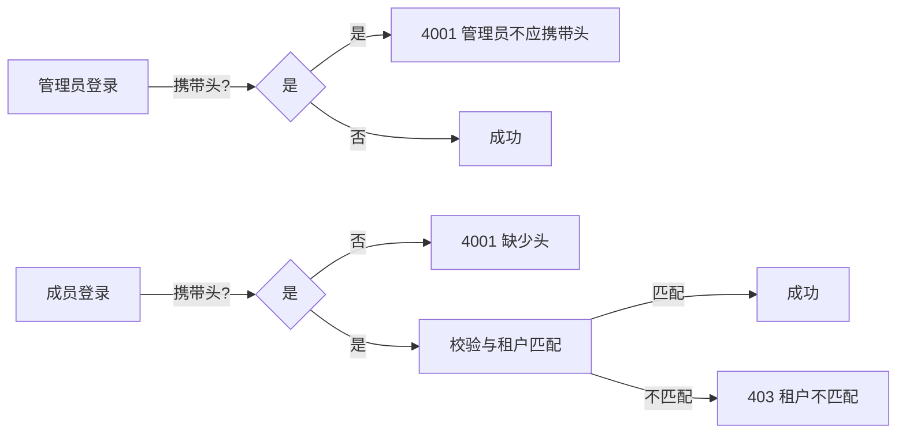

# Member Tenant Header Enforcement — Execution Plan (No Code)

更新时间: 2025-08-26 18:27 (GMT+8)

## 1. 中间件与权限（函数签名与伪代码）

- 文件：`common/middleware/member_header_enforce.py`
- 目的：统一在认证完成后强制“成员必须头且匹配”；若管理员/超管带头直接 4001；匿名带头可设租户上下文。

```python
# Pseudocode
class MemberHeaderEnforceMiddleware(MiddlewareMixin):
    def process_request(self, request):
        if not settings.FEATURE_ENFORCE_TENANT_HEADER_FOR_MEMBER:
            return None
        header_tid = request.META.get('HTTP_X_TENANT_ID')

        if not request.user.is_authenticated:
            # 匿名：允许带头用于匿名上下文（如 CMS GET）
            # 可在 request 上标注: request.anonymous_tenant_id = int(header_tid) if valid
            return None

        # 角色分流
        if isinstance(request.user, Member):
            if not header_tid: return error_4001('成员请求必须携带 X-Tenant-ID')
            if not is_valid_int(header_tid): return error_4001('非法租户ID')
            if request.user.tenant_id != int(header_tid): return error_4003('租户不匹配')
            return None

        # 管理员或超管
        if header_tid:
            return error_4001('管理员/超管不允许携带 X-Tenant-ID')
        return None
```

- 文件：`common/permissions.py`
- 新增：`RequireTenantHeaderForMember`

```python
# Pseudocode
class RequireTenantHeaderForMember(IsAuthenticated):
    def has_permission(self, request, view):
        if not super().has_permission(request, view):
            return False
        if isinstance(request.user, Member):
            header_tid = request.META.get('HTTP_X_TENANT_ID')
            if not header_tid: raise Error4001
            if not is_valid_int(header_tid): raise Error4001
            if int(header_tid) != request.user.tenant_id: raise Error4003
        else:
            # 管理员/超管若带头：与中间件一致，抛 4001（兜底）
            if request.META.get('HTTP_X_TENANT_ID'):
                raise Error4001
        return True
```

## 2. 认证端点改造（仅文档化）

- 文件：`users/views/auth_views.py`

1) LoginView.post()
- 流程：
  - 先尝试管理员认证；成功则必须“未携带头”，否则 4001。
  - 管理员失败后进入成员认证路径：必须携带头（仅头来源），若请求体含 tenant_id 则 4001（冲突/禁用）。
  - 成员认证使用 header 中的租户进行用户查询与校验。

2) MemberRegisterView.post()
- 必须头；禁止 body tenant_id；从 header 确定租户。

3) PasswordResetRequest/Verify/Confirm
- Request：必须头；若 account_type=member 或查到 member，使用 header 指定租户做消歧；若 account_type=user，禁止携带头（带了也 4001）。
- Verify/Confirm：
  - 若 token 属于 member：必须头且与 token.member.tenant 一致，否则 4001/4003。
  - 若 token 属于 user（管理员）：禁止头，带了 4001。

伪代码片段（LoginView 核心分支）：
```python
# Pseudocode
user = try_admin_auth(request)
if user: 
    if request.META.get('HTTP_X_TENANT_ID'):
        return error_4001('管理员/超管不应携带 X-Tenant-ID')
    return login_success(user)

tenant_id = require_header_tenant_id(request)  # 仅头来源
if 'tenant_id' in request.data: return error_4001('成员登录禁止 body tenant_id')
member = try_member_auth(request, tenant_id)
return login_response(member)
```

## 3. 序列化器调整点（不写代码）
- `LoginSerializer`：成员路径下仅从 header/context 获取租户；body 的 `tenant_id` 视为非法。
- `MemberSelfRegisterSerializer`：移除/忽略 body `tenant_id`；从 header/context 获取。
- `PasswordReset*Serializer`：
  - Request：移除/忽略 body `tenant_id`；从 header/context 获取；若 account_type=user，则必须无头。
  - Verify/Confirm：若 token.member 存在，则需要 header 并匹配。

## 4. 统一错误与工具
- 统一错误：
  - 4001 文案固定："缺少或非法的租户ID"（包括：缺头/非法头、管理员/超管携头、管理员在需显式租户时未提供等）
  - 4003 文案固定："租户不匹配，或者没有权限"
- 工具函数（`common/utils/tenant_header.py`）：
  - `get_header_tenant_id(request) -> Optional[int]`（合法则返回 int，否则 None）
  - `require_member_header_match(request)`（抛 4001/4003）
  - 注意：仅用于视图/权限层的重复消除。

备注：成员请求中若出现 query/body 的 `tenant_id`，一律忽略并记录 Warning 日志，仅以请求头为准，不报错。

## 5. 时序/线框补充



## 5.1 CMS 访问规则（角色矩阵，No Code）

- 成员/匿名（CMS 路径）：
  - 必须携带 `X-Tenant-ID`；缺失/非法 → 400（code=4001，"缺少或非法的租户ID"）。
  - 若 query/body 出现 `tenant_id`：忽略并 Warning 日志；仅以头为准。
  - 建议响应头添加：`Vary: X-Tenant-ID`。

- 管理员（租户管理员，CMS 路径）：
  - 禁止携带 `X-Tenant-ID`（携带 → 4001）。
  - 若无任何租户参数：默认使用其绑定租户。
  - 若提供 `?tenant_id=`：按参数指定的租户返回。

- 超级管理员（CMS 路径）：
  - 禁止携带 `X-Tenant-ID`（携带 → 4001）。
  - 允许使用 `?tenant_id=` 指定租户；未指定则返回全量（沿用现有逻辑）。

实现提示（适配 `common/viewsets.TenantModelViewSet`）：
- `get_queryset()`：按上述分流处理成员/匿名/管理员/超管；成员缺头直接 4001；管理员缺参数默认绑定租户；超管无参数全量；成员 query/body 的租户参数忽略+Warning。
- `perform_create/update/destroy/_verify_tenant_ownership()`：沿用相同的角色分流与错误码策略。

## 6. 发布步骤（仅文档）
- 添加 Feature Flag，先灰度到测试环境。
- 批次合并与回滚点与设计文档一致。

## 7. 风险与对策（与设计文档一致）
- 客户端适配、缓存 Vary、日志监控与频控。
